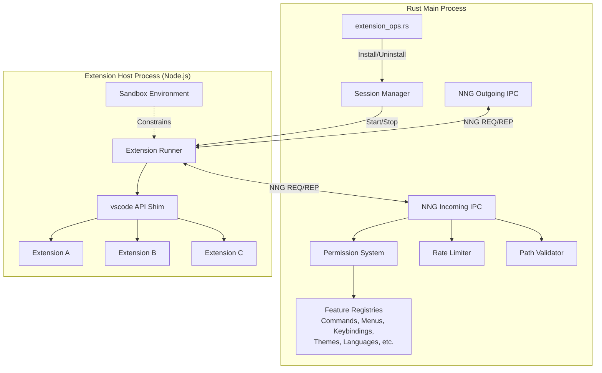
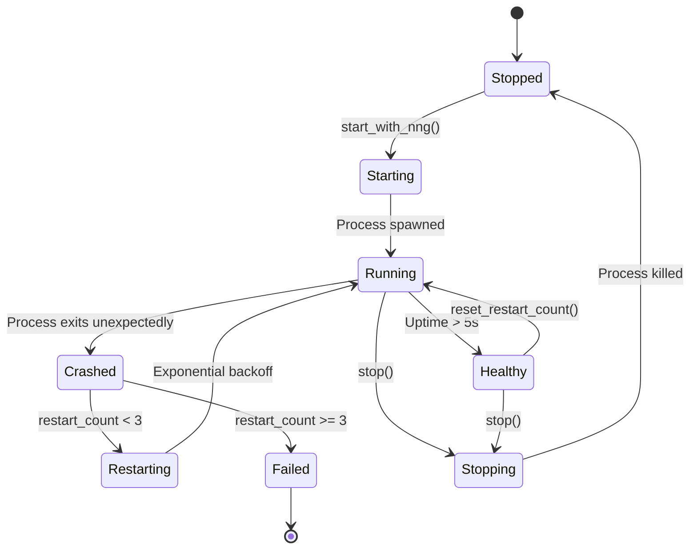
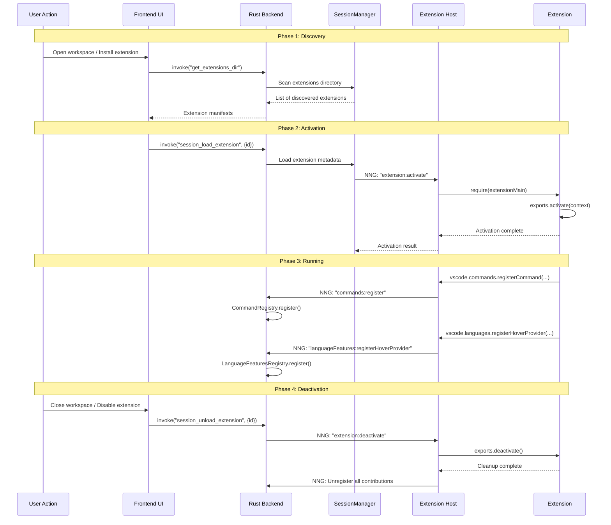
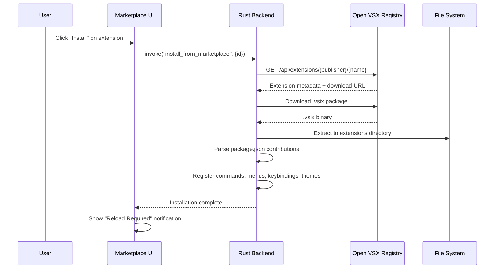

# Extension System Architecture

DSCode's extension system enables third-party developers to extend the editor with new languages, themes, debuggers, and tools. The system is designed for **VS Code compatibility** while providing **stronger security guarantees** through capability-based permissions and OS-level sandboxing.

---

## Architecture Overview



---

## Extension Host Process

The Extension Host is a **separate Node.js process** managed by the `ExtensionHostManager`. It provides the runtime environment for extensions and implements the VS Code API compatibility layer.

### Process Lifecycle

```mermaid
statechart-v2
```



### Process Configuration

The Extension Host process is started with specific environment variables:

```rust
let mut cmd = Command::new("node");
cmd.arg(extension_host_path);

// IPC URLs for bidirectional NNG communication
cmd.env("DSCODE_IPC_URL", outgoing_ipc_url);
cmd.env("DSCODE_INCOMING_IPC_URL", incoming_ipc_url);

// Sandboxing applied before spawn
let sandbox_config = SandboxConfig::default();
apply_sandbox(&mut cmd, &sandbox_config)?;

// Stdio configuration
cmd.stdin(Stdio::null())
    .stdout(Stdio::piped())
    .stderr(Stdio::piped());
```

### Crash Recovery

The `ExtensionHostManager` implements automatic restart with exponential backoff:

| Attempt | Backoff | Total Wait |
|---|---|---|
| 1 | 1,000ms | 1s |
| 2 | 2,000ms | 3s |
| 3 | 4,000ms | 7s |
| 4+ | N/A | **Max attempts exceeded** |

```rust
const MAX_RESTART_ATTEMPTS: u32 = 3;
const RESTART_BACKOFF_BASE_MS: u64 = 1000;

// Exponential backoff: 1s, 2s, 4s
let backoff_ms = RESTART_BACKOFF_BASE_MS * 2u64.pow(self.restart_count);
std::thread::sleep(Duration::from_millis(backoff_ms));
```

!!! warning "Max Restart Limit"
    After 3 failed restart attempts, the Extension Host enters a `Failed` state and will not restart automatically. The user must manually restart through the UI or by reloading the window.

---

## Extension Lifecycle



---

## VS Code API Compatibility Layer

The Extension Host implements the `vscode` namespace as a compatibility shim that translates VS Code API calls into NNG IPC messages:

```typescript
// Extension Host: vscode API shim (simplified)
const vscode = {
    commands: {
        registerCommand(id: string, handler: Function): Disposable {
            // Register in local map
            commandHandlers.set(id, handler);
            // Notify Rust backend via NNG
            nng.send('commands:register', { id, title: id });
            return { dispose: () => commandHandlers.delete(id) };
        },
        executeCommand(id: string, ...args: any[]): Promise<any> {
            return nng.request('commands:execute', { id, args });
        }
    },
    languages: {
        registerHoverProvider(selector: DocumentSelector, provider: HoverProvider): Disposable {
            nng.send('languageFeatures:registerHoverProvider', {
                selector,
                providerId: generateId()
            });
            hoverProviders.set(providerId, provider);
            return { dispose: () => { /* cleanup */ } };
        }
    },
    window: {
        showInformationMessage(message: string, ...items: string[]): Promise<string> {
            return nng.request('window:showMessage', { type: 'info', message, items });
        },
        createStatusBarItem(alignment?: number, priority?: number): StatusBarItem {
            // Creates a proxy that syncs state to Rust via NNG
            return new StatusBarItemProxy(alignment, priority);
        }
    },
    workspace: {
        getConfiguration(section?: string): WorkspaceConfiguration {
            // Returns a proxy that reads from ConfigurationRegistry
            return new ConfigurationProxy(section);
        }
    }
};
```

---

## Activation Events

Extensions declare when they should be activated in their `package.json`:

| Activation Event | Trigger |
|---|---|
| `onLanguage:python` | A Python file is opened |
| `onCommand:myExtension.start` | The specified command is executed |
| `workspaceContains:**/*.rs` | Workspace contains matching files |
| `onFileSystem:sftp` | A file with the specified scheme is accessed |
| `onView:myCustomView` | The specified view is opened |
| `onDebug` | A debug session is started |
| `onStartupFinished` | After all other startup has completed |
| `*` | Always activate (discouraged) |

```json
{
    "activationEvents": [
        "onLanguage:python",
        "onCommand:python.runFile",
        "workspaceContains:**/requirements.txt"
    ]
}
```

!!! tip "Lazy Activation"
    DSCode strongly encourages lazy activation. Extensions using `*` activation receive a performance warning in the marketplace listing. The `onStartupFinished` event is preferred for extensions that need to run at startup.

---

## Extension Isolation and Security

### Capability-Based Permissions

Every extension must declare its required permissions in the manifest. The `ExtensionPermissions` system enforces these at runtime:

```rust
#[derive(Debug, Clone, Serialize, Deserialize, Hash, Eq, PartialEq)]
pub enum Permission {
    // File System
    FileSystemRead,
    FileSystemWrite,
    FileSystemDelete,

    // Network
    NetworkHttp,
    NetworkHttps,
    NetworkWebSocket,

    // Secrets
    SecretsRead,
    SecretsWrite,

    // Terminal
    TerminalCreate,
    TerminalSend,

    // Debug
    DebugStart,
    DebugStop,
    DebugBreakpoints,

    // ... 25+ permission types total
}
```

**Permission declaration in `package.json`:**

```json
{
    "permissions": [
        "fileSystem.read",
        "fileSystem.write",
        "network.https",
        "terminal.create"
    ]
}
```

**Runtime enforcement:**

```rust
impl ExtensionPermissions {
    pub fn check_permission(&self, permission: &Permission) -> Result<(), String> {
        if self.has_permission(permission) {
            Ok(())
        } else {
            Err(format!(
                "Extension '{}' does not have permission: {:?}",
                self.extension_id, permission
            ))
        }
    }
}
```

### OS-Level Sandboxing

The Extension Host process is sandboxed using OS-specific mechanisms:

```mermaid
graph LR
    subgraph "Linux"
        BW[bubblewrap<br/>bwrap]
        RL[rlimit<br/>fallback]
        BW -.->|"Preferred"| Linux
        RL -.->|"Fallback"| Linux
    end

    subgraph "macOS"
        SE[sandbox-exec<br/>+ .sb profile]
        MR[rlimit<br/>resource limits]
        SE --> macOS
        MR --> macOS
    end

    subgraph "Windows"
        JO[Job Objects<br/>+ restricted tokens]
        JO --> Windows[Windows]
    end
```

| Platform | Mechanism | Capabilities |
|---|---|---|
| **Linux** | bubblewrap (bwrap) | Namespace isolation, read-only bind mounts, network isolation, PID isolation |
| **Linux (fallback)** | rlimit | Memory limits via `RLIMIT_AS` |
| **macOS** | sandbox-exec | Seatbelt profiles with deny-by-default, selective file/network access |
| **Windows** | Job Objects | Memory limits, CPU limits, restricted tokens (planned) |

**Default sandbox configuration:**

```rust
impl Default for SandboxConfig {
    fn default() -> Self {
        Self {
            allow_network: false,    // No network by default
            allow_file_write: false, // Read-only by default
            max_memory_mb: Some(512),  // 512MB memory limit
            max_cpu_percent: Some(50), // 50% CPU limit
        }
    }
}
```

### Rate Limiting

Extensions are rate-limited to prevent IPC flooding:

```rust
use governor::{Quota, RateLimiter};

// 100 API calls per second per extension
let limiter = RateLimiter::new(Quota::per_second(nonzero!(100u32)));
```

### Path Validation

The `PathValidator` ensures extensions can only access files within their permitted scope:

- Extension's own installation directory (read/write)
- Workspace folders (read, write if permitted)
- System paths (read-only for specific directories)
- Temp directory (write, for IPC sockets)

---

## Contribution Points

Extensions contribute functionality through declarative `contributes` in their `package.json`:

| Contribution Point | Registry | Description |
|---|---|---|
| `commands` | `CommandRegistry` | Editor commands with titles and icons |
| `menus` | `MenuRegistry` | Menu items in editor/context, view/title, etc. |
| `keybindings` | `KeybindingRegistry` | Keyboard shortcuts (platform-aware) |
| `languages` | `LanguageFeaturesRegistry` | Language declarations (ID, extensions, aliases) |
| `grammars` | `LanguageFeaturesRegistry` | TextMate grammars for syntax highlighting |
| `themes` | `ThemeRegistry` | Color themes and icon themes |
| `configuration` | `ConfigurationRegistry` | Settings schema contributions |
| `debuggers` | `DebugConfigurationRegistry` | Debug adapter configurations |
| `taskDefinitions` | `TaskRegistry` | Custom task type definitions |
| `views` | `ActivityBarRegistry` | Custom sidebar views |
| `viewsContainers` | `ActivityBarRegistry` | Custom view containers in activity bar |
| `statusBar` | `StatusBarRegistry` | Status bar items (via API) |

### Extension Menu Parsing

The `extension_menu_parser.rs` module processes the `contributes.menus` and `contributes.commands` sections from extension manifests:

```json
{
    "contributes": {
        "commands": [
            {
                "command": "python.runFile",
                "title": "Run Python File",
                "icon": "$(play)"
            }
        ],
        "menus": {
            "editor/title": [
                {
                    "command": "python.runFile",
                    "when": "resourceLangId == python",
                    "group": "navigation"
                }
            ]
        }
    }
}
```

---

## Extension Installation Flow



!!! info "Extension Storage"
    Extensions are installed to the platform-specific application data directory:

    - **Linux:** `~/.local/share/dscode/extensions/`
    - **macOS:** `~/Library/Application Support/dscode/extensions/`
    - **Windows:** `%APPDATA%\dscode\extensions\`
