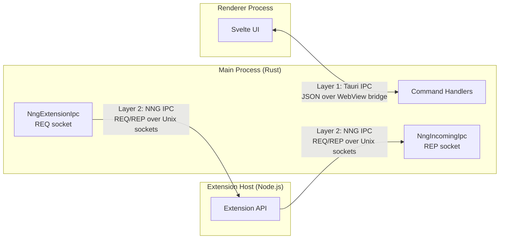
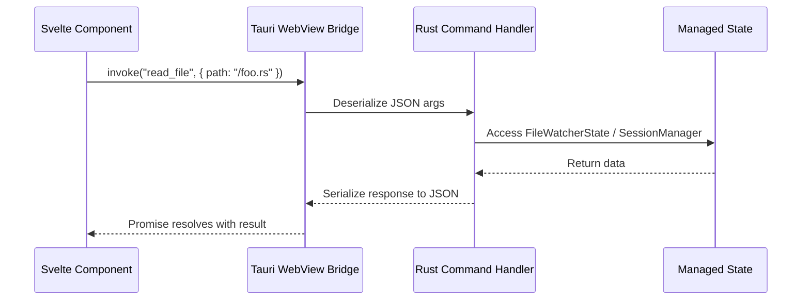
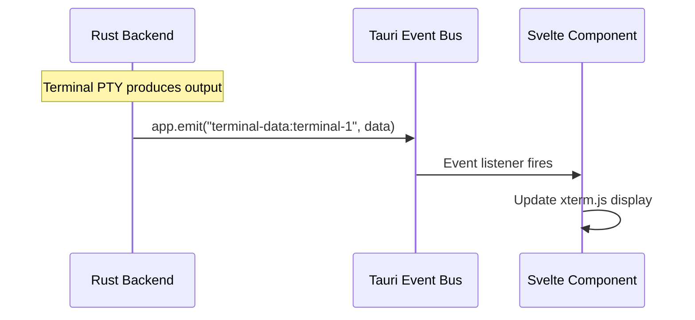
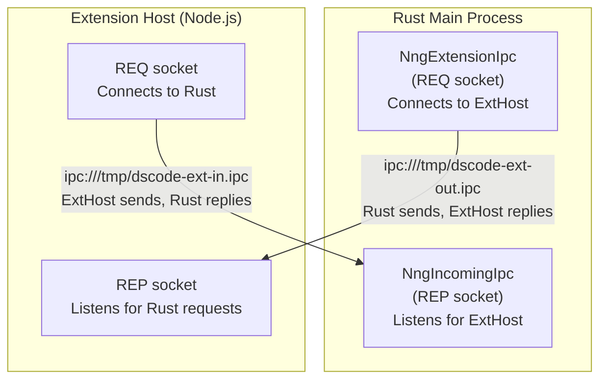
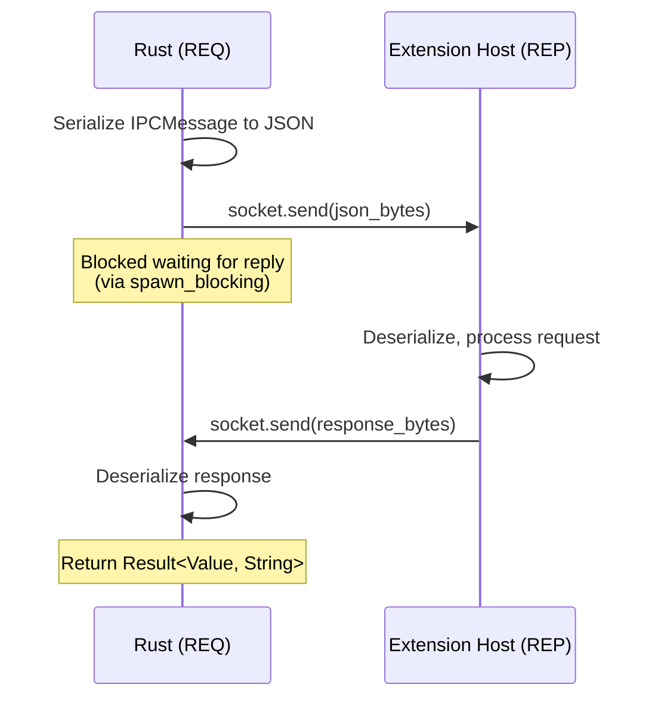
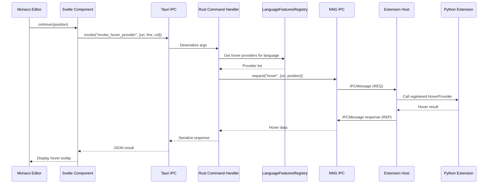
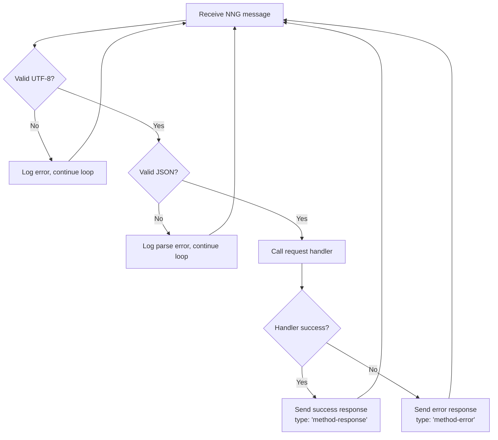

# IPC System Design

DSCode uses a two-layer IPC (Inter-Process Communication) architecture to connect its three main processes. This document covers the design, message formats, performance characteristics, and error handling of both IPC layers.

---

## Two-Layer IPC Architecture



| Layer | Transport | Serialization | Direction | Latency |
|---|---|---|---|---|
| **Layer 1: Tauri IPC** | WebView bridge (platform-native) | JSON (serde_json) | Frontend <-> Rust | <1ms |
| **Layer 2: NNG IPC** | Unix domain sockets / IPC pipes | JSON (serde_json), rkyv planned | Rust <-> Extension Host | <1ms |

---

## Layer 1: Tauri IPC (Frontend <-> Backend)

Tauri IPC connects the Svelte frontend running in the WebView to the Rust backend. Commands are invoked from JavaScript and handled by Rust functions annotated with `#[tauri::command]`.

### Command Invocation



**Frontend (TypeScript):**

```typescript
import { invoke } from '@tauri-apps/api/core';

// Invoke a Tauri command from the frontend
const content = await invoke<string>('read_file', { path: '/home/user/project/main.rs' });
```

**Backend (Rust):**

```rust
#[tauri::command]
async fn read_file(path: String) -> Result<String, String> {
    tokio::fs::read_to_string(&path)
        .await
        .map_err(|e| format!("Failed to read file: {}", e))
}
```

### Event System

In addition to request/response commands, Tauri provides an event system for pushing data from the backend to the frontend:



**Backend (Rust) -- emitting an event:**

```rust
use tauri::Emitter;

// Emit terminal output to the frontend
let _ = app_handle.emit(
    &format!("terminal-data:{}", terminal_id),
    serde_json::json!({ "data": output_data }),
);
```

**Frontend (TypeScript) -- listening for events:**

```typescript
import { listen } from '@tauri-apps/api/event';

const unlisten = await listen(`terminal-data:${terminalId}`, (event) => {
    terminal.write(event.payload.data);
});
```

!!! info "Command Registration"
    DSCode registers over **300 individual commands** through the `tauri::generate_handler!` macro in `main.rs`. Each command is a `#[tauri::command]` annotated async function.

---

## Layer 2: NNG IPC (Backend <-> Extension Host)

The second IPC layer uses **NNG (nanomsg-next-generation)** for communication between the Rust backend and the Node.js Extension Host. NNG provides high-performance, zero-copy messaging over Unix domain sockets.

### Socket Architecture

DSCode establishes **two independent NNG socket pairs** for bidirectional communication:



| Socket Pair | Rust Role | ExtHost Role | Purpose |
|---|---|---|---|
| **Outgoing** | REQ (connects) | REP (listens) | Rust sends commands to Extension Host |
| **Incoming** | REP (listens) | REQ (connects) | Extension Host sends requests to Rust |

### Message Format

All NNG messages use a structured JSON envelope:

```json
{
    "id": "req_42",
    "type": "extension:activate",
    "payload": {
        "extensionId": "ms-python.python",
        "activationEvent": "onLanguage:python"
    }
}
```

```rust
#[derive(Debug, Clone, Serialize, Deserialize)]
pub struct IPCMessage {
    pub id: String,        // Unique message identifier (e.g., "req_42")
    pub r#type: String,    // Message type / method name
    pub payload: Value,    // JSON payload (arbitrary structure)
}
```

### NNG Messaging Patterns

DSCode uses and supports several NNG messaging patterns:

| Pattern | Protocol | Use Case |
|---|---|---|
| **REQ/REP** | `Req0` / `Rep0` | Primary request-response communication |
| **Pub/Sub** | `Pub0` / `Sub0` | Broadcasting events (e.g., configuration changes) |
| **Pipeline** | `Push0` / `Pull0` | One-way fire-and-forget notifications |
| **Survey** | `Surveyor0` / `Respondent0` | Polling all extensions for capabilities |

#### REQ/REP Flow (Primary Pattern)



#### Request Implementation

```rust
pub async fn request(&self, msg_type: &str, payload: Value) -> Result<Value, String> {
    let id = {
        let mut message_id = self.message_id.lock().await;
        *message_id += 1;
        format!("req_{}", *message_id)
    };

    let message = IPCMessage {
        id: id.clone(),
        r#type: msg_type.to_string(),
        payload,
    };

    let json = serde_json::to_string(&message)
        .map_err(|e| format!("Failed to serialize message: {}", e))?;

    let socket = Arc::clone(&self.socket);

    // Use spawn_blocking to avoid blocking the async runtime
    let response_msg = tokio::task::spawn_blocking(move || {
        let sock = socket.blocking_lock();
        sock.send(json.as_bytes())
            .map_err(|(_, e)| format!("Failed to send: {:?}", e))?;
        sock.recv()
            .map_err(|e| format!("Failed to receive: {}", e))
    })
    .await
    .map_err(|e| format!("Blocking task failed: {}", e))??;

    // Parse and return response
    let response: IPCMessage = serde_json::from_str(
        std::str::from_utf8(&response_msg).map_err(|e| e.to_string())?
    ).map_err(|e| e.to_string())?;

    Ok(response.payload)
}
```

!!! warning "Blocking Avoidance"
    NNG sockets use blocking I/O internally. To prevent blocking the Tokio async runtime, all NNG send/receive operations are wrapped in `tokio::task::spawn_blocking`. This ensures the async runtime remains responsive even during IPC operations.

---

## Serialization

### Current: JSON (serde_json)

Both IPC layers currently use JSON serialization via `serde_json`:

- **Tauri IPC:** JSON is the native serialization format for the WebView bridge
- **NNG IPC:** JSON provides human-readable messages and easy debugging

### Planned: rkyv (Zero-Copy Deserialization)

For the NNG layer, DSCode plans to adopt **rkyv** for zero-copy deserialization on performance-critical paths:

```rust
// Future: rkyv zero-copy deserialization
use rkyv::{Archive, Deserialize, Serialize};

#[derive(Archive, Deserialize, Serialize)]
pub struct FastIPCMessage {
    pub id: u64,
    pub msg_type: u16,
    pub payload: Vec<u8>,
}

// Zero-copy access -- no deserialization needed
let archived = rkyv::check_archived_root::<FastIPCMessage>(&bytes).unwrap();
println!("Message type: {}", archived.msg_type);
```

| Serialization | Throughput | Latency | Zero-Copy | Use Case |
|---|---|---|---|---|
| **serde_json** | ~500 MB/s | ~50us per message | No | Debugging, Tauri IPC |
| **rkyv** | ~4 GB/s | ~5us per message | Yes | NNG hot paths (planned) |

---

## Message Flow: End-to-End Example

A complete example showing how a hover request flows through the system:



---

## Performance Benchmarks

!!! success "Target Performance"
    All IPC operations target **sub-millisecond latency** for round-trip communication.

| Metric | Target | Measured |
|---|---|---|
| Tauri IPC round-trip (simple command) | <1ms | ~0.3ms |
| Tauri IPC round-trip (file read, 1KB) | <2ms | ~0.8ms |
| NNG IPC round-trip (JSON, 1KB payload) | <1ms | ~0.4ms |
| NNG IPC round-trip (JSON, 100KB payload) | <5ms | ~2.1ms |
| Event emit (backend to frontend) | <0.5ms | ~0.2ms |
| Command registration overhead | <0.1ms | ~0.05ms |

### Optimization Techniques

1. **spawn_blocking for NNG:** NNG blocking calls are offloaded from the async runtime
2. **Arc<Mutex<Socket>>:** Socket sharing across async tasks without contention
3. **Atomic message IDs:** Lock-free message ID generation for high-throughput paths
4. **Message batching:** Multiple small messages can be batched into a single NNG frame (planned)

---

## Error Handling and Timeouts

### Timeout Configuration

```rust
const REQUEST_TIMEOUT: Duration = Duration::from_secs(30);

// Applied to NNG receive operations
socket.set_opt::<nng::options::RecvTimeout>(Some(REQUEST_TIMEOUT))
    .map_err(|e| format!("Failed to set recv timeout: {}", e))?;
```

### Error Response Protocol

When the Extension Host encounters an error, it returns a typed error response:

```json
{
    "id": "req_42",
    "type": "extension:activate-error",
    "payload": {
        "error": "Extension 'ms-python.python' failed to activate: module not found"
    }
}
```

The Rust side detects error responses by checking for the `-error` suffix on the message type:

```rust
if response.r#type.ends_with("-error") {
    let error_msg = response.payload.get("error")
        .and_then(|e| e.as_str())
        .unwrap_or("Unknown error");
    return Err(error_msg.to_string());
}
```

### Incoming Request Error Handling

The `NngIncomingIpc` listener handles errors gracefully in its event loop:



!!! danger "Connection Recovery"
    If the Extension Host crashes, the `ExtensionHostManager` implements automatic restart with exponential backoff (1s, 2s, 4s) up to 3 attempts. NNG sockets are automatically re-established after a successful restart.

---

## Security Considerations

### IPC Socket Permissions

- NNG IPC sockets are created in `/tmp/dscode-*.ipc` with restrictive file permissions
- Only the current user can access the socket files
- The Extension Host's sandbox configuration controls whether IPC sockets can be created

### Rate Limiting

The `RateLimiter` module (`extension_host/rate_limiter.rs`) prevents extensions from flooding the IPC channel:

```rust
use governor::{Quota, RateLimiter};

// Extensions are rate-limited to prevent IPC flooding
let rate_limiter = RateLimiter::new(
    Quota::per_second(nonzero!(100u32)),  // 100 requests/second max
);
```

### Path Validation

The `PathValidator` module ensures extensions can only access paths within their permitted scope, preventing directory traversal attacks through IPC messages.
