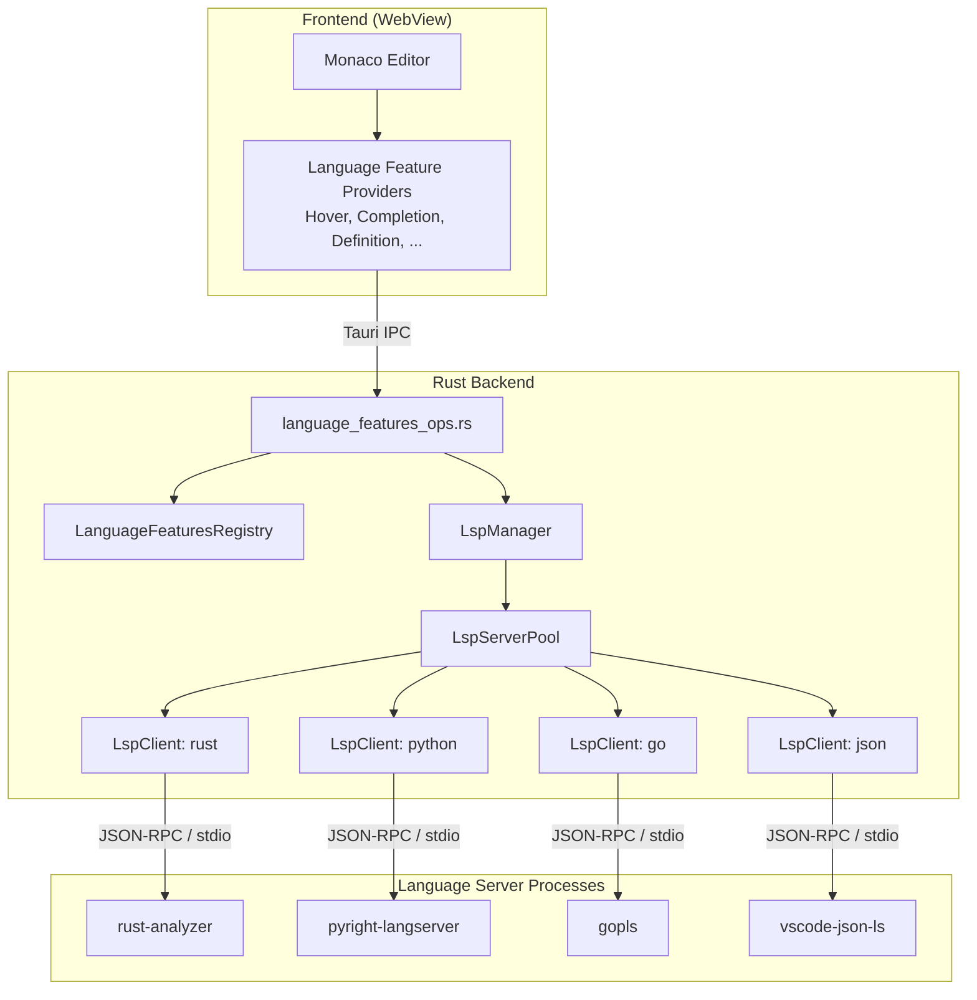
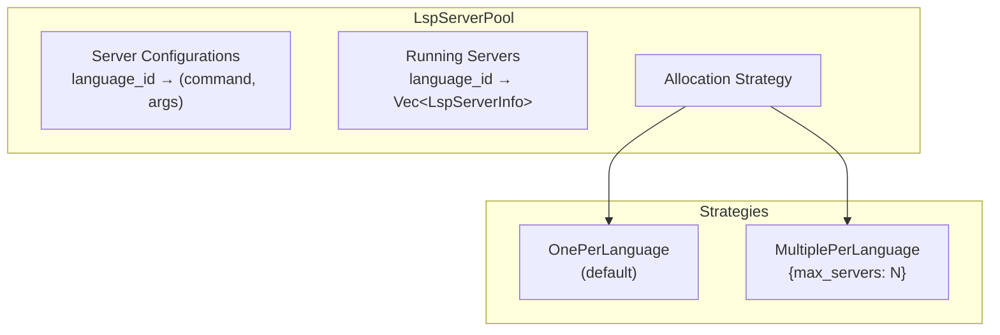
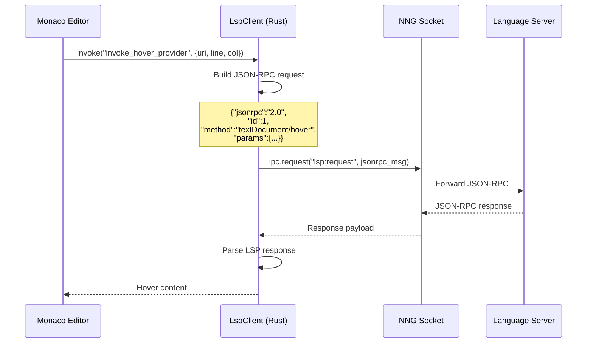
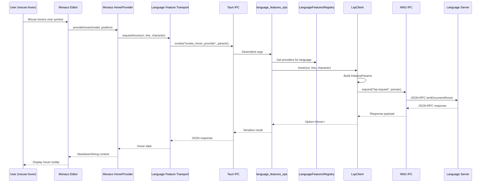

# LSP Integration Architecture

DSCode implements a full **Language Server Protocol (LSP)** client using the `tower-lsp` and `lsp-types` crates. The LSP subsystem manages multiple language server processes, routes requests to the correct server, and bridges JSON-RPC communication through NNG IPC.

---

## Architecture Overview



---

## Multi-Server Management

### LspManager

The `LspManager` is the top-level coordinator. It maintains a map of language IDs to `LspClient` instances and handles server registration and lifecycle:

```rust
pub struct LspManager {
    clients: Arc<Mutex<HashMap<String, Arc<LspClient>>>>,
}

impl LspManager {
    pub async fn register_server(&self, language_id: &str, command: &str, args: Vec<String>) {
        let client = Arc::new(LspClient::new(
            language_id.to_string(),
            command.to_string(),
            args,
        ));
        let mut clients = self.clients.lock().await;
        clients.insert(language_id.to_string(), client);
    }

    pub async fn start_server(&self, language_id: &str) -> Result<(), String> { /* ... */ }
    pub async fn stop_server(&self, language_id: &str) -> Result<(), String> { /* ... */ }
    pub async fn get_client(&self, language_id: &str) -> Option<Arc<LspClient>> { /* ... */ }
}
```

### Default Language Servers

DSCode ships with pre-configured support for common languages:

| Language | Server | Command | Transport |
|---|---|---|---|
| Rust | rust-analyzer | `rust-analyzer` | stdio |
| Python | Pyright | `pyright-langserver --stdio` | stdio |
| Go | gopls | `gopls` | stdio |
| JSON | VS Code JSON LS | `vscode-json-language-server --stdio` | stdio |

```rust
pub async fn register_defaults(&self) {
    self.register_server("python", "pyright-langserver", vec!["--stdio".to_string()]).await;
    self.register_server("rust", "rust-analyzer", vec![]).await;
    self.register_server("go", "gopls", vec![]).await;
    self.register_server("json", "vscode-json-language-server", vec!["--stdio".to_string()]).await;
}
```

!!! info "Lazy Start"
    Language servers are **registered but not started** at application boot. They are started lazily when the first file of that language is opened, keeping cold start times minimal.

---

## LspServerPool

The `LspServerPool` provides advanced server management with load balancing:



### Allocation Strategies

```rust
pub enum LspServerStrategy {
    /// One server per language (default)
    OnePerLanguage,
    /// Multiple servers per language with load balancing
    MultiplePerLanguage { max_servers: usize },
}
```

When using `MultiplePerLanguage`, the pool selects the server with the fewest in-flight requests:

```rust
pub async fn get_server(&self, language_id: &str) -> Result<Arc<LspClient>, String> {
    let servers = self.servers.read().await;
    if let Some(server_list) = servers.get(language_id) {
        if !server_list.is_empty() {
            // Return the server with the least requests (load balancing)
            let min_server = server_list
                .iter()
                .min_by_key(|s| s.request_count)
                .unwrap();
            return Ok(Arc::clone(&min_server.client));
        }
    }
    // No running server -- start one
    self.start_server(language_id).await
}
```

---

## LspClient

Each `LspClient` manages a single language server process and its communication channel:

```rust
pub struct LspClient {
    process: Arc<Mutex<Option<Child>>>,
    ipc: Arc<Mutex<Option<Arc<NngExtensionIpc>>>>,
    language_id: String,
    server_command: String,
    server_args: Vec<String>,
    request_id: Arc<Mutex<u64>>,
    ipc_url: String,  // e.g., "ipc:///tmp/dscode-lsp-rust.ipc"
}
```

### JSON-RPC over NNG Bridge

The `LspClient` bridges standard JSON-RPC 2.0 messages through NNG IPC sockets:



**Request construction:**

```rust
async fn send_request<P: Serialize, R: DeserializeOwned>(
    &self,
    method: &str,
    params: P,
) -> Result<R, String> {
    let id = self.next_request_id();

    let request = serde_json::json!({
        "jsonrpc": "2.0",
        "id": id,
        "method": method,
        "params": params,
    });

    let ipc_guard = self.ipc.lock().await;
    let ipc = ipc_guard.as_ref()
        .ok_or("LSP client not connected via NNG")?;

    let response = ipc.request("lsp:request", request).await?;

    if let Some(result) = response.get("result") {
        serde_json::from_value(result.clone())
            .map_err(|e| format!("Failed to parse LSP response: {}", e))
    } else if let Some(error) = response.get("error") {
        Err(format!("LSP error: {}", error))
    } else {
        Err("Invalid LSP response".to_string())
    }
}
```

---

## Supported LSP Features

### Feature Coverage Table

| LSP Feature | Method | Status | Provider Registration |
|---|---|---|---|
| **Hover** | `textDocument/hover` | Supported | `register_hover_provider` |
| **Completion** | `textDocument/completion` | Supported | `register_completion_provider` |
| **Go to Definition** | `textDocument/definition` | Supported | `register_definition_provider` |
| **Find References** | `textDocument/references` | Supported | `register_references_provider` |
| **Code Actions** | `textDocument/codeAction` | Supported | `register_code_action_provider` |
| **Signature Help** | `textDocument/signatureHelp` | Supported | `register_signature_help_provider` |
| **Code Lens** | `textDocument/codeLens` | Supported | `register_code_lens_provider` |
| **Document Highlights** | `textDocument/documentHighlight` | Supported | `register_document_highlight_provider` |
| **Folding Ranges** | `textDocument/foldingRange` | Supported | `register_folding_range_provider` |
| **Rename** | `textDocument/rename` | Supported | `register_rename_provider` |
| **Document Symbols** | `textDocument/documentSymbol` | Supported | `register_document_symbols_provider` |
| **Workspace Symbols** | `workspace/symbol` | Supported | `register_workspace_symbols_provider` |
| **Document Formatting** | `textDocument/formatting` | Supported | `register_document_formatting_provider` |
| **Range Formatting** | `textDocument/rangeFormatting` | Supported | `register_range_formatting_provider` |
| **On Type Formatting** | `textDocument/onTypeFormatting` | Supported | `register_on_type_formatting_provider` |
| **Semantic Tokens** | `textDocument/semanticTokens` | Supported | `register_semantic_tokens_provider` |
| **Inline Values** | `textDocument/inlineValue` | Supported | `register_inline_values_provider` |
| **Color** | `textDocument/documentColor` | Supported | `register_color_provider` |
| **Selection Range** | `textDocument/selectionRange` | Supported | `register_selection_range_provider` |
| **Linked Editing** | `textDocument/linkedEditingRange` | Supported | `register_linked_editing_range_provider` |
| **Diagnostics** | `textDocument/publishDiagnostics` | Supported | `publish_diagnostics` |
| **Did Open** | `textDocument/didOpen` | Supported | N/A (notification) |
| **Did Change** | `textDocument/didChange` | Supported | N/A (notification) |
| **Did Save** | `textDocument/didSave` | Supported | N/A (notification) |

---

## Request Lifecycle

### Complete Flow: Hover Request



### Client Capabilities

The `LspClient` advertises the following client capabilities during initialization:

```rust
pub async fn initialize(&self, root_uri: Url) -> Result<InitializeResult, String> {
    let params = InitializeParams {
        process_id: Some(std::process::id()),
        root_uri: Some(root_uri),
        capabilities: ClientCapabilities {
            text_document: Some(TextDocumentClientCapabilities {
                hover: Some(HoverClientCapabilities {
                    dynamic_registration: Some(false),
                    content_format: Some(vec![MarkupKind::Markdown, MarkupKind::PlainText]),
                }),
                completion: Some(CompletionClientCapabilities {
                    dynamic_registration: Some(false),
                    completion_item: Some(CompletionItemCapability {
                        snippet_support: Some(true),
                        ..Default::default()
                    }),
                    ..Default::default()
                }),
                definition: Some(GotoCapability {
                    dynamic_registration: Some(false),
                    link_support: Some(false),
                }),
                ..Default::default()
            }),
            ..Default::default()
        },
        ..Default::default()
    };

    self.send_request("initialize", params).await
}
```

---

## Language Server Discovery and Configuration

### Discovery Order

DSCode discovers language servers in the following order:

1. **User settings** (`settings.json` -- highest priority)
2. **Workspace settings** (`.vscode/settings.json`)
3. **Extension contributions** (via `contributes.languages`)
4. **Built-in defaults** (rust-analyzer, pyright, gopls, vscode-json-ls)

### User Configuration

```json
// settings.json
{
    "dscode.languageServer.python.command": "pylsp",
    "dscode.languageServer.python.args": [],
    "dscode.languageServer.typescript.command": "typescript-language-server",
    "dscode.languageServer.typescript.args": ["--stdio"]
}
```

---

## Performance Optimizations

### Connection Pooling with Backoff

Server connections use exponential backoff to handle slow-starting servers:

```rust
let max_attempts = 10;
let mut attempt = 0;
loop {
    attempt += 1;
    let delay = std::cmp::min(100 * 2u64.pow(attempt), 2000); // Cap at 2s
    tokio::time::sleep(Duration::from_millis(delay)).await;

    match NngExtensionIpc::new(&self.ipc_url) {
        Ok(ipc) => {
            *ipc_guard = Some(Arc::new(ipc));
            return Ok(());
        }
        Err(_) if attempt < max_attempts => continue,
        Err(e) => return Err(format!("Failed after {} attempts: {}", max_attempts, e)),
    }
}
```

### Atomic Request IDs

Request IDs use lock-free atomic operations to avoid contention under high-throughput:

```rust
fn next_request_id(&self) -> u64 {
    static ATOMIC_ID: AtomicU64 = AtomicU64::new(1);
    ATOMIC_ID.fetch_add(1, Ordering::Relaxed)
}
```

### Frontend-Side Optimizations

The TypeScript language features layer implements several optimizations:

| Technique | Description |
|---|---|
| **Debouncing** | Hover and completion requests are debounced to prevent rapid-fire calls during typing |
| **Caching** | Recent responses are cached by `(uri, position)` to avoid redundant server round-trips |
| **Cancellation** | Outdated requests are cancelled when the cursor moves before a response arrives |
| **Parallel dispatch** | When multiple providers exist for a language, requests are dispatched in parallel |

!!! tip "Monaco Integration"
    The `src/lib/language-features/` directory contains the full Monaco integration layer, organized into registrars (navigation, editing, formatting, symbol) and provider clients that bridge Monaco's `languages` API to Tauri IPC commands.

---

## Pool Statistics

The `LspServerPool` provides runtime statistics for monitoring:

```rust
pub struct LspPoolStats {
    pub total_servers: usize,    // Total running server instances
    pub total_languages: usize,  // Number of distinct languages served
}

// Query pool stats
let stats = lsp_pool.get_stats().await;
println!("Running {} servers for {} languages", stats.total_servers, stats.total_languages);
```
