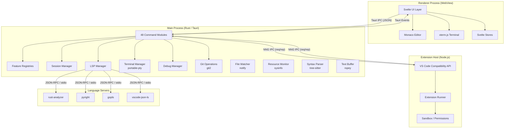
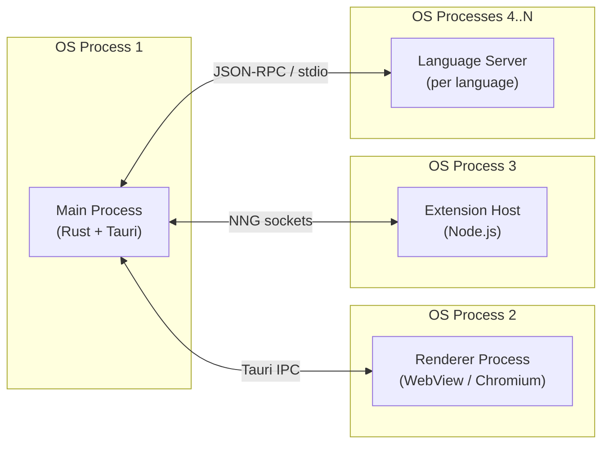
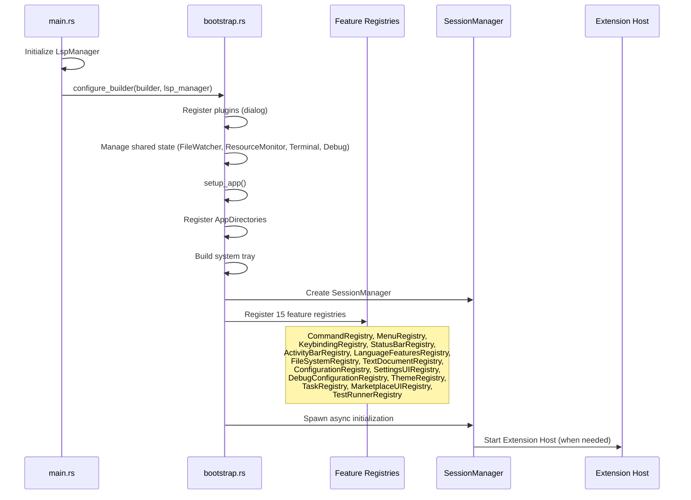

# Architecture Overview

DSCode is a high-performance code editor built as a native desktop application using **Tauri v2** (Rust) for the backend, **Svelte** for the UI layer, and **Monaco Editor** for the code editing experience. This document provides a bird's-eye view of the system design, process model, and technology choices that power DSCode.

---

## High-Level Architecture



---

## Process Model

DSCode operates as a **multi-process architecture** with three primary processes:



| Process | Runtime | Responsibility |
|---|---|---|
| **Main Process** | Rust (Tauri v2) | Core application logic, file I/O, git, terminal PTY, LSP management, extension host supervision, all registries |
| **Renderer Process** | WebView (Chromium) | UI rendering via Svelte, Monaco Editor, xterm.js, user interactions |
| **Extension Host** | Node.js | Runs extensions with VS Code API compatibility, isolated via sandboxing |
| **Language Servers** | Various (per language) | Provide language intelligence (completions, diagnostics, hover, etc.) |

!!! info "Process Isolation"
    Each process runs in its own OS-level address space. The Extension Host is further sandboxed using OS-specific mechanisms: **bubblewrap** on Linux, **sandbox-exec** on macOS, and **Job Objects** on Windows.

---

## Technology Stack

| Layer | Technology | Purpose |
|---|---|---|
| **Backend Runtime** | Rust + Tauri v2 | Native process, system APIs, performance |
| **Frontend Framework** | Svelte | Reactive UI with minimal overhead |
| **Code Editor** | Monaco Editor | Full-featured code editing (same engine as VS Code) |
| **Terminal Emulator** | xterm.js + portable-pty | Integrated terminal with PTY support |
| **IPC (Frontend)** | Tauri IPC (JSON) | Commands and events between WebView and Rust |
| **IPC (Extension Host)** | NNG (nanomsg-next-gen) | High-performance messaging between Rust and Node.js |
| **Serialization** | serde_json / rkyv | JSON for Tauri IPC, zero-copy for NNG (planned) |
| **LSP Client** | tower-lsp + lsp-types | Language Server Protocol integration |
| **Git** | git2 (libgit2) | Native git operations without shelling out |
| **Text Buffer** | ropey | Rope data structure for large file editing |
| **Syntax Parsing** | tree-sitter | Incremental syntax tree parsing |
| **File Watching** | notify | Cross-platform filesystem event monitoring |
| **Search** | grep-searcher + ignore | Ripgrep-based search with .gitignore support |
| **Memory Allocator** | jemalloc (default) / mimalloc | Configurable high-performance allocators |
| **System Monitoring** | sysinfo | CPU, memory, and disk metrics |
| **Security** | keyring, governor | Secret storage, rate limiting |

---

## Design Principles

### 1. Performance-First

Every architectural decision prioritizes speed and resource efficiency:

- **Target cold start time:** <100ms
- **IPC latency:** <1ms round-trip between frontend and backend
- **Memory allocator:** jemalloc by default, with mimalloc and system allocator as options
- **Zero-copy deserialization** via rkyv for NNG messaging (planned)
- **Incremental parsing** with tree-sitter for syntax highlighting

!!! tip "Allocator Selection"
    DSCode defaults to jemalloc but supports compile-time selection:
    ```toml
    [features]
    default = ["jemalloc"]
    jemalloc = ["tikv-jemallocator"]
    mimalloc-allocator = ["mimalloc"]
    system-allocator = []
    ```

### 2. VS Code Compatibility

DSCode aims for maximum compatibility with the VS Code ecosystem:

- **Extension API:** Node.js extension host implements the `vscode` namespace
- **Extension format:** Compatible with `.vsix` packages
- **Configuration files:** Reads `settings.json`, `keybindings.json`, `tasks.json`, `launch.json`
- **Theme format:** Supports VS Code TextMate themes
- **Marketplace:** Compatible with Open VSX Registry

### 3. Native Experience

Unlike Electron-based editors, DSCode leverages native platform capabilities:

- **Native window management** via Tauri (no Electron overhead)
- **System tray integration** with native menus
- **OS-level sandboxing** for extension security
- **Platform-specific optimizations** (conditional compilation with `#[cfg]`)
- **Native file dialogs** via `tauri-plugin-dialog`

### 4. Modular Architecture

The codebase is organized into well-defined modules with clear boundaries:

- **Registry + Ops pattern:** Every feature has a registry (data store) and ops (operations) module
- **Managed state:** Tauri's `app.manage()` provides dependency injection for all registries
- **Async-first:** All I/O operations use `tokio` for non-blocking execution
- **Event-driven:** Communication between processes uses events and message passing

---

## Project Structure

```
dscode/
├── src/                          # Frontend (Svelte + TypeScript)
│   ├── App.svelte                # Root application component
│   ├── components/               # Svelte UI components
│   │   ├── ActivityBar.svelte    # Left-most icon bar
│   │   ├── Sidebar.svelte        # File explorer, search, git, etc.
│   │   ├── EditorArea.svelte     # Monaco editor tabs and panels
│   │   ├── PanelArea.svelte      # Bottom panel (terminal, output, problems)
│   │   ├── StatusBar.svelte      # Bottom status bar
│   │   ├── CommandPalette.svelte # Ctrl+Shift+P command palette
│   │   ├── Terminal.svelte       # xterm.js terminal wrapper
│   │   ├── GitView.svelte        # Git source control panel
│   │   ├── SearchView.svelte     # File search panel
│   │   ├── DebugView.svelte      # Debug session UI
│   │   └── ...                   # 35+ components total
│   ├── lib/                      # Shared TypeScript utilities
│   │   ├── stores.ts             # Svelte stores (global state)
│   │   ├── settings-store.ts     # Settings management
│   │   ├── keybinding-manager.ts # Keyboard shortcut handling
│   │   ├── language-features/    # Monaco language feature providers
│   │   ├── app-shell/            # Application shell controller
│   │   └── contracts/            # Command and event type definitions
│   └── stores/                   # Additional Svelte stores
│       ├── windowPrompt.ts
│       ├── quickPick.ts
│       └── inputBox.ts
│
├── src-tauri/                    # Backend (Rust / Tauri)
│   ├── src/
│   │   ├── main.rs               # Entry point, command handler registration
│   │   ├── bootstrap.rs          # App setup, registry initialization
│   │   ├── config.rs             # Application directories and configuration
│   │   ├── commands/             # 48 command modules (registry + ops pairs)
│   │   │   ├── mod.rs            # Module declarations and re-exports
│   │   │   ├── file_ops.rs       # File read/write/delete operations
│   │   │   ├── git_ops.rs        # Git commands (status, commit, push, etc.)
│   │   │   ├── command_registry.rs
│   │   │   ├── command_ops.rs
│   │   │   └── ...               # See Rust Backend docs for full listing
│   │   ├── extension_host/       # Extension host process management
│   │   │   ├── manager.rs        # Process lifecycle (start, stop, restart)
│   │   │   ├── nng_ipc.rs        # NNG socket communication
│   │   │   ├── nng_manager.rs    # IPC connection management
│   │   │   ├── sandbox.rs        # OS-level sandboxing
│   │   │   ├── permissions.rs    # Capability-based permissions
│   │   │   ├── rate_limiter.rs   # API rate limiting
│   │   │   ├── path_validator.rs # Path access validation
│   │   │   └── secrets.rs        # Secure secret storage (keyring)
│   │   ├── lsp/                  # Language Server Protocol
│   │   │   ├── client.rs         # LSP client (JSON-RPC over NNG)
│   │   │   ├── manager.rs        # Multi-server management
│   │   │   └── pool.rs           # Server pool with load balancing
│   │   ├── terminal/             # Pseudo-terminal management
│   │   ├── debug/                # Debug adapter protocol
│   │   ├── session/              # Session and workspace state
│   │   ├── monitoring/           # System resource monitoring
│   │   ├── marketplace/          # Extension marketplace client
│   │   └── watcher.rs            # File system watcher
│   └── Cargo.toml                # Rust dependencies
│
├── extension-host/               # Extension Host (Node.js)
│   └── src/                      # VS Code API compatibility layer
│
└── documentation/                # MkDocs Material documentation
    ├── mkdocs.yml
    └── docs/
```

---

## Bootstrap Sequence

The application initializes through a well-defined bootstrap sequence:



!!! note "Lazy Initialization"
    Language servers are not started at boot time. They are registered as configurations and started lazily when a file of that language is first opened, keeping cold start times minimal.
