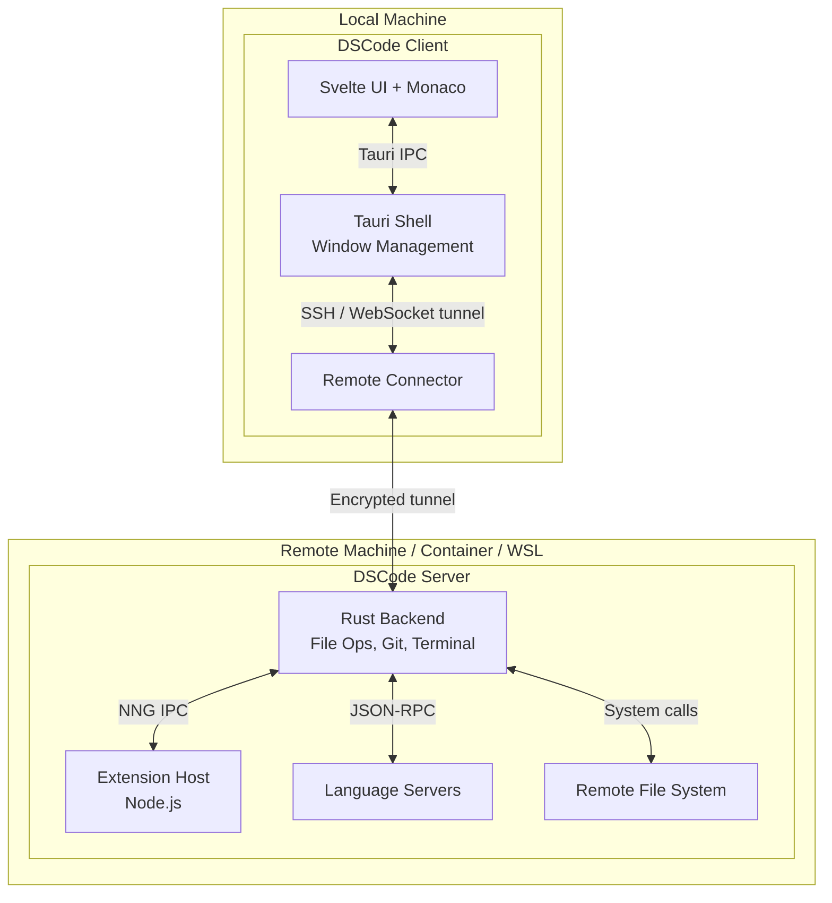
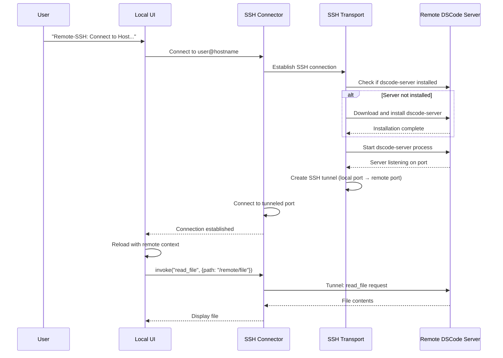
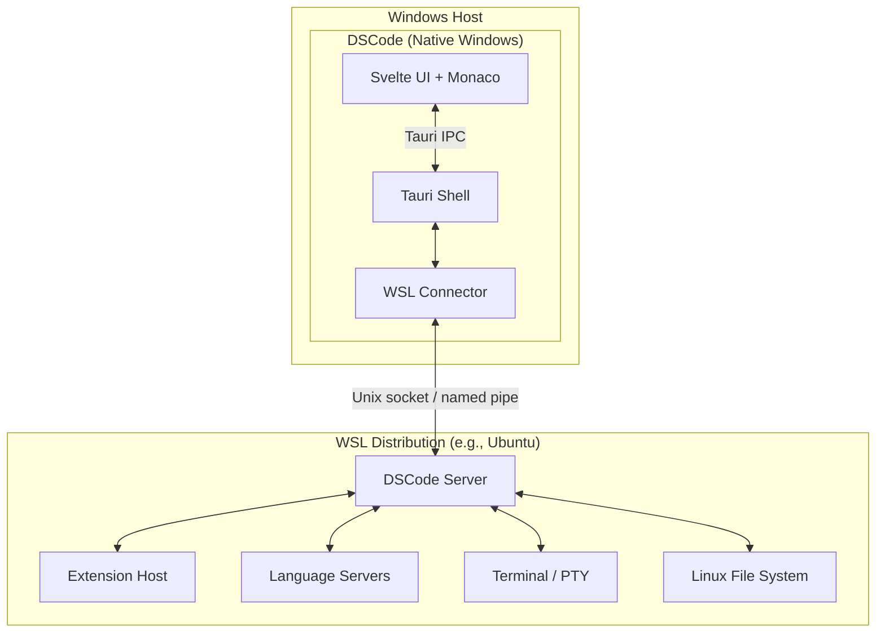
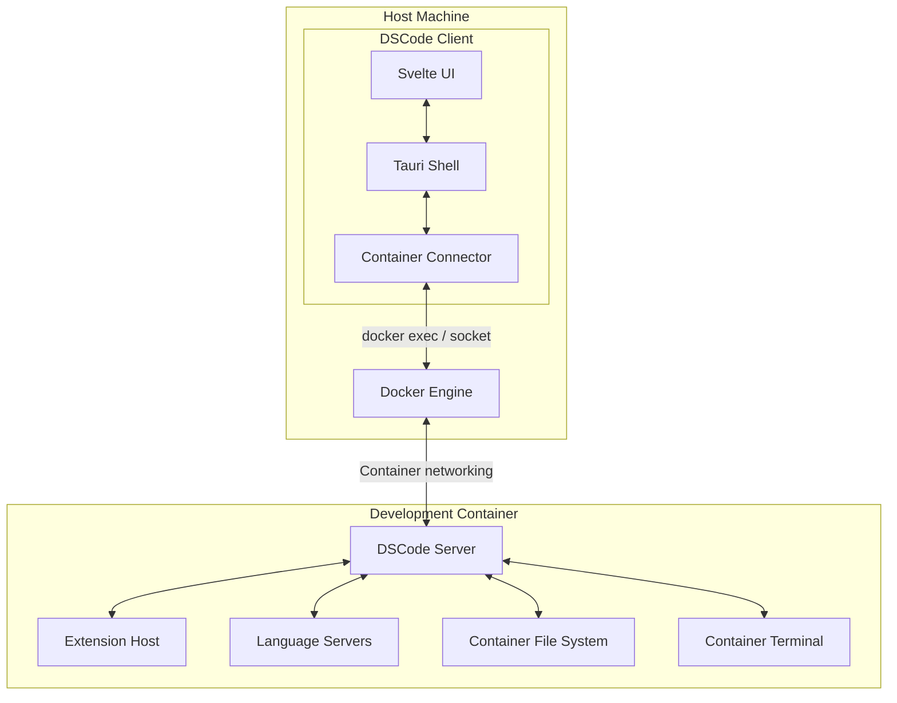
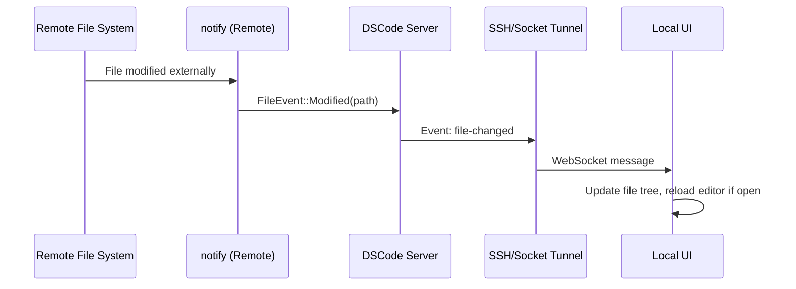
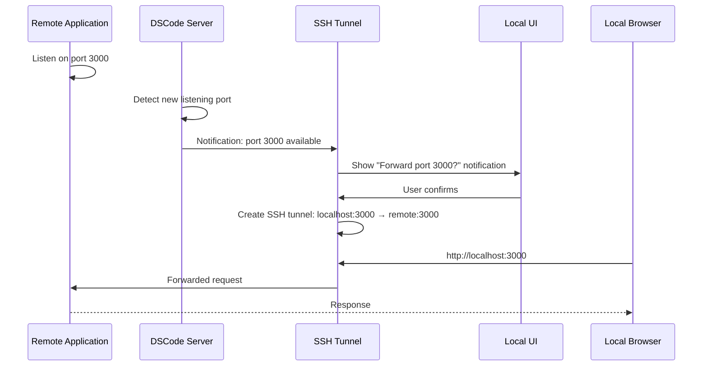
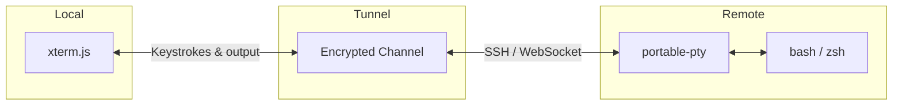

# Remote Development Architecture

DSCode supports remote development scenarios where the UI runs locally while the workspace, file system, terminal, and language services run on a remote machine. This enables development on remote servers, inside containers, and within WSL (Windows Subsystem for Linux).

---

## Architecture Overview



The remote development model follows a **thin client / rich server** pattern:

| Component | Runs Locally | Runs Remotely |
|---|---|---|
| UI (Svelte, Monaco, xterm.js) | Yes | No |
| Window management (Tauri) | Yes | No |
| File operations | No | Yes |
| Git operations | No | Yes |
| Terminal (PTY) | No | Yes |
| Extension Host | No | Yes |
| Language Servers | No | Yes |
| Search | No | Yes |
| Debug Adapter | No | Yes |

---

## SSH Remote Development

### Connection Flow



### SSH Configuration

DSCode reads SSH configuration from standard locations:

- `~/.ssh/config` -- SSH host definitions
- `~/.ssh/known_hosts` -- Host key verification
- SSH agent for key authentication

```
# ~/.ssh/config
Host dev-server
    HostName 192.168.1.100
    User developer
    Port 22
    IdentityFile ~/.ssh/id_ed25519
    ForwardAgent yes
```

!!! tip "SSH Key Authentication"
    DSCode supports SSH key authentication (RSA, Ed25519, ECDSA), password authentication, and SSH agent forwarding. For the best experience, use key-based authentication with an SSH agent.

### Remote Server Component

The `dscode-server` is a lightweight Rust binary that runs on the remote machine:

```
dscode-server
├── File operations (read, write, watch)
├── Git operations (git2)
├── Terminal management (portable-pty)
├── Extension Host (Node.js)
├── Language Servers
├── Search (ripgrep-based)
└── Debug Adapter Host
```

The server communicates with the local client through an encrypted SSH tunnel using the same IPC protocol (JSON messages over the tunnel instead of local Tauri IPC).

---

## WSL Integration

### Architecture (Windows only)



### WSL Connection

Unlike SSH remoting, WSL connections use direct inter-process communication:

1. DSCode detects installed WSL distributions via `wsl.exe --list`
2. The `dscode-server` binary is installed inside the WSL distribution
3. Communication uses a Unix domain socket exposed through WSL interop
4. No SSH tunnel is required, reducing latency

```
# Detect WSL distributions
wsl.exe --list --verbose

# Start DSCode server in WSL
wsl.exe -d Ubuntu -- /home/user/.dscode-server/bin/dscode-server --socket /tmp/dscode-wsl.sock
```

!!! info "File System Access"
    When connected to WSL, file paths use the Linux format (`/home/user/project`) rather than the Windows UNC path (`\\wsl$\Ubuntu\home\user\project`). DSCode handles path translation automatically.

---

## Container / Docker Development

### Dev Container Architecture



### Dev Container Configuration

DSCode reads `.devcontainer/devcontainer.json` for container configuration:

```json
{
    "name": "Rust Development",
    "image": "mcr.microsoft.com/devcontainers/rust:1",
    "features": {
        "ghcr.io/devcontainers/features/node:1": {}
    },
    "forwardPorts": [3000, 8080],
    "postCreateCommand": "cargo build",
    "customizations": {
        "dscode": {
            "extensions": [
                "rust-lang.rust-analyzer",
                "vadimcn.vscode-lldb"
            ],
            "settings": {
                "editor.fontSize": 14
            }
        }
    }
}
```

### Container Lifecycle

| Phase | Action |
|---|---|
| **Build** | Build Docker image from Dockerfile or pull pre-built image |
| **Create** | Create container with volume mounts and port forwards |
| **Install Server** | Install `dscode-server` in the container |
| **Start Server** | Launch the DSCode server process |
| **Connect** | Establish communication channel |
| **Install Extensions** | Install workspace-recommended extensions in the container |
| **Ready** | UI reconnects to the container backend |

---

## File Synchronization

### Strategy

DSCode uses a **remote-first** file system approach rather than file synchronization:

| Approach | Description | Used When |
|---|---|---|
| **Direct remote access** | All file operations are performed on the remote machine | SSH, WSL, Container |
| **Watched sync** | File watcher on remote, changes streamed to local cache | Slow network connections |
| **Volume mount** | Docker volume mounts bind host directories into container | Container development |

### File Watcher on Remote



---

## Port Forwarding

DSCode automatically detects and forwards ports from the remote environment:

### Automatic Port Detection

When a process on the remote machine starts listening on a port, DSCode detects it and offers to forward:



### Port Forwarding Configuration

```json
// .devcontainer/devcontainer.json or settings.json
{
    "forwardPorts": [3000, 8080, 5432],
    "portsAttributes": {
        "3000": {
            "label": "Web App",
            "onAutoForward": "openBrowser"
        },
        "5432": {
            "label": "PostgreSQL",
            "onAutoForward": "silent"
        }
    }
}
```

---

## Terminal Forwarding

Remote terminals run on the remote machine with output streamed to the local xterm.js:



Terminal features preserved in remote mode:

- Full PTY emulation (colors, cursor movement, alternate screen)
- Terminal resize propagation
- Multiple concurrent terminals
- Shell integration (command detection, working directory tracking)
- Copy/paste support

!!! warning "Latency Considerations"
    Remote terminal sessions are subject to network latency. For SSH connections, typical latency is 10-50ms per keystroke round-trip. DSCode implements local echo prediction to reduce perceived latency for typing.

---

## Security

### SSH Transport Security

- All communication is encrypted via the SSH tunnel
- Host key verification prevents MITM attacks
- SSH agent forwarding is supported but optional
- No credentials are stored on disk (delegated to SSH agent or OS keychain)

### Container Security

- The DSCode server runs as a non-root user inside containers when possible
- Container network isolation limits exposure
- Volume mounts are read-only by default unless explicitly configured
- Extension Host sandboxing applies within the container

### WSL Security

- WSL interop uses the host's security context
- File permissions follow Linux semantics within WSL
- Network access shares the host's network stack
