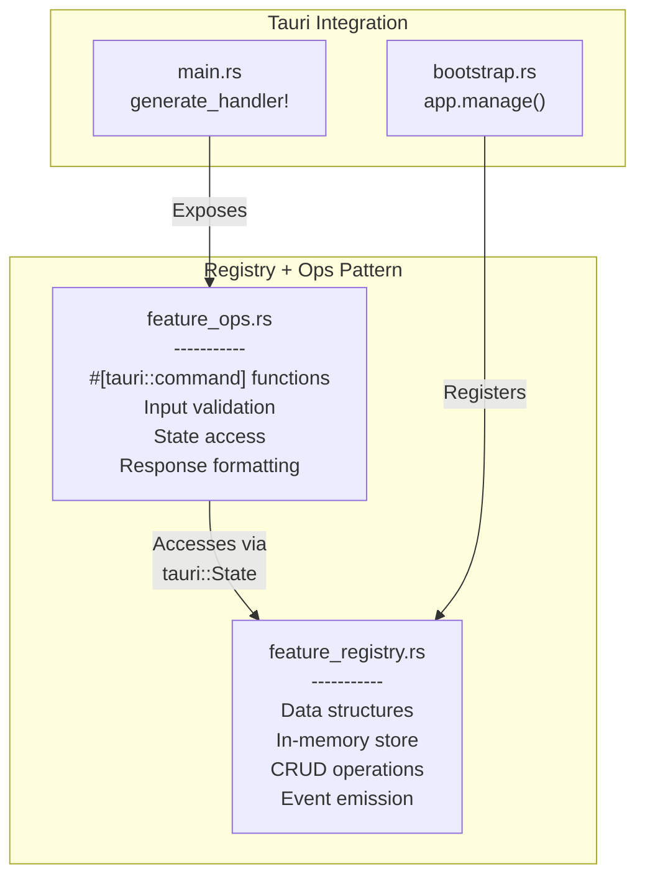

# Rust Backend Architecture

The DSCode Rust backend is the core of the application, built on **Tauri v2** and organized into 48 command modules following a consistent **registry + ops** pattern. This document catalogs every module, explains the architectural patterns, and lists key dependencies.

---

## Command Module Organization

The backend follows a strict two-module pattern for each feature domain:



**Registry modules** own the data. They contain:

- Data structures (structs, enums)
- An in-memory store (typically `HashMap` behind `Mutex` or `RwLock`)
- Methods to create, read, update, and delete entries
- Event emission to notify the frontend of changes

**Ops modules** expose the API. They contain:

- `#[tauri::command]` annotated functions
- Input validation and argument parsing
- Access to the registry via `tauri::State<T>`
- Error handling and response formatting

!!! note "Naming Convention"
    Standalone modules that do not follow the registry+ops pair (such as `app.rs`, `monitoring.rs`, `secrets_ops.rs`) handle features that do not require a persistent registry.

---

## Complete Module Catalog

### Core Operations (10 modules)

These modules handle fundamental application operations that do not use the registry pattern:

| Module | Type | Description |
|---|---|---|
| `file_ops.rs` | Ops | File system operations: read, write, create, delete, rename, directory listing, directory tree, language detection |
| `git_ops.rs` | Ops | Git operations via `git2`: status, commit, stage, unstage, push, pull, fetch, branch management, stash, log, diff, discard |
| `app.rs` | Ops | Application-level commands: version info, platform detection |
| `extension_ops.rs` | Ops | Extension management: install, uninstall, list, get contributions, marketplace search, tree view integration |
| `monitoring.rs` | Ops | System resource metrics: CPU, memory, disk usage via `sysinfo` |
| `terminal_ops.rs` | Ops | Terminal lifecycle: create, write, resize, close, list, terminal profiles, ready signals |
| `window_ops.rs` | Ops | Window management: minimize to tray, restore, visibility, message actions, quick pick, input box |
| `debug_ops.rs` | Ops | Debug session management: create, start, pause, continue, stop, step over/into/out, breakpoint management |
| `search_ops.rs` | Ops | File content search and replace using ripgrep-based libraries |
| `session_ops.rs` | Ops | Session lifecycle: initialize, get state, extension loading/unloading, workspace folder management, editor state |
| `secrets_ops.rs` | Ops | Secure secret storage: get, store, delete, check existence via `keyring` |

### Command System (3 modules)

| Module | Type | Description |
|---|---|---|
| `command_registry.rs` | Registry | Central command registry. Stores all registered commands (built-in and extension-contributed) with metadata. Supports search, filtering, and event emission on registration changes. |
| `command_ops.rs` | Ops | Exposes command CRUD: `get_all_commands`, `search_commands`, `get_command`, `register_command`, `unregister_command` |
| `extension_menu_parser.rs` | Parser | Parses extension `package.json` `contributes.menus` and `contributes.commands` sections, registers them into the command and menu registries |

### Menu System (3 modules)

| Module | Type | Description |
|---|---|---|
| `menu_registry.rs` | Registry | Stores menu items organized by location (editor/title, editor/context, view/title, etc.). Supports filtering by location and `when` clause evaluation. |
| `menu_ops.rs` | Ops | Menu item CRUD: `get_menu_items`, `get_menu_items_filtered`, `register_menu_item`, `register_menu_items`, `get_menu_locations` |
| `extension_menu_parser.rs` | Parser | Shared with Command System -- parses and registers extension menu contributions |

### Keybinding System (3 modules)

| Module | Type | Description |
|---|---|---|
| `keybinding_registry.rs` | Registry | Stores keybinding definitions with platform-aware key resolution (Mac vs Linux vs Windows). Supports lookup by key combo or by command ID. |
| `keybinding_ops.rs` | Ops | Keybinding CRUD: `get_all_keybindings`, `get_keybindings_for_key`, `get_keybindings_for_command`, `register_keybinding`, `register_keybindings`, `get_platform` |
| `extension_keybinding_parser.rs` | Parser | Parses extension `package.json` `contributes.keybindings` and registers them |

### Status Bar (2 modules)

| Module | Type | Description |
|---|---|---|
| `status_bar_registry.rs` | Registry | Manages status bar items with priority-based ordering, alignment (left/right), visibility toggling, and tooltip support |
| `status_bar_ops.rs` | Ops | Status bar CRUD: `create_status_bar_item`, `update_status_bar_item`, `show/hide_status_bar_item`, `dispose_status_bar_item`, `get_status_bar_items`, `clear_status_bar_items` |

### Activity Bar (2 modules)

| Module | Type | Description |
|---|---|---|
| `activity_bar_registry.rs` | Registry | Manages the left-side activity bar icons with badge counts, visibility, and ordering |
| `activity_bar_ops.rs` | Ops | Activity bar CRUD: `register_activity_bar_item`, `update_activity_bar_badge`, `show/hide_activity_bar_item`, `dispose_activity_bar_item`, `get_activity_bar_items` |

### Language Features (2 modules)

| Module | Type | Description |
|---|---|---|
| `language_features_registry.rs` | Registry | Central registry for all language intelligence providers: hover, completion, definition, references, code actions, signature help, code lens, document highlights, folding ranges, rename, diagnostics, document/workspace symbols, formatting, semantic tokens, inline values, color, selection ranges, linked editing ranges |
| `language_features_ops.rs` | Ops | Provider registration (20+ register commands), provider invocation (`invoke_hover_provider`, `invoke_definition_provider`, etc.), diagnostics management (`publish_diagnostics`, `get_diagnostics`, `clear_diagnostics`), and language activation triggers |

### Workspace (2 modules)

| Module | Type | Description |
|---|---|---|
| `workspace_registry.rs` | Registry | Manages workspace folders, workspace configuration, file decorations, file search, and text search capabilities |
| `workspace_ops.rs` | Ops | Workspace operations: `get_workspace_folders`, `workspace_add/remove_folder`, `get/update_workspace_configuration`, `register_file_decoration_provider`, `workspace_find_files`, `workspace_find_text` |

### File System (2 modules)

| Module | Type | Description |
|---|---|---|
| `filesystem_registry.rs` | Registry | Virtual file system provider registry. Supports custom file system schemes, file watchers, and workspace edits |
| `filesystem_ops.rs` | Ops | FS operations: `fs_read_file`, `fs_write_file`, `fs_stat`, `fs_read_directory`, `fs_create_directory`, `fs_delete`, `fs_rename`, `fs_copy`, file system provider management, file watcher management, `apply_workspace_edit` |

### Text Document (2 modules)

| Module | Type | Description |
|---|---|---|
| `textdocument_registry.rs` | Registry | Tracks open text documents, text editors, editor selections, visible ranges, decoration types, and text edits |
| `textdocument_ops.rs` | Ops | Document management: `register/unregister_text_document`, `update_text_document`, `mark_document_saved`, text editor management, decoration types, `apply_text_edits` |

### Configuration (2 modules)

| Module | Type | Description |
|---|---|---|
| `configuration_registry.rs` | Registry | Hierarchical configuration system with schema validation. Supports settings.json and workspace-level configuration with fallback chains. |
| `configuration_ops.rs` | Ops | Configuration CRUD: `set_settings/workspace_path`, `register_configuration_schema`, `get/update_configuration_value`, `get_configuration_with_fallback`, `get_all_configuration_keys` |

### Debug Configuration (2 modules)

| Module | Type | Description |
|---|---|---|
| `debug_configuration_registry.rs` | Registry | Stores debug configuration providers, debug adapter descriptor factories, and launch configurations (from `launch.json`) |
| `debug_configuration_ops.rs` | Ops | Debug config management: `register/unregister_debug_configuration_provider`, `register/unregister_debug_adapter_descriptor_factory`, `set/get_launch_configuration` |

### Theme System (2 modules)

| Module | Type | Description |
|---|---|---|
| `theme_registry.rs` | Registry | Manages color themes, icon themes, and product icon themes. Tracks active themes and supports theme switching with event emission. |
| `theme_ops.rs` | Ops | Theme CRUD: `register/unregister_color_theme`, `set/get_active_color_theme`, icon theme and product icon theme management, `get_theme_settings` |

### Task System (2 modules)

| Module | Type | Description |
|---|---|---|
| `task_registry.rs` | Registry | Task provider registry and task execution tracking. Supports custom task providers (e.g., npm, cargo) and task lifecycle management. |
| `task_ops.rs` | Ops | Task management: `register/unregister_task_provider`, `start/update/end_task_execution`, terminal profile management for task terminals |

### Settings UI (2 modules)

| Module | Type | Description |
|---|---|---|
| `settings_ui_registry.rs` | Registry | UI-specific settings management. Categories, schemas, search, validation, and effective value computation with scope resolution (user vs workspace). |
| `settings_ui_ops.rs` | Ops | Settings UI: `register_settings_category`, `register_setting_ui_schema`, `search_settings`, `get_settings_by_category`, `get/update/reset/validate_setting_value` |

### Marketplace UI (2 modules)

| Module | Type | Description |
|---|---|---|
| `marketplace_ui_registry.rs` | Registry | Extension marketplace UI state: featured extensions, categories, reviews, ratings, recommendations, update notifications |
| `marketplace_ui_ops.rs` | Ops | Marketplace UI: `set/get_featured_extensions`, `add/get_extension_reviews`, `add/get_extension_recommendations`, `generate_recommendations`, update notifications, `search_marketplace_extensions` |

### Test Runner (2 modules)

| Module | Type | Description |
|---|---|---|
| `test_runner_registry.rs` | Registry | Test suite and test run management. Stores test suites, test results, coverage data, and validates API usage. |
| `test_runner_ops.rs` | Ops | Test runner: `register_test_suite`, `start/complete_test_run`, `update_test_result`, `update/get_coverage`, `validate_api_usage` |

---

## Module Dependency Graph

```mermaid
graph TD
    Main[main.rs] --> Bootstrap[bootstrap.rs]
    Main --> Commands[commands/mod.rs]
    Bootstrap --> Session[session/]
    Bootstrap --> Registries[15 Feature Registries]
    Bootstrap --> LSP[lsp/]
    Bootstrap --> Terminal[terminal/]
    Bootstrap --> Debug[debug/]
    Bootstrap --> Monitor[monitoring/]
    Bootstrap --> Watcher[watcher.rs]

    Commands --> FileOps[file_ops]
    Commands --> GitOps[git_ops]
    Commands --> ExtOps[extension_ops]
    Commands --> CmdReg[command_registry + ops]
    Commands --> MenuReg[menu_registry + ops]
    Commands --> KBReg[keybinding_registry + ops]
    Commands --> SBReg[status_bar_registry + ops]
    Commands --> ABReg[activity_bar_registry + ops]
    Commands --> LFReg[language_features_registry + ops]
    Commands --> WSReg[workspace_registry + ops]
    Commands --> FSReg[filesystem_registry + ops]
    Commands --> TDReg[textdocument_registry + ops]
    Commands --> CfgReg[configuration_registry + ops]
    Commands --> DbgCfg[debug_configuration_registry + ops]
    Commands --> ThemeReg[theme_registry + ops]
    Commands --> TaskReg[task_registry + ops]
    Commands --> SettReg[settings_ui_registry + ops]
    Commands --> MktReg[marketplace_ui_registry + ops]
    Commands --> TestReg[test_runner_registry + ops]
    Commands --> Secrets[secrets_ops]
```



---

## Key Dependencies

| Crate | Version | Purpose |
|---|---|---|
| `tauri` | 2.1 | Application framework, window management, IPC |
| `tauri-plugin-dialog` | 2.0 | Native file/folder/message dialogs |
| `tokio` | 1.x (full) | Async runtime for all I/O operations |
| `serde` / `serde_json` | 1.0 | JSON serialization for IPC and configuration |
| `git2` | 0.18 | Native git operations via libgit2 bindings |
| `tower-lsp` | 0.20 | Language Server Protocol client framework |
| `lsp-types` | 0.94 | LSP type definitions |
| `ropey` | 1.6 | Rope data structure for efficient text editing |
| `tree-sitter` | 0.20 | Incremental syntax tree parsing |
| `portable-pty` | 0.8 | Cross-platform pseudo-terminal creation |
| `nng` | 1.0 | NNG (nanomsg) IPC sockets for extension host |
| `notify` | 6.1 | Cross-platform file system event watching |
| `ignore` | 0.4 | .gitignore-aware file traversal (from ripgrep) |
| `grep-searcher` | 0.1 | Content search engine (from ripgrep) |
| `grep-regex` | 0.1 | Regex matching for search |
| `sysinfo` | 0.30 | System resource monitoring (CPU, memory, disk) |
| `keyring` | 2.3 | OS keychain integration for secret storage |
| `governor` | 0.6 | Rate limiting for extension API calls |
| `reqwest` | 0.11 | HTTP client for marketplace API calls |
| `zip` | 2.1 | VSIX extension package extraction |
| `chrono` | 0.4 | Date/time handling for logs and sessions |
| `uuid` | 1.0 | Unique identifier generation |
| `tikv-jemallocator` | 0.5 | jemalloc memory allocator (default) |
| `mimalloc` | 0.1 | mimalloc memory allocator (optional) |
| `which` | 6.0 | Executable path resolution (for sandbox, node) |
| `libc` | 0.2 | POSIX system calls for sandboxing |
| `anyhow` / `thiserror` | 1.0 | Error handling |

---

## State Management

All registries are registered as **Tauri managed state** during bootstrap, making them available to any command handler via dependency injection:

```rust
// bootstrap.rs -- registering state
fn register_feature_registries(app: &mut tauri::App<Wry>) {
    let app_handle = app.handle().clone();

    app.manage(CommandRegistry::new(app_handle.clone()));
    app.manage(MenuRegistry::new(app_handle.clone()));
    app.manage(KeybindingRegistry::new(app_handle.clone()));
    app.manage(StatusBarRegistry::new(app_handle.clone()));
    app.manage(ActivityBarRegistry::new(app_handle.clone()));
    app.manage(LanguageFeaturesRegistry::new(app_handle.clone()));
    // ... 15 registries total
}
```

```rust
// Command handler accessing managed state
#[tauri::command]
async fn get_all_commands(
    registry: tauri::State<'_, CommandRegistry>,
) -> Result<Vec<CommandInfo>, String> {
    Ok(registry.get_all())
}
```

!!! tip "Thread Safety"
    All registries use `Arc<Mutex<_>>` or `Arc<RwLock<_>>` internally for thread-safe access from multiple async command handlers. Read-heavy registries (like `LspServerPool`) prefer `RwLock` for better concurrent read performance.

---

## Async Patterns

The backend uses several async patterns consistently:

### Spawn Blocking for CPU/IO-Bound Work

```rust
// NNG socket operations are blocking -- offload from async runtime
let result = tokio::task::spawn_blocking(move || {
    let sock = socket.blocking_lock();
    sock.send(data.as_bytes())
}).await?;
```

### Background Task Spawning

```rust
// Session initialization runs in background
fn start_session_initialization(session_manager: Arc<RwLock<SessionManager>>) {
    tauri::async_runtime::spawn(async move {
        if let Err(error) = session_manager.read().await.initialize().await {
            eprintln!("[App] Failed to initialize session: {error}");
        }
    });
}
```

### Exponential Backoff for Retries

```rust
// LSP server connection with exponential backoff
let max_attempts = 10;
let mut attempt = 0;
loop {
    attempt += 1;
    let delay = std::cmp::min(100 * 2u64.pow(attempt), 2000);
    tokio::time::sleep(Duration::from_millis(delay)).await;

    match NngExtensionIpc::new(&self.ipc_url) {
        Ok(ipc) => return Ok(ipc),
        Err(_) if attempt < max_attempts => continue,
        Err(e) => return Err(format!("Failed after {} attempts: {}", max_attempts, e)),
    }
}
```
