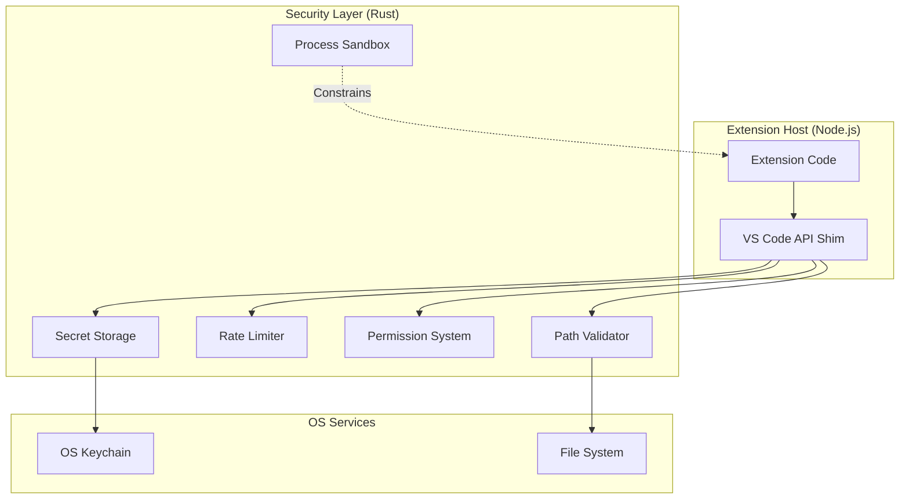

# Security Architecture

DSCode implements a multi-layered security model to protect users from malicious or misbehaving extensions. The security infrastructure spans path validation, process sandboxing, API rate limiting, secret storage, and a capability-based permission system.

---

## Overview



Every API call from an extension passes through the security layer in the Rust backend before reaching system resources. This ensures that extensions cannot bypass security checks regardless of how they access the API.

---

## Path Validation

**Source:** `src-tauri/src/extension_host/path_validator.rs`

The `PathValidator` restricts file system access to registered workspace folders, preventing path traversal attacks and unauthorized file access.

### How It Works

1. When a workspace folder is opened, it is registered with the `PathValidator`.
2. Every file operation request from an extension includes a file path.
3. The `PathValidator` canonicalizes the path and checks that it falls within a registered workspace folder.
4. Requests targeting paths outside the workspace are rejected with an error.

### Protections

| Attack | Protection |
|--------|-----------|
| Path traversal (`../../etc/passwd`) | Canonicalization resolves `..` before validation |
| Symbolic link escape | Symlink targets are resolved and validated |
| Null byte injection | Paths containing null bytes are rejected |
| Absolute path outside workspace | Only paths under registered workspace roots are allowed |

### Git Path Validation

Git operations receive additional path validation. The `git_ops` module validates that repository paths point to actual Git repositories within the workspace before performing any operations. Branch names are validated against Git's naming rules to prevent injection through branch operations.

!!! note
    The `PathValidator` does not currently support unregistering workspace folders. When a folder is removed from the workspace, its path remains in the validator's allow-list for the duration of the session. This is an acceptable trade-off -- it permits slightly broader access but avoids race conditions during folder removal.

---

## Extension Sandboxing

**Source:** `src-tauri/src/extension_host/sandbox.rs`

The extension host process runs inside an OS-level sandbox that restricts its access to system resources beyond what the DSCode API provides.

### Platform-Specific Implementations

| Platform | Technology | Restrictions |
|----------|-----------|-------------|
| **Linux** | seccomp-bpf | Restricted syscalls, limited file system access, no network bind |
| **macOS** | App Sandbox (sandbox-exec) | Restricted file access, no hardware access, controlled network |
| **Windows** | Job Objects | Memory limits, process count limits, restricted handles |

### Sandbox Capabilities

The sandbox allows the extension host to:

- Read and write files within validated workspace paths (via the DSCode API)
- Make outbound network connections (HTTP/HTTPS) if the extension has network permissions
- Spawn child processes for language servers and build tools (with restrictions)
- Access the DSCode IPC channel (NNG socket)

The sandbox blocks:

- Direct file system access outside the workspace
- Listening on network ports (server sockets)
- Accessing hardware devices
- Modifying system configuration
- Spawning unrestricted child processes

---

## Rate Limiting

**Source:** `src-tauri/src/extension_host/rate_limiter.rs`

The `RateLimiter` prevents extensions from overwhelming the system with excessive API calls. It uses a **token bucket** algorithm via the `governor` crate.

### Configuration

| Parameter | Default | Description |
|-----------|---------|-------------|
| Requests per second | 100 | Maximum sustained API call rate per extension |
| Burst capacity | 100 | Maximum burst size (tokens in the bucket) |

### How It Works

```rust
pub struct RateLimiter {
    limiters: Arc<Mutex<HashMap<String, Arc<GovernorRateLimiter<...>>>>>,
    default_quota: Quota,  // 100 requests per second
}
```

1. Each extension gets its own independent rate limiter, identified by `extension_id`.
2. When an API call is made, `check_rate_limit(extension_id)` is called.
3. If the token bucket has available tokens, the request proceeds.
4. If the bucket is empty, the request is rejected with: *"Rate limit exceeded for extension 'X'. Please slow down."*
5. Tokens refill at the configured rate (100/second by default).

### Per-Extension Isolation

Rate limits are enforced independently per extension. One extension exhausting its quota does not affect other extensions. When an extension is unloaded, its rate limiter is removed via `remove_limiter()`.

---

## Secret Storage

**Source:** `src-tauri/src/extension_host/secrets.rs`

The `SecretStorage` module provides secure storage for extension secrets (API tokens, passwords, credentials) using the operating system's native keychain.

### Backend

| Platform | Keychain Service |
|----------|-----------------|
| **macOS** | Keychain Services |
| **Linux** | Secret Service (GNOME Keyring / KWallet) |
| **Windows** | Credential Manager |

All secrets are stored under the service name `com.dscode.secrets` via the `keyring` crate.

### API

```rust
pub struct SecretStorage {
    cache: Mutex<HashMap<String, String>>,  // In-memory cache
}

impl SecretStorage {
    pub fn get(&self, extension_id: &str, key: &str) -> Result<Option<String>, String>;
    pub fn set(&self, extension_id: &str, key: &str, value: &str) -> Result<(), String>;
    pub fn delete(&self, extension_id: &str, key: &str) -> Result<(), String>;
    pub fn delete_all_for_extension(&self, extension_id: &str) -> Result<(), String>;
}
```

### Namespacing

Secrets are namespaced by extension ID using the format `extension_id:key`. This prevents extensions from reading each other's secrets. For example, an extension `github.vscode-pull-request-github` storing a key `oauth_token` results in the keychain entry `github.vscode-pull-request-github:oauth_token`.

### Caching

`SecretStorage` maintains an in-memory cache for performance. The cache is populated on first access and invalidated on writes or deletes. This avoids repeated keychain lookups for frequently accessed secrets.

---

## Permission System

**Source:** `src-tauri/src/extension_host/permissions.rs`

DSCode implements a capability-based permission system. Extensions declare their required permissions in their manifest, and users can review and approve them.

### Permission Categories

| Category | Permissions | Description |
|----------|------------|-------------|
| **File System** | `fileSystem.read`, `fileSystem.write`, `fileSystem.delete` | Access to workspace files |
| **Workspace** | `workspace.read`, `workspace.write`, `workspace.execute` | Workspace configuration and task execution |
| **Network** | `network.http`, `network.https`, `network.webSocket` | Outbound network access |
| **Clipboard** | `clipboard.read`, `clipboard.write` | System clipboard access |
| **Secrets** | `secrets.read`, `secrets.write` | Secure secret storage |
| **UI** | `ui.notifications`, `ui.dialogs`, `ui.quickPick` | User interface elements |
| **Editor** | `textEditor.read`, `textEditor.write`, `textEditor.selection` | Text editor manipulation |
| **Debug** | `debug.start`, `debug.stop`, `debug.breakpoints` | Debug session control |
| **Terminal** | `terminal.create`, `terminal.send` | Terminal access |
| **Tasks** | `tasks.execute` | Task execution |
| **Commands** | `commands.execute` | Command execution |
| **Authentication** | `authentication.getSession`, `authentication.createSession` | Authentication providers |

### Permission Resolution

```rust
pub struct ExtensionPermissions {
    extension_id: String,
    granted_permissions: HashSet<Permission>,
}

impl ExtensionPermissions {
    pub fn check_permission(&self, permission: &Permission) -> Result<(), String>;
    pub fn from_manifest(extension_id: String, manifest_permissions: Option<Vec<String>>) -> Result<Self, String>;
}
```

1. When an extension is installed, its `package.json` permissions are parsed via `from_manifest()`.
2. Permissions are stored as a `HashSet<Permission>` for O(1) lookup.
3. Before any privileged API call, `check_permission()` verifies the extension has the required permission.
4. If the permission is missing, the call is rejected with an error naming the extension and missing permission.

### Default Permissions

Extensions with no declared permissions receive an empty permission set. They can still use basic APIs (command registration, UI notifications) but cannot access the file system, network, or other privileged resources.

---

## Security Best Practices for Extension Authors

1. **Declare minimal permissions** -- Only request the permissions your extension actually needs.
2. **Use `SecretStorage`** -- Never store tokens or passwords in settings or files. Use the `vscode.SecretStorage` API.
3. **Validate inputs** -- Sanitize all user inputs, especially file paths and URLs.
4. **Handle errors gracefully** -- Do not expose internal paths or sensitive information in error messages.
5. **Use HTTPS** -- Always use HTTPS for network requests. The permission system distinguishes between HTTP and HTTPS.

---

## See Also

- [Architecture Overview](overview.md) -- system design and process model
- [Extension System](extension-system.md) -- extension host architecture
- [Extension Development: Getting Started](../extension-development/getting-started.md) -- building extensions
