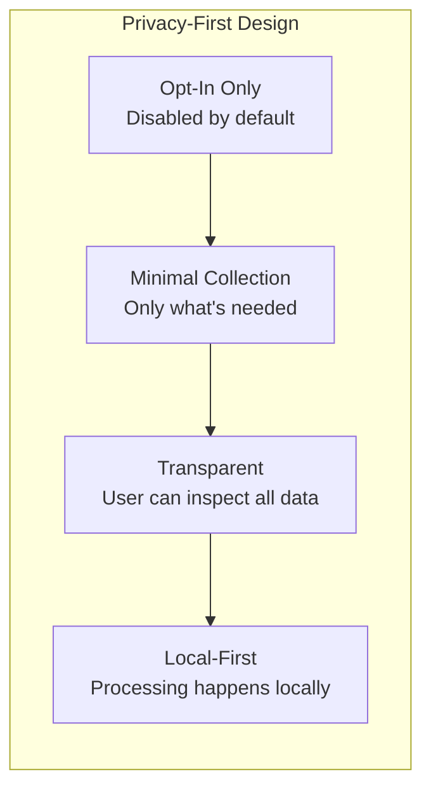
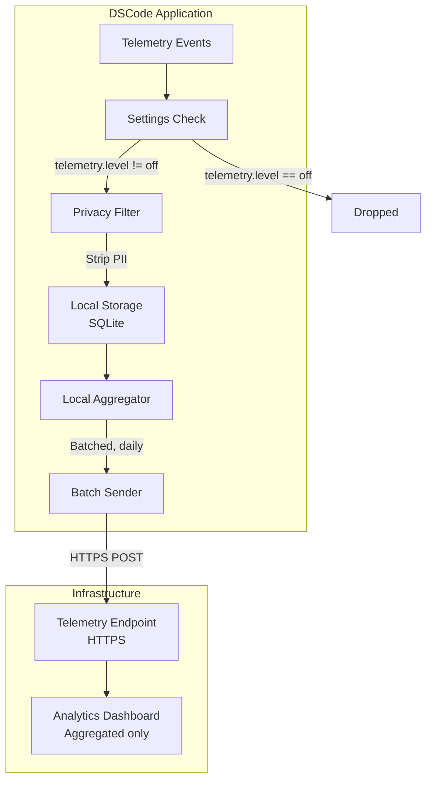
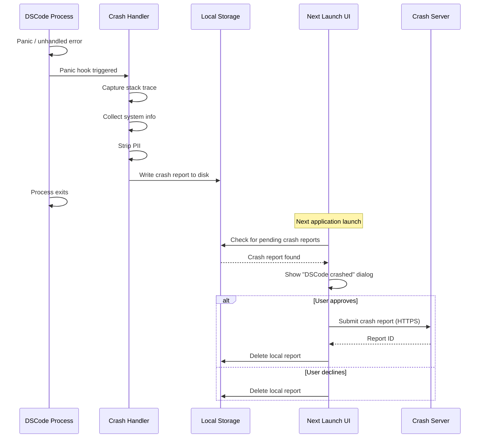

# Telemetry and Privacy

DSCode follows a **privacy-first** approach to telemetry. All data collection is opt-in, minimal, and transparent. This document describes what data is collected, what is explicitly not collected, how the system works, and how users maintain full control.

---

## Design Principles



1. **Opt-in by default:** Telemetry is completely disabled until the user explicitly enables it
2. **Minimal data:** Only collect data that directly improves the product
3. **No personal data:** Never collect file contents, personal information, or browsing history
4. **Transparent:** Users can view exactly what data would be sent before enabling
5. **Local processing:** Aggregate analytics locally whenever possible
6. **Easy opt-out:** Telemetry can be disabled at any time with immediate effect

---

## Telemetry Settings

### Configuration

Telemetry is controlled through the settings system:

```json
// settings.json
{
    "dscode.telemetry.level": "off",
    "dscode.telemetry.crashReports": false,
    "dscode.telemetry.performanceMetrics": false
}
```

### Telemetry Levels

| Level | Description | Data Collected |
|---|---|---|
| `off` | **No telemetry** (default) | Nothing. No network requests are made. |
| `crash` | Crash reports only | Stack traces, OS version, DSCode version |
| `error` | Crash reports + error telemetry | Above + unhandled errors, error frequency |
| `all` | Full telemetry | Above + feature usage, performance metrics |

!!! success "Default: Off"
    DSCode ships with telemetry **completely disabled**. The first-run experience includes a clear, non-intrusive prompt explaining telemetry options. Users are never enrolled without explicit action.

### First-Run Prompt

```
Welcome to DSCode!

To help improve DSCode, you can optionally share anonymous usage data.
This helps us understand which features are most useful and identify
performance bottlenecks.

  [Enable Telemetry]    [Keep Disabled]    [Learn More]

You can change this anytime in Settings > Privacy > Telemetry.
```

---

## Data Collected

### When Telemetry is Enabled

The following categories of data may be collected when the user opts in:

#### Crash Reports (`telemetry.crashReports`)

| Data Point | Example | Purpose |
|---|---|---|
| Stack trace | `panic at src/commands/file_ops.rs:42` | Identify and fix crashes |
| DSCode version | `0.1.0` | Determine affected versions |
| OS and version | `macOS 14.2`, `Ubuntu 24.04` | Platform-specific bug fixes |
| Architecture | `aarch64`, `x86_64` | Architecture-specific issues |
| Memory allocator | `jemalloc` | Allocator-related crashes |
| Crash timestamp | `2026-04-13T10:30:00Z` | Frequency analysis |

#### Performance Metrics (`telemetry.performanceMetrics`)

| Data Point | Example | Purpose |
|---|---|---|
| Cold start time | `87ms` | Startup performance tracking |
| IPC round-trip latency | `0.3ms` | IPC performance monitoring |
| Extension activation time | `120ms` | Identify slow extensions |
| File open time | `15ms` | Editor responsiveness |
| Memory usage (peak) | `245MB` | Memory optimization |
| LSP response time | `50ms` | Language server performance |

#### Feature Usage (`telemetry.level = "all"`)

| Data Point | Example | Purpose |
|---|---|---|
| Feature used | `terminal.created`, `git.commit` | Prioritize development effort |
| Extension count | `12 extensions installed` | Understand extension ecosystem usage |
| Languages used | `["rust", "python", "typescript"]` | Language support prioritization |
| UI interactions | `commandPalette.opened: 15 times/day` | UI/UX improvements |
| Session duration | `2.5 hours` | Usage pattern understanding |

---

## Data NOT Collected

!!! danger "Never Collected"
    The following data is **never** collected, regardless of telemetry settings:

| Category | Specifics |
|---|---|
| **File contents** | No source code, documents, or file data of any kind |
| **File names and paths** | No file names, directory structures, or project names |
| **Personal information** | No names, emails, IP addresses, or account identifiers |
| **Browsing history** | No URLs visited, search queries, or web activity |
| **Credentials** | No passwords, tokens, API keys, or secrets |
| **Clipboard contents** | No data from the system clipboard |
| **Network activity** | No DNS queries, HTTP requests, or network traffic from user code |
| **Git data** | No commit messages, branch names, repository URLs, or diffs |
| **Extension data** | No data from or about specific extension configurations |
| **Keystrokes** | No keyboard input or typing patterns |
| **Screen content** | No screenshots, screen recordings, or display data |

---

## System Architecture



### Event Pipeline

1. **Event Generation:** Instrumentation points emit telemetry events
2. **Settings Check:** If telemetry is disabled, the event is immediately dropped (no processing)
3. **Privacy Filter:** Strips any potentially identifying information
4. **Local Storage:** Events are stored locally in a SQLite database
5. **Aggregation:** Events are aggregated locally (counts, averages, percentiles)
6. **Batch Sending:** Aggregated data is sent in daily batches over HTTPS
7. **Server-Side:** Only aggregated, anonymous data reaches the analytics dashboard

### Privacy Filter

The privacy filter runs before any data is stored or sent:

```rust
fn filter_telemetry_event(event: &mut TelemetryEvent) {
    // Remove any file paths
    event.properties.retain(|k, _| !k.contains("path"));

    // Remove any potential PII from error messages
    if let Some(message) = event.properties.get_mut("error_message") {
        *message = sanitize_error_message(message);
    }

    // Ensure no environment variables leak
    event.properties.retain(|k, _| !k.starts_with("env."));

    // Hash any identifiers
    if let Some(id) = event.properties.get_mut("session_id") {
        *id = hash_identifier(id);
    }
}
```

---

## GDPR Compliance

DSCode is designed to comply with GDPR and similar privacy regulations:

### Data Subject Rights

| Right | Implementation |
|---|---|
| **Right to be informed** | Clear privacy policy and telemetry documentation |
| **Right of access** | Users can view all locally stored telemetry data |
| **Right to erasure** | "Delete All Telemetry Data" button in settings |
| **Right to restrict processing** | Telemetry levels allow granular control |
| **Right to data portability** | Local telemetry data can be exported as JSON |
| **Right to object** | Telemetry is opt-in; can be disabled at any time |

### Data Retention

| Data Type | Local Retention | Server Retention |
|---|---|---|
| Crash reports | 30 days | 90 days |
| Performance metrics | 7 days | 30 days (aggregated) |
| Feature usage | 7 days | 30 days (aggregated) |

### Data Processing

- **No third-party analytics:** DSCode does not use Google Analytics, Mixpanel, or similar services
- **Self-hosted infrastructure:** Telemetry endpoints are operated by the DSCode project
- **No data sharing:** Telemetry data is never shared with or sold to third parties
- **No profiling:** Data is used for aggregate product improvement only

---

## Crash Reporting System

### Crash Report Generation



### Crash Report Contents

```json
{
    "version": "0.1.0",
    "os": "darwin",
    "os_version": "14.2",
    "arch": "aarch64",
    "allocator": "jemalloc",
    "timestamp": "2026-04-13T10:30:00Z",
    "crash_type": "panic",
    "message": "index out of bounds: the len is 0 but the index is 5",
    "stack_trace": [
        "dscode::commands::file_ops::read_directory_tree::{{closure}} at src/commands/file_ops.rs:142",
        "tokio::runtime::task::harness::Harness<T,S>::poll at /rustc/.../harness.rs:89",
        "..."
    ],
    "extension_count": 12,
    "uptime_seconds": 3600
}
```

!!! note "User Approval Required"
    Crash reports are never sent automatically. They are stored locally and the user is prompted on the next launch to review and approve sending the report.

---

## Local-Only Analytics

For users who want to understand their own usage without sending any data externally, DSCode offers a **local-only analytics** mode:

### Enabling Local Analytics

```json
// settings.json
{
    "dscode.telemetry.level": "off",
    "dscode.analytics.local": true
}
```

### Local Dashboard

When local analytics is enabled, DSCode tracks usage patterns in a local SQLite database and provides a built-in dashboard:

| Metric | Description |
|---|---|
| **Session history** | When and how long you used DSCode |
| **Languages used** | Time spent editing each language |
| **Features used** | Which commands and features you use most |
| **Performance trends** | Startup time, memory usage over time |
| **Extension impact** | How each extension affects performance |

!!! info "Zero Network Activity"
    Local-only analytics mode stores all data in `~/.dscode/analytics.db` and makes absolutely no network requests. The data never leaves your machine.

---

## Auditing and Transparency

### Viewing Telemetry Data

Users can inspect all telemetry data before it is sent:

1. Open Command Palette (Ctrl+Shift+P)
2. Run "DSCode: Show Telemetry Data"
3. View the pending telemetry events in a read-only editor
4. Optionally delete specific events or all data

### Source Code

All telemetry-related code is clearly marked in the codebase:

- `src-tauri/src/monitoring/` -- Rust-side telemetry collection
- `src/lib/telemetry.ts` -- Frontend telemetry instrumentation
- No telemetry code is obfuscated or hidden
- Telemetry endpoints are documented and auditable
