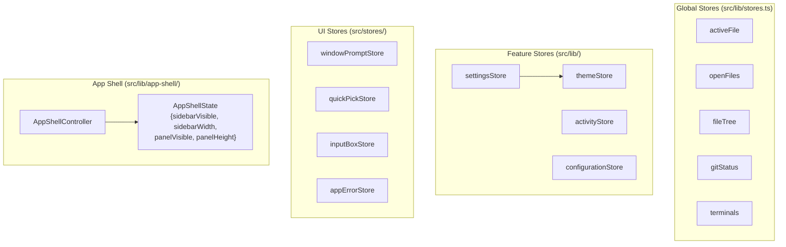
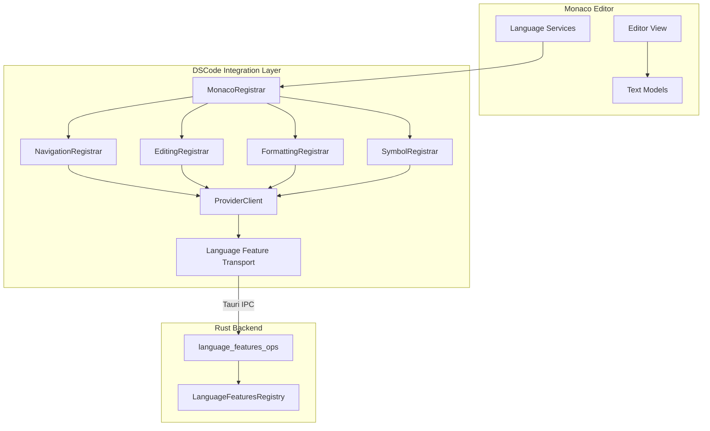
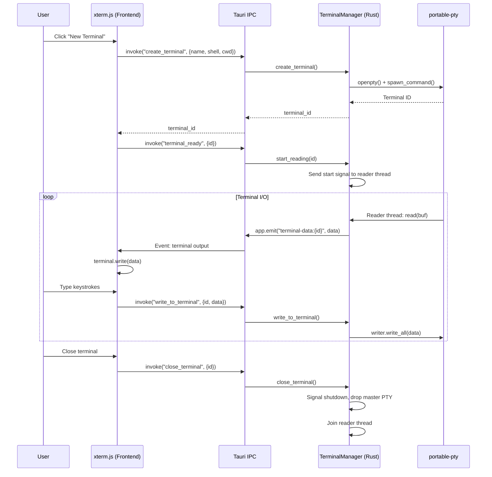
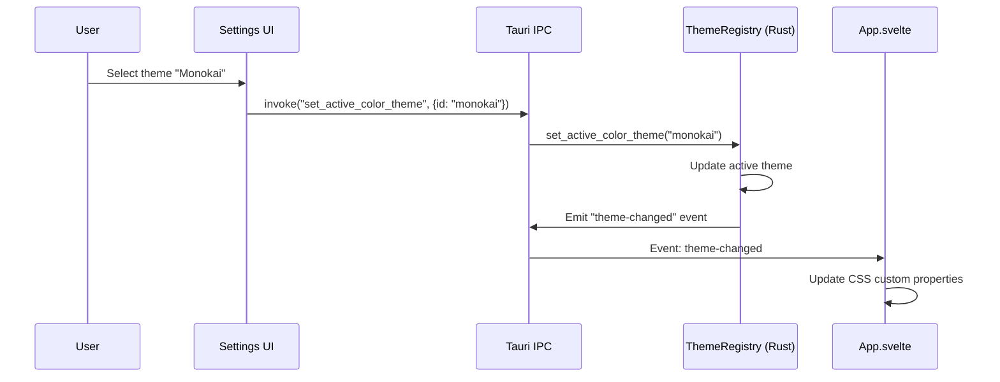

# Svelte UI Architecture

DSCode's user interface is built with **Svelte** and renders inside a Tauri WebView. The UI follows a component-based architecture with reactive state management through Svelte stores, integrating **Monaco Editor** for code editing and **xterm.js** for the terminal.

---

## Component Hierarchy

```mermaid
graph TB
    App[App.svelte]

    subgraph "Application Shell"
        AB[ActivityBar]
        SB[Sidebar]
        EA[EditorArea]
        PA[PanelArea]
        STB[StatusBar]
        RH[ResizeHandle]
    end

    subgraph "Overlay Components"
        CP[CommandPalette]
        QO[QuickOpen]
        SS[SymbolSearch]
        SM[SettingsModal]
        WPM[WindowPromptModal]
        QPM[QuickPickModal]
        IBM[InputBoxModal]
        EO[ErrorOverlay]
        TC[ToastContainer]
    end

    subgraph "Sidebar Views"
        SV1[GitView]
        SV2[SearchView]
        SV3[ExtensionView]
        SV4[ExtensionGallery]
        SV5[DebugView]
        SV6[TreeNode]
        SV7[TreeItemView]
    end

    subgraph "Panel Views"
        PV1[Terminal]
        PV2[OutputPanel]
        PV3[ProblemsPanel]
        PV4[DebugConsole]
        PV5[GitHistoryPanel]
        PV6[CallStackPanel]
        PV7[VariablesPanel]
    end

    subgraph "Editor Components"
        EC1[DiffViewer]
        EC2[DebugToolbar]
        EC3[ContextMenu]
        EC4[BranchSwitcher]
        EC5[ResourceMetrics]
    end

    App --> AB
    App --> SB
    App --> EA
    App --> PA
    App --> STB
    App --> RH
    App --> CP
    App --> WPM
    App --> QPM
    App --> IBM
    App --> EO
    App --> TC

    SB --> SV1
    SB --> SV2
    SB --> SV3
    SB --> SV4
    SB --> SV5
    SB --> SV6

    PA --> PV1
    PA --> PV2
    PA --> PV3
    PA --> PV4
    PA --> PV5

    EA --> EC1
    EA --> EC2
    EA --> EC3
```



---

## Component Inventory

DSCode's UI consists of **35+ Svelte components** organized by function:

### Application Shell

| Component | File | Description |
|---|---|---|
| `App` | `App.svelte` | Root component. Manages layout state, resize handlers, error boundaries. |
| `ActivityBar` | `ActivityBar.svelte` | Left-most icon bar for switching between sidebar views (Explorer, Search, Git, Debug, Extensions) |
| `Sidebar` | `Sidebar.svelte` | Collapsible side panel that hosts view containers (file tree, search, git, etc.) |
| `EditorArea` | `EditorArea.svelte` | Central area containing Monaco Editor instances, tabs, split views |
| `PanelArea` | `PanelArea.svelte` | Bottom panel area for terminal, output, problems, debug console |
| `StatusBar` | `StatusBar.svelte` | Bottom status bar showing git branch, language, encoding, cursor position |
| `ResizeHandle` | `ResizeHandle.svelte` | Draggable resize handles between sidebar/editor and editor/panel |

### Editor Components

| Component | File | Description |
|---|---|---|
| `DiffViewer` | `DiffViewer.svelte` | Side-by-side and inline diff view using Monaco's diff editor |
| `DebugToolbar` | `DebugToolbar.svelte` | Floating debug controls (continue, step over, step into, step out, stop) |
| `ContextMenu` | `ContextMenu.svelte` | Right-click context menu with dynamic items from MenuRegistry |
| `BranchSwitcher` | `BranchSwitcher.svelte` | Git branch switching dropdown |
| `ResourceMetrics` | `ResourceMetrics.svelte` | CPU/memory usage indicator |

### Sidebar Views

| Component | File | Description |
|---|---|---|
| `GitView` | `GitView.svelte` | Source control panel: staged/unstaged changes, commit, push/pull |
| `SearchView` | `SearchView.svelte` | File search with regex, case sensitivity, include/exclude filters |
| `ExtensionView` | `ExtensionView.svelte` | Installed extensions management |
| `ExtensionGallery` | `ExtensionGallery.svelte` | Marketplace extension browser |
| `DebugView` | `DebugView.svelte` | Debug configuration and session management |
| `TreeNode` | `TreeNode.svelte` | Generic tree node for file explorer and custom tree views |
| `TreeItemView` | `TreeItemView.svelte` | Extension-contributed tree item rendering |

### Panel Views

| Component | File | Description |
|---|---|---|
| `Terminal` | `Terminal.svelte` | xterm.js terminal emulator wrapper |
| `OutputPanel` | `OutputPanel.svelte` | Output channel display (extension logs, task output) |
| `ProblemsPanel` | `ProblemsPanel.svelte` | Diagnostics display (errors, warnings, info from LSP) |
| `DebugConsole` | `DebugConsole.svelte` | Debug REPL console |
| `GitHistoryPanel` | `GitHistoryPanel.svelte` | Git commit history log |
| `CallStackPanel` | `CallStackPanel.svelte` | Debug call stack viewer |
| `VariablesPanel` | `VariablesPanel.svelte` | Debug variables inspector |

### Modal / Overlay Components

| Component | File | Description |
|---|---|---|
| `CommandPalette` | `CommandPalette.svelte` | Ctrl+Shift+P command palette with fuzzy search |
| `QuickOpen` | `QuickOpen.svelte` | Ctrl+P quick file open with fuzzy matching |
| `SymbolSearch` | `SymbolSearch.svelte` | Ctrl+Shift+O symbol search within file |
| `SettingsModal` | `SettingsModal.svelte` | Settings editor UI |
| `WindowPromptModal` | `WindowPromptModal.svelte` | VS Code-style window.showInformationMessage dialogs |
| `QuickPickModal` | `QuickPickModal.svelte` | VS Code-style window.showQuickPick |
| `InputBoxModal` | `InputBoxModal.svelte` | VS Code-style window.showInputBox |
| `ErrorOverlay` | `ErrorOverlay.svelte` | Full-screen error overlay for unhandled exceptions |
| `ToastContainer` | `ToastContainer.svelte` | Toast notification system |

---

## State Management

DSCode uses **Svelte stores** for reactive state management. Stores are organized by domain:



### Store Architecture

```typescript
// src/lib/stores.ts -- Core application stores
import { writable, derived } from 'svelte/store';

export const activeFile = writable<string | null>(null);
export const openFiles = writable<FileTab[]>([]);
export const fileTree = writable<TreeNode[]>([]);
export const gitStatus = writable<GitStatusInfo | null>(null);
```

```typescript
// src/lib/settings-store.ts -- Settings with persistence
import { writable } from 'svelte/store';

export const settingsStore = writable({
    theme: {
        colorTheme: 'dark',
    },
    editor: {
        fontSize: 14,
        tabSize: 4,
        wordWrap: 'off',
    },
    terminal: {
        fontSize: 13,
        shell: null, // Use system default
    },
});
```

### App Shell Controller

The `AppShellController` manages layout state (sidebar width, panel height, visibility) as a coordinated state machine:

```typescript
// src/lib/app-shell/controller.ts
export interface AppShellState {
    sidebarVisible: boolean;
    sidebarWidth: number;
    panelVisible: boolean;
    panelHeight: number;
}

export function createDefaultAppShellState(): AppShellState {
    return {
        sidebarVisible: true,
        sidebarWidth: 260,
        panelVisible: true,
        panelHeight: 200,
    };
}

export function createAppShellController(options: {
    getState: () => AppShellState;
    setState: (state: AppShellState) => void;
}) {
    return {
        initialize() { /* Load persisted layout state */ },
        destroy() { /* Persist layout state */ },
        resizeSidebar(delta: number) {
            const state = options.getState();
            options.setState({
                ...state,
                sidebarWidth: Math.max(180, Math.min(600, state.sidebarWidth + delta)),
            });
        },
        resizePanel(delta: number) {
            const state = options.getState();
            options.setState({
                ...state,
                panelHeight: Math.max(100, Math.min(500, state.panelHeight - delta)),
            });
        },
    };
}
```

---

## Monaco Editor Integration

Monaco Editor is the core code editing component, providing the same editing experience as VS Code.

### Integration Architecture



### Language Feature Registration

The `src/lib/language-features/` directory provides a structured bridge between Monaco and the Rust backend:

| Directory | Purpose |
|---|---|
| `registrars/` | Register Monaco language providers (one per category) |
| `provider-clients/` | Handle IPC communication for each provider type |
| `registration-services/` | Coordinate registration lifecycle |
| `monaco-conversions.ts` | Convert between Monaco types and LSP types |
| `transport.ts` | Tauri IPC transport layer |
| `types.ts` | Shared type definitions |
| `diagnostics.ts` | Diagnostic (error/warning) management |

```typescript
// src/lib/language-features/transport.ts
import { invoke } from '@tauri-apps/api/core';

export async function requestHover(
    uri: string,
    line: number,
    character: number
): Promise<HoverResult | null> {
    return invoke('invoke_hover_provider', { uri, line, character });
}
```

---

## xterm.js Terminal Integration

The terminal uses **xterm.js** in the frontend with **portable-pty** in the Rust backend:



### Terminal Features

- **Multiple terminals:** Each terminal gets a unique ID and independent PTY
- **Shell selection:** Configurable shell (bash, zsh, PowerShell, etc.)
- **Working directory:** Set per-terminal working directory
- **Resize support:** Dynamic terminal resizing with PTY resize propagation
- **Terminal profiles:** Pre-configured shell environments with custom env vars
- **Shutdown signal:** Clean shutdown via `AtomicBool` flag and reader thread join

---

## Theme System

DSCode implements theming through **CSS custom properties** that are applied to the root element:

### Theme Application

```svelte
<!-- App.svelte -->
<script lang="ts">
    import { settingsStore } from './lib/settings-store';
    $: theme = $settingsStore.theme.colorTheme;
</script>

<main class="app theme-{theme}">
    <!-- Application layout -->
</main>
```

### CSS Custom Properties

```css
/* Theme variables */
.theme-dark {
    --bg-primary: #1e1e1e;
    --bg-secondary: #252526;
    --bg-sidebar: #252526;
    --bg-editor: #1e1e1e;
    --bg-panel: #1e1e1e;
    --bg-statusbar: #007acc;
    --bg-activitybar: #333333;
    --text-primary: #cccccc;
    --text-secondary: #969696;
    --border-color: #404040;
    --accent-color: #007acc;
    --error-color: #f44747;
    --warning-color: #cca700;
    --info-color: #3794ff;
}

.theme-light {
    --bg-primary: #ffffff;
    --bg-secondary: #f3f3f3;
    --bg-sidebar: #f3f3f3;
    --bg-editor: #ffffff;
    --bg-panel: #ffffff;
    --bg-statusbar: #007acc;
    --bg-activitybar: #2c2c2c;
    --text-primary: #333333;
    --text-secondary: #717171;
    --border-color: #e5e5e5;
    --accent-color: #007acc;
    --error-color: #e51400;
    --warning-color: #bf8803;
    --info-color: #1a85ff;
}
```

### Theme Registry Integration

Extension-contributed themes are managed by the `ThemeRegistry` in the Rust backend and applied via Tauri events:



---

## Reactive Updates via Tauri Events

The frontend subscribes to Tauri events for real-time updates from the backend:

```typescript
import { listen } from '@tauri-apps/api/event';

// Listen for file system changes
await listen('file-changed', (event) => {
    const { path, kind } = event.payload;
    // Update file tree store reactively
    fileTree.update(tree => refreshNode(tree, path));
});

// Listen for git status changes
await listen('git-status-changed', (event) => {
    gitStatus.set(event.payload);
});

// Listen for extension contributions
await listen('commands-changed', (event) => {
    // Refresh command palette data
    commandsStore.set(event.payload.commands);
});
```

---

## Component Communication Patterns

### Pattern 1: Store-Based (Global State)

Components communicate through shared Svelte stores:

```svelte
<!-- ActivityBar.svelte -->
<script lang="ts">
    import { activeView } from '../lib/stores';
    function selectView(view: string) {
        $activeView = view;
    }
</script>

<!-- Sidebar.svelte -->
<script lang="ts">
    import { activeView } from '../lib/stores';
    // Reactively updates when activeView changes
    $: currentView = $activeView;
</script>
```

### Pattern 2: Event Dispatching (Parent-Child)

Child components dispatch events to parents:

```svelte
<!-- ResizeHandle.svelte -->
<script lang="ts">
    import { createEventDispatcher } from 'svelte';
    const dispatch = createEventDispatcher();

    function onMouseMove(event: MouseEvent) {
        dispatch('resize', { delta: event.movementX });
    }
</script>

<!-- App.svelte -->
<ResizeHandle direction="horizontal" on:resize={handleSidebarResize} />
```

### Pattern 3: Tauri Command Invocation (UI to Backend)

Components invoke Tauri commands for backend operations:

```svelte
<!-- GitView.svelte -->
<script lang="ts">
    import { invoke } from '@tauri-apps/api/core';

    async function commitChanges(message: string) {
        await invoke('git_commit', { message });
        // Refresh git status after commit
        const status = await invoke('git_status');
        gitStatus.set(status);
    }
</script>
```

### Pattern 4: Tauri Event Subscription (Backend to UI)

Components subscribe to backend events for real-time updates:

```svelte
<!-- Terminal.svelte -->
<script lang="ts">
    import { listen } from '@tauri-apps/api/event';
    import { onMount, onDestroy } from 'svelte';

    let unlisten: Function;

    onMount(async () => {
        unlisten = await listen(`terminal-data:${terminalId}`, (event) => {
            xterm.write(event.payload.data);
        });
    });

    onDestroy(() => {
        if (unlisten) unlisten();
    });
</script>
```

---

## Error Handling

### Global Error Boundary

The `ErrorOverlay` component catches unhandled errors and promise rejections:

```svelte
<!-- App.svelte -->
<script lang="ts">
    import { setAppError } from './stores/appError';

    onMount(() => {
        const handleWindowError = (event: ErrorEvent) => {
            setAppError(event.error ?? new Error(event.message));
        };

        const handleUnhandledRejection = (event: PromiseRejectionEvent) => {
            setAppError(event.reason);
        };

        window.addEventListener('error', handleWindowError);
        window.addEventListener('unhandledrejection', handleUnhandledRejection);
    });
</script>

{#if $appErrorStore}
    <ErrorOverlay error={$appErrorStore} />
{/if}
```

!!! note "Error Recovery"
    The `ErrorOverlay` provides a "Reload Window" button that allows users to recover from UI errors without restarting the entire application. The Rust backend process continues running during a window reload.
