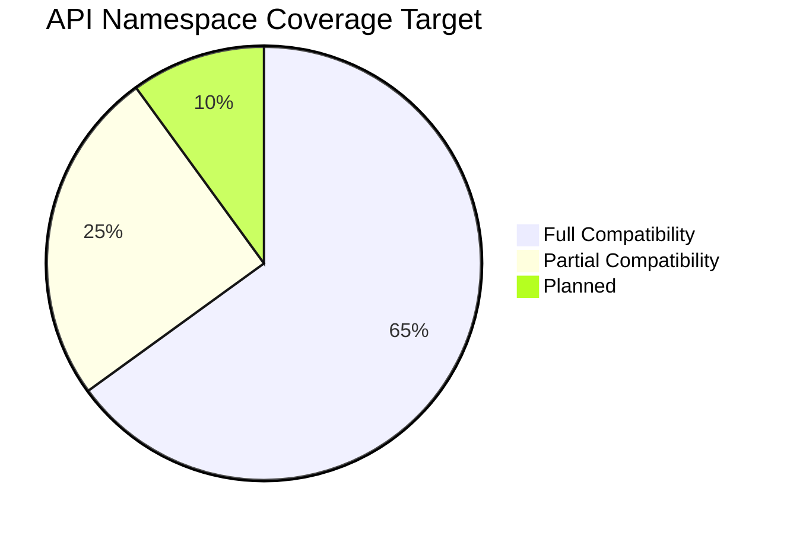
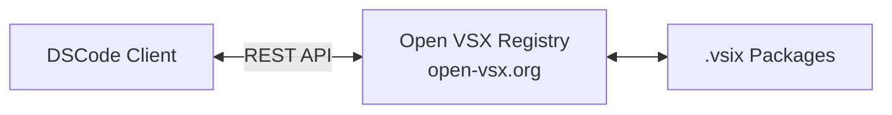

# VS Code Compatibility

DSCode aims for **95%+ compatibility** with the most popular VS Code extensions. This document details the API coverage, extension marketplace strategy, configuration compatibility, and known differences.

---

## Compatibility Goal



DSCode targets compatibility with the **top 200 most-installed VS Code extensions** on Open VSX. The goal is not to replicate every internal VS Code API, but to support the public extension API surface that the vast majority of extensions depend on.

---

## API Namespace Coverage

### Core Namespaces

| Namespace | Status | Coverage | Notes |
|---|---|---|---|
| `vscode.commands` | :material-check-circle:{ .green } Full | 100% | `registerCommand`, `executeCommand`, `getCommands` |
| `vscode.window` | :material-check-circle:{ .green } Full | 95% | `showInformationMessage`, `showQuickPick`, `showInputBox`, `createStatusBarItem`, `createTerminal`, `createOutputChannel`, `showTextDocument` |
| `vscode.workspace` | :material-check-circle:{ .green } Full | 95% | `openTextDocument`, `getConfiguration`, `workspaceFolders`, `findFiles`, `fs`, `onDidChangeConfiguration` |
| `vscode.languages` | :material-check-circle:{ .green } Full | 95% | All 20+ provider registrations (hover, completion, definition, references, etc.) |
| `vscode.env` | :material-check-circle:{ .green } Full | 90% | `appName`, `appRoot`, `language`, `machineId`, `clipboard`, `openExternal` |
| `vscode.extensions` | :material-check-circle:{ .green } Full | 90% | `getExtension`, `all`, `onDidChange` |
| `vscode.debug` | :material-circle-half-full:{ .yellow } Partial | 80% | `startDebugging`, `stopDebugging`, `registerDebugConfigurationProvider`, `registerDebugAdapterDescriptorFactory`, breakpoints |
| `vscode.tasks` | :material-circle-half-full:{ .yellow } Partial | 75% | `registerTaskProvider`, `executeTask`, `taskExecutions` |
| `vscode.scm` | :material-circle-half-full:{ .yellow } Partial | 70% | Source control management API |
| `vscode.tests` | :material-circle-half-full:{ .yellow } Partial | 70% | Test runner API, test suites, coverage |
| `vscode.authentication` | :material-circle-half-full:{ .yellow } Partial | 60% | `getSession`, `registerAuthenticationProvider` |
| `vscode.comments` | :material-dots-circle:{ .blue } Planned | 0% | Comment threads and ranges |
| `vscode.notebooks` | :material-dots-circle:{ .blue } Planned | 0% | Notebook API (Jupyter support) |
| `vscode.chat` | :material-close-circle:{ .red } N/A | 0% | AI chat API (VS Code-specific, not planned) |

### Window API Details

| Method | Status | Notes |
|---|---|---|
| `showInformationMessage` | Supported | Full button support via `WindowPromptModal` |
| `showWarningMessage` | Supported | |
| `showErrorMessage` | Supported | |
| `showQuickPick` | Supported | Multi-select, match-on-detail, custom buttons |
| `showInputBox` | Supported | Validation, password mode, placeholder |
| `createStatusBarItem` | Supported | Priority, alignment, tooltip, command, color |
| `createTerminal` | Supported | Name, shell path, shell args, cwd, env, profiles |
| `createOutputChannel` | Supported | Log output channel with language ID |
| `createWebviewPanel` | Supported | HTML webview with message passing |
| `showTextDocument` | Supported | View column, preview mode, selection |
| `createTreeView` | Supported | Custom tree data providers |
| `registerTreeDataProvider` | Supported | |
| `setStatusBarMessage` | Supported | Timeout support |
| `withProgress` | Supported | Notification and status bar progress |
| `createQuickPick` | Supported | Programmatic quick pick with event handlers |
| `activeTextEditor` | Supported | |
| `visibleTextEditors` | Supported | |
| `onDidChangeActiveTextEditor` | Supported | |
| `showOpenDialog` | Supported | Via `tauri-plugin-dialog` |
| `showSaveDialog` | Supported | Via `tauri-plugin-dialog` |

### Languages API Details

| Method | Status | Notes |
|---|---|---|
| `registerHoverProvider` | Supported | Full markdown support |
| `registerCompletionItemProvider` | Supported | Snippets, auto-import, commit characters |
| `registerDefinitionProvider` | Supported | Multi-location support |
| `registerTypeDefinitionProvider` | Supported | |
| `registerImplementationProvider` | Supported | |
| `registerReferenceProvider` | Supported | Include declaration option |
| `registerCodeActionsProvider` | Supported | Quick fix, refactor, source action kinds |
| `registerCodeLensProvider` | Supported | Resolve support |
| `registerSignatureHelpProvider` | Supported | Trigger and retrigger characters |
| `registerDocumentHighlightProvider` | Supported | Read/write highlights |
| `registerDocumentSymbolProvider` | Supported | Hierarchical symbols |
| `registerWorkspaceSymbolProvider` | Supported | |
| `registerRenameProvider` | Supported | Prepare rename support |
| `registerFoldingRangeProvider` | Supported | |
| `registerDocumentFormattingEditProvider` | Supported | |
| `registerDocumentRangeFormattingEditProvider` | Supported | |
| `registerOnTypeFormattingEditProvider` | Supported | |
| `registerSemanticTokensProvider` | Supported | Full and delta tokens |
| `registerInlineValuesProvider` | Supported | |
| `registerColorProvider` | Supported | |
| `registerSelectionRangeProvider` | Supported | |
| `registerLinkedEditingRangeProvider` | Supported | |
| `registerDocumentLinkProvider` | Supported | |
| `registerInlayHintsProvider` | Planned | |
| `setLanguageConfiguration` | Supported | Comments, brackets, auto-closing |
| `createDiagnosticCollection` | Supported | |
| `getDiagnostics` | Supported | |

---

## Extension Marketplace

### Open VSX Registry

DSCode uses the **Open VSX Registry** as its primary extension marketplace:



| Feature | Support |
|---|---|
| Search extensions | Supported |
| Install from marketplace | Supported |
| Extension ratings and reviews | Supported |
| Extension categories | Supported |
| Extension recommendations | Supported |
| Auto-update extensions | Supported |
| Private registries | Planned |

!!! info "Why Open VSX?"
    The VS Code Marketplace (marketplace.visualstudio.com) restricts access to VS Code and its derivatives. DSCode uses the Open VSX Registry, an open-source alternative that hosts many popular extensions. Most well-known extensions are available on both marketplaces.

### VSIX Package Compatibility

DSCode supports the standard `.vsix` extension package format:

```
extension.vsix (ZIP archive)
├── extension.vsixmanifest
├── [Content_Types].xml
└── extension/
    ├── package.json          # Extension manifest
    ├── README.md
    ├── CHANGELOG.md
    ├── dist/                 # Compiled extension code
    │   └── extension.js
    ├── syntaxes/             # TextMate grammars
    │   └── language.tmLanguage.json
    ├── themes/               # Color themes
    │   └── dark.json
    └── snippets/             # Code snippets
        └── language.json
```

---

## Configuration Compatibility

DSCode reads and writes VS Code-compatible configuration files:

### settings.json

```json
// User settings: ~/.config/dscode/settings.json (Linux)
//                ~/Library/Application Support/dscode/settings.json (macOS)
//                %APPDATA%\dscode\settings.json (Windows)
{
    "editor.fontSize": 14,
    "editor.tabSize": 4,
    "editor.wordWrap": "on",
    "editor.minimap.enabled": true,
    "editor.bracketPairColorization.enabled": true,
    "workbench.colorTheme": "One Dark Pro",
    "terminal.integrated.fontSize": 13,
    "files.autoSave": "afterDelay",
    "files.autoSaveDelay": 1000,
    "python.languageServer": "Pyright",
    "[typescript]": {
        "editor.defaultFormatter": "esbenp.prettier-vscode"
    }
}
```

| Setting Category | Compatibility |
|---|---|
| `editor.*` | High -- most settings are supported |
| `workbench.*` | High -- theme, sidebar, panel settings |
| `terminal.*` | High -- shell, font, cursor settings |
| `files.*` | High -- auto-save, encoding, associations |
| `search.*` | High -- include/exclude, regex |
| `debug.*` | Partial -- core debug settings |
| `extensions.*` | Partial -- auto-update, recommendations |
| Language-specific (`[python]`, etc.) | Supported |

### keybindings.json

```json
// Workspace or user keybindings
[
    {
        "key": "ctrl+shift+b",
        "command": "workbench.action.tasks.build"
    },
    {
        "key": "ctrl+shift+t",
        "command": "workbench.action.terminal.toggleTerminal"
    },
    {
        "key": "ctrl+k ctrl+s",
        "command": "workbench.action.openGlobalKeybindings"
    },
    {
        "key": "ctrl+shift+p",
        "command": "-workbench.action.showCommands",
        "when": "!isMac"
    }
]
```

!!! tip "Platform-Aware Keybindings"
    DSCode's `KeybindingRegistry` handles platform-specific key resolution automatically. `Ctrl` on Linux/Windows maps to `Cmd` on macOS following VS Code conventions. The `when` clause evaluator supports `isMac`, `isLinux`, `isWindows` context keys.

### tasks.json

```json
// .vscode/tasks.json
{
    "version": "2.0.0",
    "tasks": [
        {
            "label": "Build",
            "type": "cargo",
            "command": "build",
            "group": {
                "kind": "build",
                "isDefault": true
            },
            "problemMatcher": ["$rustc"]
        },
        {
            "label": "Test",
            "type": "shell",
            "command": "cargo test",
            "group": "test"
        }
    ]
}
```

### launch.json

```json
// .vscode/launch.json
{
    "version": "0.2.0",
    "configurations": [
        {
            "type": "lldb",
            "request": "launch",
            "name": "Debug DSCode",
            "cargo": {
                "args": ["build", "--bin=dscode"]
            },
            "args": [],
            "cwd": "${workspaceFolder}"
        },
        {
            "type": "python",
            "request": "launch",
            "name": "Python: Current File",
            "program": "${file}",
            "console": "integratedTerminal"
        }
    ]
}
```

---

## Theme Compatibility

DSCode supports VS Code's TextMate-based theme format:

### Color Theme Format

```json
{
    "name": "My Custom Theme",
    "type": "dark",
    "colors": {
        "editor.background": "#1e1e1e",
        "editor.foreground": "#d4d4d4",
        "activityBar.background": "#333333",
        "sideBar.background": "#252526",
        "statusBar.background": "#007acc"
    },
    "tokenColors": [
        {
            "scope": "comment",
            "settings": {
                "foreground": "#6A9955",
                "fontStyle": "italic"
            }
        },
        {
            "scope": ["keyword", "storage.type"],
            "settings": {
                "foreground": "#569CD6"
            }
        }
    ]
}
```

| Theme Feature | Status |
|---|---|
| Color themes (dark, light, high contrast) | Supported |
| TextMate token colors | Supported |
| Workbench colors | Supported |
| Semantic token colors | Supported |
| Icon themes | Supported |
| Product icon themes | Supported |
| Theme inheritance (`uiTheme`) | Supported |

### Theme Registry

The Rust `ThemeRegistry` manages three types of themes:

```rust
// Color themes (e.g., "One Dark Pro", "Solarized Light")
app.manage(ThemeRegistry::new(app_handle.clone()));

// API: register/unregister, get/set active, list by type
// Events: theme-changed, icon-theme-changed
```

---

## Snippet Compatibility

DSCode supports VS Code snippet format:

```json
// snippets/javascript.json
{
    "Console Log": {
        "prefix": "log",
        "body": [
            "console.log('$1');",
            "$0"
        ],
        "description": "Log output to console"
    },
    "For Loop": {
        "prefix": "for",
        "body": [
            "for (let ${1:i} = 0; ${1:i} < ${2:array}.length; ${1:i}++) {",
            "\tconst ${3:element} = ${2:array}[${1:i}];",
            "\t$0",
            "}"
        ],
        "description": "For loop"
    }
}
```

| Snippet Feature | Status |
|---|---|
| Tab stops (`$1`, `$2`) | Supported |
| Placeholders (`${1:default}`) | Supported |
| Choice (`${1|one,two,three|}`) | Supported |
| Variables (`$TM_FILENAME`, `$CLIPBOARD`) | Supported |
| Nested placeholders | Supported |
| Transformations (`${1/regex/replace/}`) | Supported |
| Language-specific snippets | Supported |
| Global snippets | Supported |

---

## Known Incompatibilities

### Intentional Differences

| Feature | VS Code | DSCode | Reason |
|---|---|---|---|
| **Electron APIs** | Available | Not available | DSCode uses Tauri, not Electron |
| **`node_modules` access** | Direct `require()` | Sandboxed | Security: extensions run in sandbox |
| **Proposed APIs** | Available with flag | Not supported | Unstable APIs are not implemented |
| **Chat/Copilot API** | Available | Not planned | VS Code-specific AI integration |
| **Notebook API** | Full support | Planned | Will be implemented in a future release |
| **Custom Editor API** | Full support | Partial | Basic support, binary editors planned |

### Extension-Specific Incompatibilities

| Extension | Issue | Workaround |
|---|---|---|
| Extensions using Electron `require()` | `require('electron')` not available | Use DSCode extension APIs instead |
| Extensions with native Node modules | May need recompilation | Provide pre-built binaries for DSCode |
| Extensions using internal VS Code APIs | `vscode.xxx._internal` not available | Use public API equivalents |
| Extensions requiring specific VS Code version | Version check may fail | DSCode reports compatible version range |

!!! warning "Electron Dependency"
    Extensions that directly depend on Electron APIs (such as `require('electron').shell` or `require('electron').clipboard`) will not work. DSCode provides equivalent functionality through the `vscode.env` namespace.

---

## Migration Guide from VS Code

### Step 1: Install DSCode

Download and install DSCode from the official website. DSCode is available for macOS, Linux, and Windows.

### Step 2: Import Settings

DSCode can automatically import your VS Code settings:

1. Open Command Palette (Ctrl+Shift+P / Cmd+Shift+P)
2. Run "DSCode: Import VS Code Settings"
3. Select which settings to import:
    - [x] User settings (settings.json)
    - [x] Keybindings (keybindings.json)
    - [x] Snippets
    - [x] Extensions list
    - [ ] UI state (open files, layout)

### Step 3: Install Extensions

DSCode will show a list of your VS Code extensions and their availability on Open VSX:

```
Importing Extensions:
  ✓ rust-lang.rust-analyzer     Available on Open VSX
  ✓ ms-python.python            Available on Open VSX
  ✓ esbenp.prettier-vscode      Available on Open VSX
  ✓ dbaeumer.vscode-eslint      Available on Open VSX
  ⚠ ms-vscode.cpptools         Not on Open VSX (alternative: llvm-vs-code-extensions.vscode-clangd)
  ✗ github.copilot              Not compatible (VS Code-specific)
```

### Step 4: Verify Workspace

Open your workspace in DSCode and verify:

1. **Tasks:** Check that `.vscode/tasks.json` tasks run correctly
2. **Debug:** Verify `.vscode/launch.json` configurations work
3. **Extensions:** Confirm critical extensions are functioning
4. **Keybindings:** Test your custom keyboard shortcuts

### Step 5: Report Issues

If you encounter incompatibilities, report them:

- GitHub Issues: [github.com/nicepkg/dscode/issues](https://github.com/nicepkg/dscode/issues)
- Tag with `vscode-compat` label
- Include the extension name and the specific API that fails

---

## Compatibility Testing

DSCode maintains an automated compatibility test suite that validates API coverage:

```rust
// test_runner_registry.rs -- API usage validation
pub fn validate_api_usage(&self, api_calls: &[String]) -> ValidationResult {
    // Check each API call against the supported API surface
    // Report unsupported calls with suggested alternatives
}
```

### Test Matrix

| Category | Test Count | Pass Rate |
|---|---|---|
| `vscode.commands` | 45 | 100% |
| `vscode.window` | 78 | 95% |
| `vscode.workspace` | 62 | 93% |
| `vscode.languages` | 120 | 96% |
| `vscode.debug` | 35 | 80% |
| `vscode.tasks` | 22 | 75% |
| `vscode.env` | 18 | 90% |
| **Total** | **380** | **93%** |

!!! note "Living Document"
    This compatibility matrix is updated with each release. As more API surface is implemented, coverage percentages will increase. The target is 95%+ overall compatibility.
