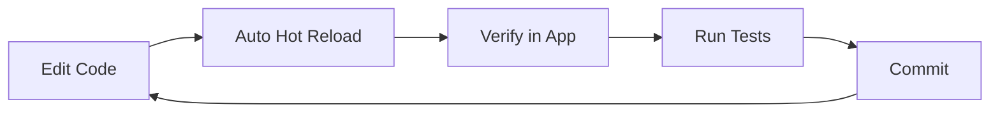

# Development Setup

This guide covers IDE configuration, project structure, debugging workflows, and
environment variables for DSCode development.

---

## Recommended IDE

!!! tip "Yes, we know"
    Using VS Code to develop a VS Code alternative is perfectly reasonable.
    The `rust-analyzer` and Svelte extension ecosystem in VS Code is unmatched.
    Once DSCode reaches feature parity, we encourage dogfooding with DSCode itself.

### VS Code (recommended)

Download [Visual Studio Code](https://code.visualstudio.com/) and install the
extensions listed below.

### DSCode (dogfooding)

If you already have a working DSCode build, you can use it for frontend
development. Rust-analyzer support requires the extension host to be running.

---

## Recommended Extensions

Install these extensions for the best development experience:

| Extension | ID | Purpose |
|-----------|----|---------|
| **rust-analyzer** | `rust-lang.rust-analyzer` | Rust language support, inline errors, code actions |
| **Svelte for VS Code** | `svelte.svelte-vscode` | Svelte component syntax, intellisense |
| **ESLint** | `dbaeumer.vscode-eslint` | JavaScript/TypeScript linting |
| **Prettier** | `esbenp.prettier-vscode` | Code formatting |
| **Tauri** | `tauri-apps.tauri-vscode` | Tauri-specific tooling and snippets |
| **Even Better TOML** | `tamasfe.even-better-toml` | TOML syntax for `Cargo.toml` |
| **Error Lens** | `usernamehw.errorlens` | Inline error/warning display |
| **GitLens** | `eamodio.gitlens` | Git blame, history, and annotations |

### Workspace Settings

Create or update `.vscode/settings.json` for consistent formatting:

```json
{
  "[rust]": {
    "editor.defaultFormatter": "rust-lang.rust-analyzer",
    "editor.formatOnSave": true
  },
  "[svelte]": {
    "editor.defaultFormatter": "svelte.svelte-vscode",
    "editor.formatOnSave": true
  },
  "[typescript]": {
    "editor.defaultFormatter": "esbenp.prettier-vscode",
    "editor.formatOnSave": true
  },
  "[javascript]": {
    "editor.defaultFormatter": "esbenp.prettier-vscode",
    "editor.formatOnSave": true
  },
  "rust-analyzer.check.command": "clippy",
  "rust-analyzer.cargo.features": "all",
  "eslint.validate": ["javascript", "typescript", "svelte"],
  "files.associations": {
    "*.svelte": "svelte"
  }
}
```

---

## Project Structure

```
dscode/
+-- src/                        # Frontend (Svelte + TypeScript)
|   +-- main.ts                 # Application entry point
|   +-- App.svelte              # Root Svelte component
|   +-- app.css                 # Global styles
|   +-- components/             # UI components
|   |   +-- EditorArea.svelte       # Monaco editor wrapper
|   |   +-- ActivityBar.svelte      # Left sidebar activity icons
|   |   +-- Sidebar.svelte          # Explorer, search, git panels
|   |   +-- StatusBar.svelte        # Bottom status bar
|   |   +-- Terminal.svelte         # Integrated terminal (xterm.js)
|   |   +-- CommandPalette.svelte   # Ctrl+Shift+P command palette
|   |   +-- GitView.svelte          # Git integration panel
|   |   +-- DebugView.svelte        # Debug panel
|   |   +-- SearchView.svelte       # File/text search
|   |   +-- ExtensionView.svelte    # Extension manager
|   |   +-- ...
|   +-- stores/                 # Svelte stores (reactive state)
|   |   +-- editor.ts               # Editor state
|   |   +-- workspace.ts            # Workspace/file tree state
|   |   +-- debug.ts                # Debugger state
|   |   +-- session.ts              # Session persistence
|   |   +-- ...
|   +-- lib/                    # Shared utilities and logic
|       +-- command-dispatcher.ts    # Command palette infrastructure
|       +-- keybinding-manager.ts    # Keyboard shortcuts
|       +-- filesystem.ts           # File system operations
|       +-- settings.ts             # User settings management
|       +-- theme.ts                # Theme management
|       +-- monaco-wasm-provider.ts # Monaco WASM loader
|       +-- ...
+-- src-tauri/                  # Rust backend (Tauri v2)
|   +-- Cargo.toml              # Rust dependencies
|   +-- tauri.conf.json         # Tauri configuration
|   +-- build.rs                # Build script
|   +-- src/
|   |   +-- main.rs             # Application entry, Tauri setup
|   |   +-- bootstrap.rs        # Startup initialization
|   |   +-- config.rs           # Configuration management
|   |   +-- watcher.rs          # File system watcher (notify)
|   |   +-- logging.rs          # Structured logging
|   |   +-- commands/           # Tauri IPC commands
|   |   |   +-- mod.rs              # Module declarations
|   |   |   +-- file_ops.rs         # File read/write/delete
|   |   |   +-- git_ops.rs          # Git operations (git2)
|   |   |   +-- search_ops.rs       # Ripgrep-based search
|   |   |   +-- terminal_ops.rs     # PTY management
|   |   |   +-- extension_ops.rs    # Extension lifecycle
|   |   |   +-- debug_ops.rs        # Debug adapter protocol
|   |   |   +-- *_registry.rs       # State registries
|   |   |   +-- *_ops.rs            # Tauri command handlers
|   |   +-- core/               # Core editor engine
|   |   |   +-- text_buffer.rs      # Rope-based text buffer
|   |   |   +-- syntax.rs           # Tree-sitter syntax
|   |   +-- lsp/                # Language Server Protocol
|   |   |   +-- client.rs           # LSP client
|   |   |   +-- manager.rs          # LSP lifecycle
|   |   |   +-- pool.rs             # Server pooling
|   |   +-- debug/              # Debug Adapter Protocol
|   |   |   +-- adapter.rs          # DAP adapter
|   |   |   +-- manager.rs          # Debug session manager
|   |   |   +-- pool.rs             # Adapter pooling
|   |   +-- extension_host/     # Extension host IPC
|   |   +-- terminal/           # PTY terminal backend
|   |   +-- session/            # Session persistence
|   |   +-- marketplace/        # Extension marketplace
|   |   +-- monitoring/         # Resource monitoring
|   +-- tests/                  # Integration tests
+-- extension-host/             # Node.js extension host
|   +-- src/
|   |   +-- main.ts             # Extension host entry
|   |   +-- bridge.ts           # Rust-Node IPC bridge
|   |   +-- nng-ipc.ts          # NNG socket communication
|   |   +-- api/                # VS Code API shim
|   |   +-- extensions/         # Extension loader
|   |   +-- native/             # Native Node addons
|   +-- package.json
|   +-- tsconfig.json
+-- documentation/              # MkDocs Material documentation
|   +-- docs/                   # Markdown source files
|   +-- mkdocs.yml              # Site configuration
+-- vite.config.ts              # Vite build configuration
+-- svelte.config.js            # Svelte preprocessor config
+-- tsconfig.json               # TypeScript configuration
+-- package.json                # Frontend dependencies & scripts
```

### The Registry + Ops Pattern

The Rust backend follows a consistent **registry + ops** pattern for all command
modules:

- **`*_registry.rs`** -- Defines the state struct (wrapped in `Arc<RwLock<...>>`)
  with business logic methods. Holds data structures and provides async APIs.
- **`*_ops.rs`** -- Thin `#[tauri::command]` wrappers that accept `State<'_, Registry>`
  and delegate to registry methods. These are the IPC boundary.

```rust
// Example: test_runner_registry.rs defines TestRunnerRegistry
// Example: test_runner_ops.rs exposes #[tauri::command] functions
```

This separation keeps Tauri-specific code isolated from business logic, making
registries independently testable.

---

## Development Workflow

### Typical iteration cycle



1. **Start the dev server:**

    ```bash
    npm run tauri:dev
    ```

2. **Make changes** -- the frontend hot-reloads instantly. Rust changes trigger
   a recompile and app restart.

3. **Open DevTools** -- press ++f12++ or ++ctrl+shift+i++ inside the running
   DSCode window to inspect the frontend.

4. **Run checks before committing:**

    ```bash
    npm run lint          # ESLint
    npm run format        # Prettier
    npm run check         # svelte-check
    cd src-tauri && cargo clippy  # Rust lints
    cd src-tauri && cargo fmt --check  # Rust formatting
    ```

---

## Debugging the Rust Backend

### Using VS Code with CodeLLDB

Create `.vscode/launch.json`:

```json
{
  "version": "0.2.0",
  "configurations": [
    {
      "type": "lldb",
      "request": "launch",
      "name": "Debug Tauri (Rust)",
      "cargo": {
        "args": [
          "build",
          "--manifest-path=src-tauri/Cargo.toml",
          "--no-default-features"
        ]
      },
      "env": {
        "RUST_LOG": "debug",
        "RUST_BACKTRACE": "1"
      },
      "cwd": "${workspaceFolder}"
    }
  ]
}
```

!!! note "Required extension"
    Install the [CodeLLDB](https://marketplace.visualstudio.com/items?itemName=vadimcn.vscode-lldb)
    extension for LLDB debugging support in VS Code.

### Using `lldb` from the terminal

```bash
cd src-tauri
cargo build
lldb target/debug/dscode

# Inside lldb
(lldb) breakpoint set --name main
(lldb) run
```

### Rust logging

DSCode uses the `RUST_LOG` environment variable for log levels:

```bash
# Show all debug logs
RUST_LOG=debug npm run tauri:dev

# Show logs for specific modules
RUST_LOG=dscode::commands=debug,dscode::lsp=trace npm run tauri:dev

# Show only warnings and errors
RUST_LOG=warn npm run tauri:dev
```

---

## Debugging the Frontend

### Chrome DevTools (via Tauri)

When running in development mode (`npm run tauri:dev`), the Tauri webview
supports Chrome DevTools:

1. Press ++f12++ or ++ctrl+shift+i++ (++cmd+option+i++ on macOS) in the app window.
2. The DevTools panel opens with full access to:
    - **Elements** -- inspect the Svelte-rendered DOM
    - **Console** -- view `console.log()` output and errors
    - **Network** -- monitor IPC calls and resource loading
    - **Sources** -- set breakpoints in TypeScript/Svelte source maps
    - **Performance** -- profile rendering and script execution

### Svelte DevTools

For Svelte-specific state inspection, install the
[Svelte DevTools](https://chrome.google.com/webstore/detail/svelte-devtools/ckolcbmkjpjmangdbmnkpjigpkddpogn)
browser extension. It works within Tauri's DevTools and allows you to:

- Inspect component hierarchy
- View and edit Svelte store values
- Monitor reactive updates

---

## Debugging the Extension Host

The extension host runs as a separate Node.js process, communicating with the
Rust backend over NNG IPC sockets.

### Node.js Inspector

Start the extension host with the inspector enabled:

```bash
cd extension-host
npm run build
node --inspect dist/main.js
```

Then open `chrome://inspect` in Chrome and connect to the Node.js debugger.

### Logging IPC messages

Set the `DSCODE_EXT_DEBUG` environment variable to log all IPC traffic between
the Rust backend and extension host:

```bash
DSCODE_EXT_DEBUG=1 npm run tauri:dev
```

This prints all request/response pairs flowing through the NNG sockets in
`ipc:///tmp/dscode-ext-*.ipc`.

---

## Environment Variables

| Variable | Default | Description |
|----------|---------|-------------|
| `RUST_LOG` | `info` | Rust log level (`trace`, `debug`, `info`, `warn`, `error`) |
| `RUST_BACKTRACE` | `0` | Show Rust backtraces on panic (`1` for short, `full` for complete) |
| `TAURI_DEBUG` | _(unset)_ | Set to `1` to enable debug mode in production builds |
| `DSCODE_EXT_DEBUG` | _(unset)_ | Enable extension host IPC logging |
| `DSCODE_LOG_DIR` | Platform default | Override log file directory |
| `VITE_DEV_SERVER_URL` | `http://localhost:1420` | Override the Vite dev server URL |
| `CARGO_INCREMENTAL` | `1` | Enable/disable incremental Rust compilation |
| `RUSTC_WRAPPER` | _(unset)_ | Set to `sccache` for build caching |

!!! warning "Do not commit `.env` files"
    If you use a `.env` file for local configuration, ensure it is listed in
    `.gitignore`. Never commit files containing secrets, API keys, or personal
    environment settings.

---

## Next Steps

- [Testing](testing.md) -- learn how to run and write tests
- [Code Style](code-style.md) -- understand the formatting and lint rules
- [Pull Request Guidelines](pull-request-guidelines.md) -- prepare your contribution
