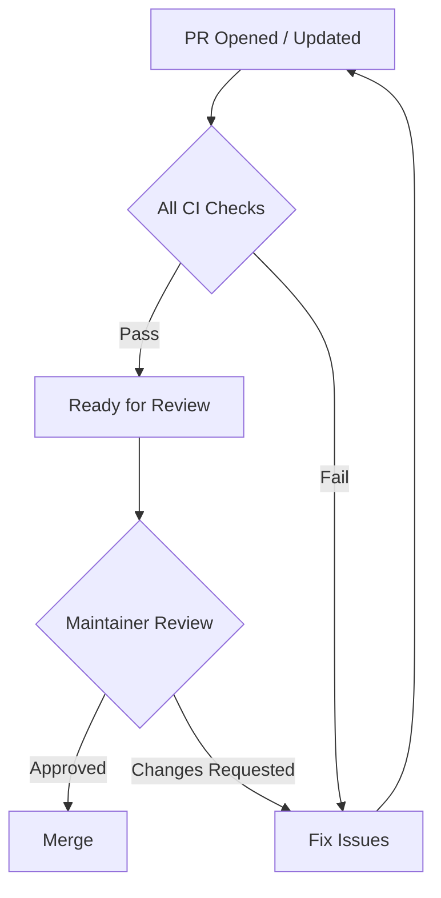

# Pull Request Guidelines

This guide covers the full lifecycle of a pull request (PR) -- from forking the
repository to merging your contribution.

---

## Fork and Branch Workflow

DSCode uses a **fork-based workflow**. Contributors do not push directly to the
main repository.

### 1. Fork the repository

Click the **Fork** button on [github.com/nicepkg/dscode](https://github.com/nicepkg/dscode)
to create your personal copy.

### 2. Clone your fork

```bash
git clone https://github.com/<your-username>/dscode.git
cd dscode
```

### 3. Add the upstream remote

```bash
git remote add upstream https://github.com/nicepkg/dscode.git
git fetch upstream
```

### 4. Create a feature branch

Always branch from the latest `main`:

```bash
git checkout main
git pull upstream main
git checkout -b feature/my-new-feature
```

---

## Branch Naming

Use a descriptive prefix followed by a short, kebab-case description:

| Prefix | Use When | Example |
|--------|----------|---------|
| `feature/` | Adding new functionality | `feature/multi-cursor-editing` |
| `fix/` | Fixing a bug | `fix/terminal-resize-crash` |
| `docs/` | Documentation changes only | `docs/add-testing-guide` |
| `refactor/` | Code restructuring (no behavior change) | `refactor/extract-registry-pattern` |
| `perf/` | Performance improvements | `perf/parallel-file-search` |
| `test/` | Adding or updating tests | `test/extension-host-ipc` |
| `ci/` | CI/CD pipeline changes | `ci/add-windows-build` |

!!! warning "Avoid generic branch names"
    Do not use names like `patch-1`, `update`, or `my-branch`. Branch names
    should clearly indicate the purpose of the change.

---

## Before Submitting

Run the full suite of checks locally before pushing your branch. This saves
CI time and avoids back-and-forth review cycles.

### Checklist

- [ ] **Code compiles** without errors
- [ ] **All tests pass**
- [ ] **Linting** produces no errors
- [ ] **Formatting** matches project standards
- [ ] **New code has tests** (if applicable)
- [ ] **Documentation updated** (if applicable)

### Commands to run

```bash
# Frontend checks
npm run lint                    # ESLint
npm run format                  # Prettier (auto-fix)
npm run check                   # svelte-check (type checking)
npm test                        # Vitest

# Rust checks
cd src-tauri
cargo fmt                       # Format Rust code
cargo clippy -- -D warnings     # Lint with warnings as errors
cargo test                      # Run Rust tests
cd ..

# Extension host checks (if you modified extension-host/)
cd extension-host
npm run lint                    # ESLint
npm test                        # Jest
cd ..
```

!!! tip "Run everything at once"
    You can chain the commands to run the full check suite:

    ```bash
    npm run lint && npm run check && npm test && \
    cd src-tauri && cargo fmt --check && cargo clippy -- -D warnings && cargo test && cd ..
    ```

---

## PR Template

When you open a pull request, use the following template for the description.
Fill in each section -- do not leave them blank.

```markdown
## Description

<!-- What does this PR do? Why is this change needed? -->

Briefly explain the purpose of the change and link to any related issues.

Closes #<issue-number>

## Changes

<!-- List the specific changes made -->

- Added `FooRegistry` with methods for managing Foo state
- Created `foo_ops.rs` Tauri commands wrapping the registry
- Added Svelte `FooPanel.svelte` component
- Updated `mod.rs` to export new modules

## Testing

<!-- How was this tested? Include specific test commands or steps. -->

- [ ] Added unit tests in `foo_registry.rs` (`cargo test foo`)
- [ ] Added frontend tests in `FooPanel.test.ts` (`npm test`)
- [ ] Manually tested in `npm run tauri:dev`

## Screenshots

<!-- If this PR includes UI changes, add before/after screenshots. -->
<!-- Delete this section if there are no visual changes. -->

| Before | After |
|--------|-------|
| (screenshot) | (screenshot) |

## Checklist

- [ ] I have read the [contributing guidelines](https://docs.dscode.dev/contributing/code-style/)
- [ ] I have run `cargo fmt` and `npm run format`
- [ ] I have run `cargo clippy -- -D warnings` and `npm run lint`
- [ ] I have added tests for my changes
- [ ] All existing tests pass
- [ ] I have updated documentation if needed
```

---

## Review Process

### What to expect

1. **Automated CI** runs immediately when you open or update the PR. All checks
   must pass before human review begins.

2. **A maintainer** will be assigned to review your PR, typically within
   1--3 business days.

3. **Code review** focuses on:
    - Correctness and edge cases
    - Adherence to [code style](code-style.md)
    - Test coverage for new functionality
    - Performance implications
    - Consistency with existing patterns (registry + ops, store patterns)
    - Clear commit messages

4. **Feedback** is given as inline comments on the diff. Address each comment
   by either:
    - Pushing a new commit with the fix
    - Replying to explain why the current approach is preferred

5. **Approval** requires at least one maintainer approval. Complex changes may
   require two reviewers.

### Responding to review feedback

```bash
# Make requested changes on your branch
git add -A
git commit -m "fix(editor): address review feedback on cursor handling"
git push origin feature/my-new-feature
```

!!! note
    Do **not** force-push over reviewed commits. Reviewers use the commit
    history to track what changed between review rounds. Add new commits
    instead.

---

## CI Checks That Must Pass

Every pull request runs through the following automated checks:

| Check | Tool | What It Validates |
|-------|------|-------------------|
| **Lint (TS/Svelte)** | ESLint | No unused variables, no `any` types, etc. |
| **Format (TS/Svelte)** | Prettier | Consistent formatting |
| **Type Check** | svelte-check | TypeScript type correctness in Svelte files |
| **Lint (Rust)** | Clippy | Idiomatic Rust, no common mistakes |
| **Format (Rust)** | rustfmt | Consistent Rust formatting |
| **Frontend Tests** | Vitest | All unit tests pass |
| **Rust Tests** | cargo test | All unit and integration tests pass |
| **Extension Host Tests** | Jest | Extension host tests pass |
| **Build** | Tauri CLI | Production build completes successfully |



!!! danger "Do not ask maintainers to review a PR with failing CI"
    Fix all CI failures first. If a failure looks unrelated to your changes
    (flaky test, infrastructure issue), mention it in a PR comment so
    maintainers are aware.

---

## Merging Strategy

DSCode uses **squash and merge** for all pull requests.

### What this means

- All commits in your PR branch are squashed into a **single commit** on `main`.
- The squashed commit message is derived from your PR title and description.
- The full commit history of your PR branch is preserved in the PR itself
  (on GitHub) for reference.

### Why squash and merge

- Keeps the `main` branch history linear and clean.
- Each commit on `main` maps to exactly one PR, making `git bisect` and
  `git log` straightforward.
- Contributors do not need to worry about rebase etiquette or clean commit
  history within their PR branch.

!!! info "PR title becomes the commit message"
    Make sure your PR title follows the
    [conventional commit format](code-style.md#commit-message-format):

    ```
    feat(editor): add multi-cursor support via Monaco API
    ```

---

## After Merge

Once your PR is merged, clean up your local environment:

### 1. Switch back to main and pull

```bash
git checkout main
git pull upstream main
```

### 2. Delete your feature branch

```bash
# Delete local branch
git branch -d feature/my-new-feature

# Delete remote branch (on your fork)
git push origin --delete feature/my-new-feature
```

### 3. Sync your fork

```bash
git push origin main
```

### 4. Celebrate

Your contribution is now part of DSCode. Thank you.

---

## Special Cases

### Draft pull requests

If your work is in progress and you want early feedback, open a **draft PR**:

```bash
gh pr create --draft --title "feat(terminal): add split pane support"
```

Draft PRs:

- Do not trigger reviewer assignment.
- CI still runs so you can catch issues early.
- Convert to "Ready for review" when complete.

### Large PRs

!!! warning "Keep PRs small and focused"
    PRs with more than **500 changed lines** are harder to review and more
    likely to introduce bugs. If your change is large, consider splitting it
    into multiple PRs:

    1. First PR: infrastructure/types/interfaces
    2. Second PR: core implementation
    3. Third PR: UI integration and tests

### Breaking changes

If your PR introduces a breaking change (modified IPC commands, changed store
interfaces, altered configuration format):

1. Add `BREAKING CHANGE:` to the commit footer:

    ```
    feat(ipc): redesign file operations command interface

    BREAKING CHANGE: The `read_file` command now returns a structured
    FileContent object instead of a raw string. Update all invoke() calls
    to destructure the response.
    ```

2. Document the migration path in the PR description.
3. Update any affected documentation pages.

---

## Getting Help

- **Questions about contributing?** Open a
  [GitHub Discussion](https://github.com/nicepkg/dscode/discussions).
- **Found a bug?** File an [issue](https://github.com/nicepkg/dscode/issues/new)
  with reproduction steps.
- **Need review?** Tag `@nicepkg/maintainers` in your PR if no one has responded
  after 3 business days.

---

## Related Guides

- [Building from Source](building-from-source.md) -- set up the build environment
- [Development Setup](development-setup.md) -- configure your IDE and tools
- [Testing](testing.md) -- run and write tests
- [Code Style](code-style.md) -- formatting and lint rules
