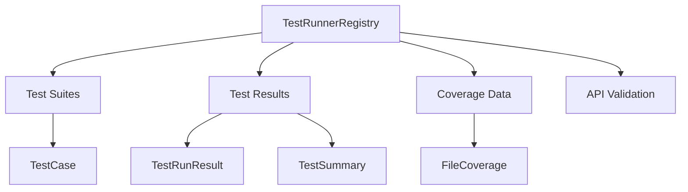
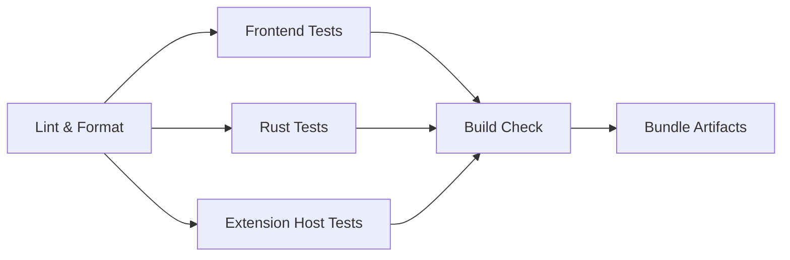

# Testing

DSCode has three layers of testing: frontend unit tests (Vitest), Rust backend
tests (`cargo test`), and integration tests that exercise cross-boundary
behavior. This guide covers running, writing, and understanding tests across all
layers.

---

## Quick Reference

| Command | Scope | Description |
|---------|-------|-------------|
| `npm test` | Frontend | Run Vitest unit tests |
| `npm run test:watch` | Frontend | Run Vitest in watch mode |
| `cd src-tauri && cargo test` | Rust | Run all Rust unit and integration tests |
| `cd extension-host && npm test` | Extension host | Run Jest tests for the extension host |

---

## Frontend Tests (Vitest)

The frontend uses [Vitest](https://vitest.dev/) for unit testing Svelte
components, TypeScript utilities, and store logic.

### Running frontend tests

```bash
# Run all tests once
npm test

# Run in watch mode (re-runs on file changes)
npm run test:watch

# Run a specific test file
npx vitest run src/lib/command-dispatcher.test.ts

# Run tests matching a pattern
npx vitest run --reporter=verbose -t "keybinding"
```

### Test file conventions

- Test files live alongside the source files they test.
- Name test files with the `.test.ts` or `.spec.ts` suffix.
- For Svelte component tests, use `.test.ts` (not `.test.svelte`).

```
src/
+-- lib/
|   +-- command-dispatcher.ts
|   +-- command-dispatcher.test.ts    # <-- test file
+-- stores/
|   +-- editor.ts
|   +-- editor.test.ts                # <-- test file
+-- components/
    +-- StatusBar.svelte
    +-- StatusBar.test.ts             # <-- test file
```

### Writing a frontend test

```typescript
// src/lib/example.test.ts
import { describe, it, expect, vi } from 'vitest';
import { myFunction } from './example';

describe('myFunction', () => {
  it('should return the expected value', () => {
    const result = myFunction('input');
    expect(result).toBe('expected output');
  });

  it('should handle edge cases', () => {
    expect(() => myFunction('')).toThrow('Input cannot be empty');
  });
});
```

#### Testing Svelte components

```typescript
// src/components/StatusBar.test.ts
import { describe, it, expect } from 'vitest';
import { render, screen } from '@testing-library/svelte';
import StatusBar from './StatusBar.svelte';

describe('StatusBar', () => {
  it('should render the branch name', () => {
    render(StatusBar, { props: { branch: 'main' } });
    expect(screen.getByText('main')).toBeTruthy();
  });
});
```

#### Mocking Tauri IPC calls

When testing code that calls the Tauri backend, mock the `@tauri-apps/api`
module:

```typescript
import { describe, it, expect, vi } from 'vitest';
import { invoke } from '@tauri-apps/api/core';

vi.mock('@tauri-apps/api/core', () => ({
  invoke: vi.fn(),
}));

describe('file operations', () => {
  it('should read a file via IPC', async () => {
    const mockInvoke = vi.mocked(invoke);
    mockInvoke.mockResolvedValueOnce('file contents');

    const result = await invoke('read_file', { path: '/tmp/test.txt' });
    expect(result).toBe('file contents');
    expect(mockInvoke).toHaveBeenCalledWith('read_file', { path: '/tmp/test.txt' });
  });
});
```

#### Testing Svelte stores

```typescript
import { describe, it, expect } from 'vitest';
import { get } from 'svelte/store';
import { editorStore } from '../stores/editor';

describe('editorStore', () => {
  it('should initialize with no open tabs', () => {
    const state = get(editorStore);
    expect(state.openTabs).toHaveLength(0);
  });
});
```

---

## Rust Tests (cargo test)

The Rust backend uses the built-in `cargo test` framework for both unit tests
(inline `#[cfg(test)]` modules) and integration tests (files in `src-tauri/tests/`).

### Running Rust tests

```bash
cd src-tauri

# Run all tests
cargo test

# Run tests with output visible (including println!)
cargo test -- --nocapture

# Run a specific test by name
cargo test test_extension_host_path_resolution

# Run tests in a specific module
cargo test commands::test_runner

# Run only integration tests
cargo test --test extension_host_pool_tests
```

### Test file conventions

**Unit tests** are defined inside the source file they test, using a `#[cfg(test)]`
module:

```rust
// src-tauri/src/commands/example_registry.rs

pub struct ExampleRegistry {
    // ...
}

impl ExampleRegistry {
    pub fn process(&self, input: &str) -> Result<String, String> {
        if input.is_empty() {
            return Err("Input cannot be empty".to_string());
        }
        Ok(format!("processed: {}", input))
    }
}

#[cfg(test)]
mod tests {
    use super::*;

    #[test]
    fn test_process_valid_input() {
        let registry = ExampleRegistry {};
        let result = registry.process("hello");
        assert_eq!(result.unwrap(), "processed: hello");
    }

    #[test]
    fn test_process_empty_input() {
        let registry = ExampleRegistry {};
        let result = registry.process("");
        assert!(result.is_err());
    }
}
```

**Integration tests** live in `src-tauri/tests/` and test cross-module behavior:

```rust
// src-tauri/tests/my_integration_test.rs

#[cfg(test)]
mod tests {
    #[test]
    fn test_cross_module_behavior() {
        // Integration test logic here
    }

    #[tokio::test]
    async fn test_async_behavior() {
        // Async integration test
    }
}
```

### Existing integration tests

The project includes integration tests for critical infrastructure:

- **`extension_host_pool_tests.rs`** -- tests Extension Host lifecycle, IPC URL
  generation, workspace folder response format, and serialization of IPC responses.

```rust
// Example from the existing test suite
#[test]
fn test_ipc_url_generation() {
    let host_id = "host-1";
    let outgoing_url = format!("ipc:///tmp/dscode-ext-out-{}.ipc", host_id);
    let incoming_url = format!("ipc:///tmp/dscode-ext-in-{}.ipc", host_id);

    assert_ne!(outgoing_url, incoming_url);
    assert!(outgoing_url.starts_with("ipc://"));
}
```

---

## Extension Host Tests (Jest)

The extension host uses [Jest](https://jestjs.io/) for testing the VS Code API
shim, IPC bridge, and extension loading logic.

### Running extension host tests

```bash
cd extension-host

# Run all tests
npm test

# Run in watch mode
npm run test:watch

# Run with coverage
npm run test:coverage
```

### Test file conventions

Extension host tests live in `extension-host/src/__tests__/`:

```
extension-host/
+-- src/
    +-- __tests__/          # Jest test files
    +-- api/                # VS Code API shim (tested)
    +-- extensions/         # Extension loader (tested)
    +-- bridge.ts           # IPC bridge (tested)
```

---

## Test Runner Infrastructure

DSCode includes a built-in **test runner system** for extension API testing,
implemented as a registry + ops pair in the Rust backend.

### Architecture



### Key components

| File | Purpose |
|------|---------|
| `src-tauri/src/commands/test_runner_registry.rs` | Test suite management, execution tracking, coverage collection, and API validation |
| `src-tauri/src/commands/test_runner_ops.rs` | Tauri IPC commands exposing the registry to the frontend |

### Test lifecycle

1. **Register** a test suite via `register_test_suite` (IPC command)
2. **Start** a test run with `start_test_run` -- emits a `test-run-started` event
3. **Update** individual results with `update_test_result` -- emits `test-result-updated`
4. **Complete** the run via `complete_test_run` -- emits `test-run-completed`
5. **Query** results with `get_test_run_result` or `get_all_test_results`
6. **Coverage** is tracked per extension via `update_coverage` and `get_coverage`

### API validation

The test runner also validates extension API usage:

```rust
// Detects deprecated APIs and suggests replacements
// workspace.rootPath -> workspace.workspaceFolders
// window.onDidChangeActiveEditor -> window.onDidChangeActiveTextEditor

// Checks required APIs for extension types
// "language" extensions must implement registerHoverProvider, etc.
```

---

## Test Coverage

### Frontend coverage (Vitest)

```bash
npx vitest run --coverage
```

!!! info "Coverage provider"
    Vitest uses `@vitest/coverage-v8` or `@vitest/coverage-istanbul`. Install
    the provider if not already present:

    ```bash
    npm install -D @vitest/coverage-v8
    ```

Coverage reports are generated in `coverage/` with HTML and LCOV output.

### Rust coverage (tarpaulin)

```bash
# Install tarpaulin
cargo install cargo-tarpaulin

# Generate coverage report
cd src-tauri
cargo tarpaulin --out Html --output-dir ../coverage-rust
```

!!! warning "tarpaulin limitations"
    `cargo-tarpaulin` only works on Linux (x86_64). For macOS, use
    [cargo-llvm-cov](https://github.com/taiki-e/cargo-llvm-cov) instead:

    ```bash
    cargo install cargo-llvm-cov
    cd src-tauri
    cargo llvm-cov --html --output-dir ../coverage-rust
    ```

### Extension host coverage (Jest)

```bash
cd extension-host
npm run test:coverage
```

Coverage reports appear in `extension-host/coverage/`.

---

## CI/CD Test Pipeline

All tests run automatically on every pull request via GitHub Actions.

### Pipeline stages



### What CI checks

| Check | Command | Must Pass |
|-------|---------|-----------|
| ESLint | `npm run lint` | Yes |
| Prettier | `npx prettier --check .` | Yes |
| svelte-check | `npm run check` | Yes |
| Clippy | `cargo clippy -- -D warnings` | Yes |
| rustfmt | `cargo fmt --check` | Yes |
| Frontend tests | `npm test` | Yes |
| Rust tests | `cargo test` | Yes |
| Extension host tests | `cd extension-host && npm test` | Yes |
| Production build | `npm run tauri:build` | Yes |

!!! danger "All checks must pass"
    Pull requests cannot be merged until every CI check passes. If a check fails,
    review the CI logs, fix the issue locally, and push a new commit.

---

## Best Practices

1. **Write tests alongside code.** Every new feature or bug fix should include
   corresponding tests.

2. **Keep tests fast.** Avoid unnecessary async waits, large test fixtures, or
   network calls. Mock external dependencies.

3. **Test behavior, not implementation.** Focus on what the function does, not
   how it does it internally. This makes tests resilient to refactoring.

4. **Use descriptive test names.** Prefer `it('should return empty array when no files match')`
   over `it('test1')`.

5. **Isolate test state.** Each test should set up and tear down its own state.
   Do not rely on test execution order.

---

## Next Steps

- [Code Style](code-style.md) -- formatting and lint rules for all languages
- [Pull Request Guidelines](pull-request-guidelines.md) -- how to submit your contribution
