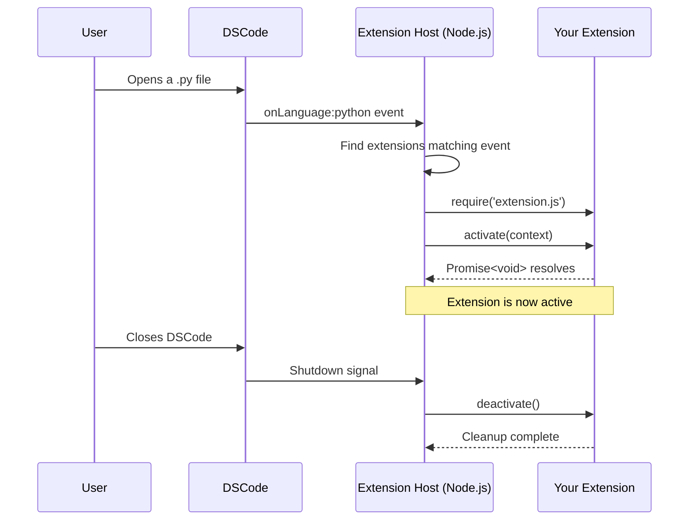

# Activation Events

Activation events control **when** DSCode loads your extension into the extension host. Extensions are not loaded at startup by default -- they are activated lazily in response to specific user actions or workspace conditions. This keeps the editor fast and memory-efficient.

Activation events are declared in the `activationEvents` array of your `package.json`.

!!! info "Automatic inference"
    If `activationEvents` is an empty array `[]`, DSCode automatically infers activation events from your `contributes` section. For example, a contributed command `myExt.doThing` implicitly generates `onCommand:myExt.doThing`. Explicit declaration is still recommended for clarity and for event types that cannot be inferred.

---

## Event Types

### `onCommand:${command}`

Activates when a specific command is invoked -- from the Command Palette, a keybinding, a menu item, or programmatically via `vscode.commands.executeCommand`.

```json title="package.json"
{
    "activationEvents": [
        "onCommand:myExtension.formatDocument",
        "onCommand:myExtension.openSettings"
    ]
}
```

!!! tip "Best practice"
    This is the most common and most efficient activation event. If your extension only provides commands, use `onCommand` exclusively. The extension stays dormant until the user actually needs it.

---

### `onLanguage:${language}`

Activates when a file of the specified language is opened. The language identifier matches the language ID used by Monaco (e.g., `typescript`, `python`, `rust`, `markdown`).

```json title="package.json"
{
    "activationEvents": [
        "onLanguage:python",
        "onLanguage:jupyter"
    ]
}
```

```typescript title="src/extension.ts"
export function activate(context: vscode.ExtensionContext) {
    // Register providers only for the target language
    const selector: vscode.DocumentSelector = {
        language: 'python',
        scheme: 'file'
    };

    context.subscriptions.push(
        vscode.languages.registerCompletionItemProvider(
            selector,
            new PythonCompletionProvider()
        )
    );
}
```

!!! note "Multiple languages"
    List each language as a separate entry. There is no wildcard for languages -- this is intentional to prevent extensions from activating on every file open.

---

### `onDebug`

Activates when any debug session is about to start. Use this if your extension contributes a debug adapter or needs to configure debugging.

```json title="package.json"
{
    "activationEvents": [
        "onDebug"
    ]
}
```

This is a broad event. For more granular control, use the specialized debug events below.

---

### `onDebugResolve:${type}`

Activates when a debug session of the specified type is about to start. More specific than `onDebug`.

```json title="package.json"
{
    "activationEvents": [
        "onDebugResolve:node"
    ]
}
```

This fires when the debug configuration's `type` field matches. Use this for extensions that provide `resolveDebugConfiguration` for a specific debugger type.

---

### `onDebugInitialConfigurations`

Activates when DSCode needs initial debug configurations -- typically when the user clicks **create a launch.json file** and no `launch.json` exists yet.

```json title="package.json"
{
    "activationEvents": [
        "onDebugInitialConfigurations"
    ]
}
```

---

### `workspaceContains:${glob}`

Activates when the opened workspace contains at least one file matching the specified glob pattern. DSCode evaluates this at workspace open time.

```json title="package.json"
{
    "activationEvents": [
        "workspaceContains:Cargo.toml",
        "workspaceContains:**/.eslintrc*"
    ]
}
```

!!! example "Use cases"
    - A Rust extension activates when `Cargo.toml` is present
    - An ESLint extension activates when any `.eslintrc` configuration file exists
    - A Docker extension activates when a `Dockerfile` or `docker-compose.yml` is found

!!! warning "Performance consideration"
    Glob patterns are evaluated by scanning the workspace file tree. Deep recursive patterns like `**/*.obscure` can be slow in large workspaces. Prefer patterns that match files near the workspace root.

---

### `onFileSystem:${scheme}`

Activates when a file or folder from a specific URI scheme is opened or read. This is used by file system provider extensions.

```json title="package.json"
{
    "activationEvents": [
        "onFileSystem:ftp",
        "onFileSystem:ssh"
    ]
}
```

Standard schemes like `file` and `untitled` are handled by DSCode itself. Use this for custom schemes your extension provides (e.g., virtual file systems).

---

### `onView:${viewId}`

Activates when a specific view (sidebar panel, tree view) becomes visible. The `viewId` must match a view declared in `contributes.views`.

```json title="package.json"
{
    "activationEvents": [
        "onView:myExtension.projectExplorer"
    ],
    "contributes": {
        "views": {
            "explorer": [
                {
                    "id": "myExtension.projectExplorer",
                    "name": "Project Explorer"
                }
            ]
        }
    }
}
```

```typescript title="src/extension.ts"
export function activate(context: vscode.ExtensionContext) {
    vscode.window.registerTreeDataProvider(
        'myExtension.projectExplorer',
        new ProjectTreeProvider()
    );
}
```

---

### `onUri`

Activates when a system-wide URI targeting your extension is opened. This enables deep-link scenarios like OAuth callbacks, protocol handlers, and external tool integrations.

```json title="package.json"
{
    "activationEvents": [
        "onUri"
    ]
}
```

```typescript title="src/extension.ts"
export function activate(context: vscode.ExtensionContext) {
    vscode.window.registerUriHandler({
        handleUri(uri: vscode.Uri) {
            // uri = dscode://publisher.extensionId/callback?token=abc123
            const token = new URLSearchParams(uri.query).get('token');
            console.log(`Received token: ${token}`);
        }
    });
}
```

The URI scheme is `dscode://` followed by the extension identifier:

```
dscode://publisher.extensionId/your/custom/path?key=value
```

---

### `onWebviewPanel:${viewType}`

Activates when DSCode needs to restore a webview panel of the specified type. This happens when the user reopens the editor and a serialized webview from a previous session needs to be restored.

```json title="package.json"
{
    "activationEvents": [
        "onWebviewPanel:myExtension.preview"
    ]
}
```

```typescript title="src/extension.ts"
export function activate(context: vscode.ExtensionContext) {
    vscode.window.registerWebviewPanelSerializer(
        'myExtension.preview',
        {
            async deserializeWebviewPanel(panel, state) {
                // Restore webview content from saved state
                panel.webview.html = renderPreview(state);
            }
        }
    );
}
```

!!! note "Prerequisite"
    For webview restoration to work, your extension must register a serializer using `registerWebviewPanelSerializer` and the webview panel must call `setState` to persist its state.

---

### `onStartupFinished`

Activates after DSCode has fully started up and all other activation events have been processed. This is a deferred startup event -- your extension loads in the background without blocking the editor.

```json title="package.json"
{
    "activationEvents": [
        "onStartupFinished"
    ]
}
```

!!! tip "When to use"
    Use `onStartupFinished` for extensions that need to run setup logic but do not need to be ready instantly. Examples:

    - Telemetry or analytics extensions
    - Auto-update checkers
    - Background indexers
    - Extensions that register providers the user will not need immediately

    This is **much better** than `*` because it does not block startup.

---

### `*` (Always Activate)

Activates the extension immediately when DSCode starts up, before the workspace is fully loaded.

```json title="package.json"
{
    "activationEvents": [
        "*"
    ]
}
```

!!! danger "Avoid in production"
    Using `*` means your extension loads on **every** DSCode launch, increasing startup time and memory usage for **every** user -- even those who are not actively using your extension's features.

    **Do not use `*` unless your extension truly needs to be active at all times** (e.g., a core UI theme or a foundational service). In almost every case, a more specific event or `onStartupFinished` is the correct choice.

---

## Combining Multiple Events

You can declare multiple activation events. The extension activates when **any** of them fires (logical OR):

```json title="package.json"
{
    "activationEvents": [
        "onLanguage:typescript",
        "onLanguage:javascript",
        "onCommand:myExtension.analyzeProject",
        "workspaceContains:tsconfig.json"
    ]
}
```

In this example, the extension activates if:

- A TypeScript or JavaScript file is opened, **or**
- The `analyzeProject` command is run, **or**
- The workspace contains a `tsconfig.json`

The `activate()` function is called only once regardless of how many events match.

---

## Activation Event Lifecycle

Understanding the full lifecycle helps you write robust extensions:



Key points:

1. **Loading**: The extension's `main` file is `require()`-d into the Node.js extension host
2. **Activation**: The `activate(context)` function is called and must return a `Promise` (or be synchronous)
3. **Active**: The extension is running -- all registered providers and commands are live
4. **Deactivation**: Called when the extension is disabled, uninstalled, or DSCode shuts down

---

## Performance Best Practices

### 1. Be as Specific as Possible

=== "Bad"
    ```json
    {
        "activationEvents": ["*"]
    }
    ```

=== "Better"
    ```json
    {
        "activationEvents": ["onStartupFinished"]
    }
    ```

=== "Best"
    ```json
    {
        "activationEvents": [
            "onLanguage:python",
            "workspaceContains:pyproject.toml"
        ]
    }
    ```

### 2. Defer Heavy Initialization

Even after activation, defer expensive work to when it is actually needed:

```typescript
export function activate(context: vscode.ExtensionContext) {
    // Register providers immediately (cheap)
    context.subscriptions.push(
        vscode.languages.registerCompletionItemProvider(
            'python',
            new LazyCompletionProvider() // does not load model until first invocation
        )
    );
}

class LazyCompletionProvider implements vscode.CompletionItemProvider {
    private model: LanguageModel | undefined;

    async provideCompletionItems(doc: vscode.TextDocument, pos: vscode.Position) {
        // Heavy initialization only when first completion is requested
        if (!this.model) {
            this.model = await loadLanguageModel();
        }
        return this.model.complete(doc, pos);
    }
}
```

### 3. Measure Your Activation Time

Check the **Extension Host** output channel for activation timing:

```
[info] Activating extension 'publisher.myExtension'...
[info] Extension 'publisher.myExtension' activated in 12ms.
```

!!! success "Target: under 50ms"
    Aim for activation times under **50ms**. If your extension takes longer, consider deferring initialization work to the first user interaction.

### 4. Avoid Redundant Events

Do not declare events that are automatically inferred:

```json
{
    "activationEvents": [
        "onCommand:myExt.run" // (1)!
    ],
    "contributes": {
        "commands": [
            { "command": "myExt.run", "title": "Run" }
        ]
    }
}
```

1. This is automatically inferred from `contributes.commands`. You can leave `activationEvents` as `[]`.

---

## Quick Reference

| Event | Fires When | Typical Use |
|-------|-----------|-------------|
| `onCommand:${cmd}` | Command is invoked | Extensions with commands |
| `onLanguage:${lang}` | File of language opened | Language support extensions |
| `onDebug` | Any debug session starts | Debug adapter extensions |
| `onDebugResolve:${type}` | Debug session of type starts | Type-specific debug support |
| `onDebugInitialConfigurations` | launch.json needs creation | Debug configuration providers |
| `workspaceContains:${glob}` | Workspace has matching file | Project-type-specific extensions |
| `onFileSystem:${scheme}` | Custom scheme file accessed | Virtual file system providers |
| `onView:${viewId}` | View becomes visible | Tree view / sidebar extensions |
| `onUri` | Extension URI opened | Deep links, OAuth callbacks |
| `onWebviewPanel:${type}` | Webview needs restoration | Webview extensions |
| `onStartupFinished` | Editor fully loaded | Background tasks |
| `*` | Immediately at startup | Avoid unless absolutely necessary |
