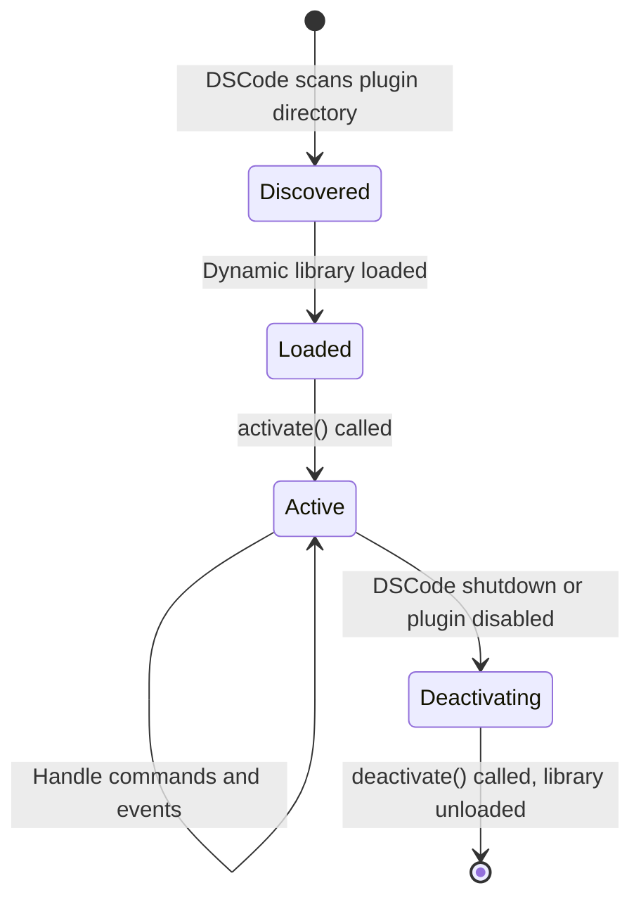

# Native Rust Plugins

!!! warning "DSCode-Specific Feature"
    Native Rust plugins are a **DSCode-exclusive** feature. They are **not compatible with VS Code** and will not work in other editors. If you need cross-editor compatibility, use the standard [VS Code Extension API](vscode-api-reference.md) instead.

While Node.js extensions cover most use cases, some scenarios demand the raw performance and system-level access that only native code can provide. DSCode's native plugin system lets you write plugins in **Rust** that run inside the Tauri backend process -- with direct access to the file system, OS APIs, and the full Tauri plugin ecosystem.

---

## When to Use Native Plugins

| Scenario | Node.js Extension | Native Rust Plugin |
|----------|-------------------|--------------------|
| Register commands, menus, keybindings | Yes | Yes |
| IntelliSense, language providers | Yes | Not directly (use LSP) |
| Webview UIs | Yes | No |
| CPU-intensive computation (parsing, indexing) | Slow | **Fast** |
| File system watchers (high-throughput) | Decent | **Best** |
| System-level access (sockets, hardware) | Limited | **Full** |
| Integrate C/C++ libraries via FFI | Difficult | **Easy** |
| Sub-millisecond IPC with frontend | Via NNG | **Direct Tauri events** |

!!! tip "Hybrid approach"
    You can ship a native Rust plugin alongside a Node.js extension. The Rust plugin handles performance-critical backend work, while the Node.js extension provides the familiar VS Code API for UI integration.

---

## Plugin Structure

A native plugin is a standard Rust library crate that implements the `DsPlugin` trait.

```
my-plugin/
├── Cargo.toml
├── src/
│   └── lib.rs
└── README.md
```

### Cargo.toml

```toml title="Cargo.toml"
[package]
name = "dscode-file-watcher"
version = "0.1.0"
edition = "2021"

[lib]
crate-type = ["cdylib"]  # Compile as a dynamic library

[dependencies]
dscode-plugin-api = "0.1"    # DSCode plugin SDK
tauri = { version = "2", features = [] }
serde = { version = "1", features = ["derive"] }
serde_json = "1"
notify = "7"                  # File system notifications
tokio = { version = "1", features = ["full"] }
```

!!! info "Crate type"
    The `crate-type = ["cdylib"]` setting is required. DSCode loads plugins as dynamic libraries (`.so` on Linux, `.dylib` on macOS, `.dll` on Windows) at runtime.

---

## The Plugin Trait

Every native plugin must implement the `DsPlugin` trait:

```rust title="src/lib.rs"
use dscode_plugin_api::{DsPlugin, PluginContext, PluginResult, command};
use serde::{Deserialize, Serialize};

/// Plugin metadata -- exported for DSCode to discover
#[dscode_plugin_api::plugin]
pub struct FileWatcherPlugin {
    watchers: Vec<notify::RecommendedWatcher>,
}

impl DsPlugin for FileWatcherPlugin {
    /// Called when the plugin is loaded.
    /// Use this to register commands, set up state, and initialize resources.
    fn activate(&mut self, ctx: &PluginContext) -> PluginResult<()> {
        log::info!("FileWatcherPlugin activated");

        // Register commands
        ctx.register_command("fileWatcher.start", Self::start_watching)?;
        ctx.register_command("fileWatcher.stop", Self::stop_watching)?;
        ctx.register_command("fileWatcher.status", Self::get_status)?;

        Ok(())
    }

    /// Called when the plugin is unloaded.
    /// Clean up all resources here.
    fn deactivate(&mut self) -> PluginResult<()> {
        log::info!("FileWatcherPlugin deactivated");
        self.watchers.clear();
        Ok(())
    }

    /// Plugin metadata
    fn name(&self) -> &str {
        "file-watcher"
    }

    fn version(&self) -> &str {
        env!("CARGO_PKG_VERSION")
    }
}
```

### Lifecycle



1. **Discovery**: DSCode scans `~/.config/dscode/plugins/` for `.so`/`.dylib`/`.dll` files with valid plugin metadata
2. **Loading**: The dynamic library is loaded via `dlopen` / `LoadLibrary`
3. **Activation**: `activate()` is called with a `PluginContext` providing access to DSCode internals
4. **Runtime**: The plugin handles commands, emits events, and interacts with the Tauri app
5. **Deactivation**: `deactivate()` is called during shutdown or when the plugin is disabled

---

## Registering Commands

Commands registered from Rust plugins are available in the Command Palette and can be bound to keybindings just like extension commands.

```rust
use dscode_plugin_api::{PluginContext, PluginResult, CommandArgs};
use serde_json::Value;

impl FileWatcherPlugin {
    fn start_watching(
        &mut self,
        ctx: &PluginContext,
        args: CommandArgs
    ) -> PluginResult<Value> {
        // Parse the directory path from command arguments
        let path: String = args.get("path")
            .and_then(|v| v.as_str())
            .unwrap_or(".")
            .to_string();

        // Create a file system watcher
        use notify::{Watcher, RecursiveMode, Event};
        let app_handle = ctx.app_handle().clone();

        let mut watcher = notify::recommended_watcher(
            move |res: Result<Event, notify::Error>| {
                if let Ok(event) = res {
                    // Emit event to the frontend
                    app_handle.emit("file-changed", &event.paths).ok();
                }
            }
        )?;

        watcher.watch(path.as_ref(), RecursiveMode::Recursive)?;
        self.watchers.push(watcher);

        // Show a notification via the frontend
        ctx.show_information_message(
            &format!("Watching directory: {}", path)
        )?;

        Ok(serde_json::json!({ "status": "watching", "path": path }))
    }

    fn stop_watching(
        &mut self,
        _ctx: &PluginContext,
        _args: CommandArgs
    ) -> PluginResult<Value> {
        let count = self.watchers.len();
        self.watchers.clear();
        Ok(serde_json::json!({ "stopped": count }))
    }

    fn get_status(
        &self,
        _ctx: &PluginContext,
        _args: CommandArgs
    ) -> PluginResult<Value> {
        Ok(serde_json::json!({
            "active_watchers": self.watchers.len()
        }))
    }
}
```

---

## Accessing Tauri APIs

Native plugins run inside the Tauri process and have access to the full Tauri API surface through the `PluginContext`.

### App Handle

```rust
fn my_command(&self, ctx: &PluginContext, _args: CommandArgs) -> PluginResult<Value> {
    let app = ctx.app_handle();

    // Access the Tauri app config
    let config = app.config();
    log::info!("App name: {}", config.product_name.as_deref().unwrap_or("DSCode"));

    // Get the app data directory
    let data_dir = app.path().app_data_dir()?;
    log::info!("Data dir: {:?}", data_dir);

    Ok(Value::Null)
}
```

### Window Management

```rust
fn open_side_panel(&self, ctx: &PluginContext, _args: CommandArgs) -> PluginResult<Value> {
    let app = ctx.app_handle();

    // Get the main window
    if let Some(window) = app.get_webview_window("main") {
        // Set window properties
        window.set_title("DSCode - Custom Plugin Active")?;

        // Execute JavaScript in the frontend
        window.eval("console.log('Hello from Rust plugin!')")?;
    }

    Ok(Value::Null)
}
```

### Emit Events to Frontend

```rust
use serde::Serialize;

#[derive(Serialize, Clone)]
struct IndexProgress {
    files_indexed: usize,
    total_files: usize,
    current_file: String,
}

fn index_workspace(&self, ctx: &PluginContext, _args: CommandArgs) -> PluginResult<Value> {
    let app = ctx.app_handle().clone();
    let workspace_path = ctx.workspace_root().to_path_buf();

    // Spawn an async task for long-running work
    tokio::spawn(async move {
        let files = walkdir::WalkDir::new(&workspace_path)
            .into_iter()
            .filter_map(|e| e.ok())
            .filter(|e| e.file_type().is_file())
            .collect::<Vec<_>>();

        let total = files.len();

        for (i, entry) in files.iter().enumerate() {
            // Index the file...
            index_file(entry.path()).await;

            // Report progress to the frontend
            app.emit("index-progress", &IndexProgress {
                files_indexed: i + 1,
                total_files: total,
                current_file: entry.path().display().to_string(),
            }).ok();
        }

        app.emit("index-complete", &serde_json::json!({
            "total": total
        })).ok();
    });

    Ok(serde_json::json!({ "status": "indexing_started" }))
}
```

---

## IPC Between Rust Plugin and Frontend

### Listening for Frontend Events

```rust
fn activate(&mut self, ctx: &PluginContext) -> PluginResult<()> {
    let app = ctx.app_handle().clone();

    // Listen for events from the Svelte frontend
    app.listen("user-action", move |event| {
        if let Some(payload) = event.payload() {
            log::info!("Received from frontend: {}", payload);
        }
    });

    Ok(())
}
```

### Frontend (Svelte) Side

```svelte
<script lang="ts">
    import { invoke } from '@tauri-apps/api/core';
    import { listen, emit } from '@tauri-apps/api/event';
    import { onMount, onDestroy } from 'svelte';

    let progress = { files_indexed: 0, total_files: 0, current_file: '' };
    let unlisten: (() => void) | undefined;

    onMount(async () => {
        // Listen for events from the Rust plugin
        unlisten = await listen<typeof progress>('index-progress', (event) => {
            progress = event.payload;
        });
    });

    onDestroy(() => {
        unlisten?.();
    });

    async function startIndexing() {
        // Invoke a command registered by the Rust plugin
        const result = await invoke('plugin:file-watcher|index_workspace');
        console.log(result);
    }

    // Send events to the Rust plugin
    function sendAction(action: string) {
        emit('user-action', { action, timestamp: Date.now() });
    }
</script>

<div>
    <button on:click={startIndexing}>Start Indexing</button>
    {#if progress.total_files > 0}
        <progress value={progress.files_indexed} max={progress.total_files} />
        <p>{progress.current_file}</p>
    {/if}
</div>
```

---

## Building and Loading

### Building

```bash
# Build the plugin (release mode for performance)
cd my-plugin
cargo build --release

# The compiled plugin is at:
# target/release/libdscode_file_watcher.dylib  (macOS)
# target/release/libdscode_file_watcher.so     (Linux)
# target/release/dscode_file_watcher.dll       (Windows)
```

### Installing

Copy the compiled library to the DSCode plugins directory:

=== "macOS"

    ```bash
    cp target/release/libdscode_file_watcher.dylib \
        ~/.config/dscode/plugins/
    ```

=== "Linux"

    ```bash
    cp target/release/libdscode_file_watcher.so \
        ~/.config/dscode/plugins/
    ```

=== "Windows"

    ```powershell
    Copy-Item target\release\dscode_file_watcher.dll `
        "$env:APPDATA\dscode\plugins\"
    ```

### Plugin Manifest

Each plugin needs a `plugin.json` manifest alongside the binary:

```json title="plugin.json"
{
    "name": "file-watcher",
    "displayName": "File Watcher",
    "version": "0.1.0",
    "description": "High-performance file system watcher using the notify crate",
    "author": "Your Name",
    "license": "MIT",
    "library": "libdscode_file_watcher",
    "platforms": ["macos-aarch64", "macos-x86_64", "linux-x86_64", "windows-x86_64"],
    "contributes": {
        "commands": [
            {
                "command": "fileWatcher.start",
                "title": "Start File Watcher",
                "category": "File Watcher"
            },
            {
                "command": "fileWatcher.stop",
                "title": "Stop File Watcher",
                "category": "File Watcher"
            },
            {
                "command": "fileWatcher.status",
                "title": "File Watcher Status",
                "category": "File Watcher"
            }
        ]
    }
}
```

### Loading on Startup

DSCode automatically scans and loads plugins at startup. You can also reload plugins without restarting:

```
Command Palette > Developer: Reload Native Plugins
```

---

## Example: Complete File Watcher Plugin

Here is the full `lib.rs` for a production-ready file watcher plugin:

```rust title="src/lib.rs"
use dscode_plugin_api::{
    DsPlugin, PluginContext, PluginResult, CommandArgs, plugin,
};
use notify::{
    Event, EventKind, RecommendedWatcher, RecursiveMode, Watcher,
};
use serde::{Deserialize, Serialize};
use serde_json::Value;
use std::collections::HashMap;
use std::path::PathBuf;
use std::sync::{Arc, Mutex};

#[derive(Serialize, Clone)]
struct FileEvent {
    kind: String,
    paths: Vec<String>,
    timestamp: u64,
}

#[plugin]
pub struct FileWatcherPlugin {
    watchers: Arc<Mutex<HashMap<String, RecommendedWatcher>>>,
}

impl Default for FileWatcherPlugin {
    fn default() -> Self {
        Self {
            watchers: Arc::new(Mutex::new(HashMap::new())),
        }
    }
}

impl DsPlugin for FileWatcherPlugin {
    fn activate(&mut self, ctx: &PluginContext) -> PluginResult<()> {
        ctx.register_command("fileWatcher.watch", Self::watch_directory)?;
        ctx.register_command("fileWatcher.unwatch", Self::unwatch_directory)?;
        ctx.register_command("fileWatcher.list", Self::list_watchers)?;

        log::info!("File Watcher plugin activated");
        Ok(())
    }

    fn deactivate(&mut self) -> PluginResult<()> {
        let mut watchers = self.watchers.lock().unwrap();
        watchers.clear();
        log::info!("File Watcher plugin deactivated -- all watchers stopped");
        Ok(())
    }

    fn name(&self) -> &str { "file-watcher" }
    fn version(&self) -> &str { env!("CARGO_PKG_VERSION") }
}

impl FileWatcherPlugin {
    fn watch_directory(
        &self,
        ctx: &PluginContext,
        args: CommandArgs,
    ) -> PluginResult<Value> {
        let path = args.get_string("path")?;
        let app_handle = ctx.app_handle().clone();
        let recursive = args.get("recursive")
            .and_then(|v| v.as_bool())
            .unwrap_or(true);

        let mode = if recursive {
            RecursiveMode::Recursive
        } else {
            RecursiveMode::NonRecursive
        };

        let mut watcher = notify::recommended_watcher(
            move |res: Result<Event, notify::Error>| {
                if let Ok(event) = res {
                    let kind = match event.kind {
                        EventKind::Create(_) => "create",
                        EventKind::Modify(_) => "modify",
                        EventKind::Remove(_) => "remove",
                        _ => "other",
                    };

                    let file_event = FileEvent {
                        kind: kind.to_string(),
                        paths: event.paths.iter()
                            .map(|p| p.display().to_string())
                            .collect(),
                        timestamp: std::time::SystemTime::now()
                            .duration_since(std::time::UNIX_EPOCH)
                            .unwrap()
                            .as_secs(),
                    };

                    app_handle.emit("file-watcher:event", &file_event).ok();
                }
            },
        )?;

        watcher.watch(PathBuf::from(&path).as_ref(), mode)?;

        let mut watchers = self.watchers.lock().unwrap();
        watchers.insert(path.clone(), watcher);

        ctx.show_information_message(
            &format!("Now watching: {}", path)
        )?;

        Ok(serde_json::json!({
            "status": "watching",
            "path": path,
            "recursive": recursive,
            "total_watchers": watchers.len()
        }))
    }

    fn unwatch_directory(
        &self,
        ctx: &PluginContext,
        args: CommandArgs,
    ) -> PluginResult<Value> {
        let path = args.get_string("path")?;
        let mut watchers = self.watchers.lock().unwrap();

        if watchers.remove(&path).is_some() {
            ctx.show_information_message(
                &format!("Stopped watching: {}", path)
            )?;
            Ok(serde_json::json!({ "status": "unwatched", "path": path }))
        } else {
            Ok(serde_json::json!({ "status": "not_found", "path": path }))
        }
    }

    fn list_watchers(
        &self,
        _ctx: &PluginContext,
        _args: CommandArgs,
    ) -> PluginResult<Value> {
        let watchers = self.watchers.lock().unwrap();
        let paths: Vec<&String> = watchers.keys().collect();
        Ok(serde_json::json!({
            "watchers": paths,
            "count": paths.len()
        }))
    }
}
```

---

## Debugging Native Plugins

### Logging

Plugins use the standard Rust `log` crate. DSCode routes log output to the **Output** panel under the channel **Native Plugins**.

```rust
log::debug!("Detailed debug info");
log::info!("General information");
log::warn!("Something looks wrong");
log::error!("Something failed: {}", error);
```

### Attaching a Debugger

For full debugging with breakpoints:

1. Build in debug mode: `cargo build`
2. Launch DSCode with `RUST_LOG=debug dscode .`
3. Attach `lldb` or `gdb` to the DSCode process
4. Set breakpoints in your plugin code

!!! tip "Faster iteration"
    Use `cargo watch` for automatic rebuilds during development:

    ```bash
    cargo install cargo-watch
    cargo watch -x 'build --release' -w src/
    ```

    Then reload plugins in DSCode with **Developer: Reload Native Plugins**.

---

## Safety and Compatibility

!!! danger "Native plugins run with full system access"
    Unlike sandboxed Node.js extensions, native plugins run inside the Tauri backend process with the same privileges as DSCode itself. A buggy or malicious plugin can:

    - Crash the entire editor
    - Access any file on the system
    - Make network requests
    - Execute arbitrary system commands

    **Only install native plugins from sources you trust.** DSCode displays a warning dialog when loading unsigned native plugins.

!!! info "Platform compatibility"
    Native plugins are compiled for a specific OS and CPU architecture. You must provide separate binaries for each target:

    | Target | Library Extension | Example |
    |--------|-------------------|---------|
    | macOS (Apple Silicon) | `.dylib` | `libmyplugin.dylib` |
    | macOS (Intel) | `.dylib` | `libmyplugin.dylib` |
    | Linux (x86_64) | `.so` | `libmyplugin.so` |
    | Windows (x86_64) | `.dll` | `myplugin.dll` |

    Use cross-compilation or CI/CD to build for all platforms. See [Publishing](publishing.md) for CI/CD examples.
