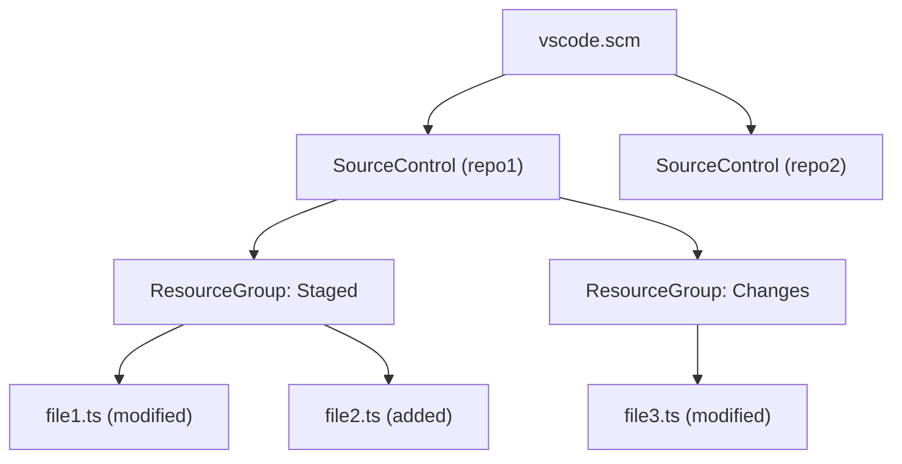

# Source Control Management API

DSCode implements the `vscode.scm` namespace, allowing extensions to integrate custom source control providers into the editor. This is the same API used by extensions like GitLens and SVN to provide source control features.

**Source:** `extension-host/src/api/scm.ts`

---

## Overview

The SCM API provides three main abstractions:

| Concept | Description |
|---------|-------------|
| **SourceControl** | A source control provider instance (e.g., a Git repository) |
| **SourceControlResourceGroup** | A group of resources (e.g., "Staged Changes", "Changes") |
| **SourceControlResourceState** | An individual file change within a group |



---

## Creating a Source Control Provider

Use `vscode.scm.createSourceControl()` to register a new source control provider:

```typescript
import * as vscode from 'vscode';

export function activate(context: vscode.ExtensionContext) {
    const rootUri = vscode.workspace.workspaceFolders?.[0]?.uri;

    // Create the source control instance
    const scm = vscode.scm.createSourceControl(
        'myScm',           // Unique ID
        'My SCM',          // Display label
        rootUri            // Optional root URI
    );

    context.subscriptions.push(scm);
}
```

---

## Resource Groups

Resource groups organize changes into logical sections displayed in the SCM view:

```typescript
// Create resource groups
const stagedGroup = scm.createResourceGroup('staged', 'Staged Changes');
const changesGroup = scm.createResourceGroup('changes', 'Changes');

// Add resources to a group
changesGroup.resourceStates = [
    {
        resourceUri: vscode.Uri.file('/path/to/modified-file.ts'),
        decorations: {
            strikeThrough: false,
            faded: false,
            tooltip: 'Modified',
            light: { iconPath: modifiedIcon },
            dark: { iconPath: modifiedIcon }
        },
        command: {
            title: 'Open Diff',
            command: 'myScm.openDiff',
            arguments: [vscode.Uri.file('/path/to/modified-file.ts')]
        }
    }
];
```

### Hiding Empty Groups

Set `hideWhenEmpty` to automatically hide groups with no resources:

```typescript
stagedGroup.hideWhenEmpty = true;
```

---

## Input Box

The SCM view includes an input box for commit messages. Access it through `sourceControl.inputBox`:

```typescript
// Set placeholder text
scm.inputBox.placeholder = 'Enter commit message';

// Set a default message template
scm.commitTemplate = 'feat: ';

// Handle the accept command (when user presses Ctrl+Enter)
scm.acceptInputCommand = {
    title: 'Commit',
    command: 'myScm.commit',
    arguments: []
};
```

---

## Resource Decorations

Resource states support decorations that control how files appear in the SCM view:

```typescript
interface SourceControlResourceDecorations {
    strikeThrough?: boolean;    // Strike through deleted files
    faded?: boolean;            // Dim ignored files
    tooltip?: string;           // Hover tooltip
    light?: { iconPath: Uri };  // Icon for light themes
    dark?: { iconPath: Uri };   // Icon for dark themes
}
```

---

## Status Bar Commands

Display commands in the status bar associated with your SCM provider:

```typescript
scm.statusBarCommands = [
    {
        title: '$(git-branch) main',
        command: 'myScm.showBranches',
        arguments: []
    },
    {
        title: '$(sync) 2↑ 1↓',
        command: 'myScm.sync',
        arguments: []
    }
];
```

---

## Count Badge

Set the count property to display a badge on the SCM view icon:

```typescript
scm.count = changesGroup.resourceStates.length;
```

---

## Complete Example

```typescript
import * as vscode from 'vscode';

export function activate(context: vscode.ExtensionContext) {
    const rootUri = vscode.workspace.workspaceFolders?.[0]?.uri;
    const scm = vscode.scm.createSourceControl('example', 'Example SCM', rootUri);

    // Set up input box
    scm.inputBox.placeholder = 'Commit message';
    scm.acceptInputCommand = {
        title: 'Commit',
        command: 'example.commit'
    };

    // Create resource groups
    const changes = scm.createResourceGroup('changes', 'Changes');
    changes.hideWhenEmpty = true;

    // Register commands
    context.subscriptions.push(
        vscode.commands.registerCommand('example.commit', () => {
            const message = scm.inputBox.value;
            vscode.window.showInformationMessage(`Committed: ${message}`);
            scm.inputBox.value = '';
            changes.resourceStates = [];
            scm.count = 0;
        })
    );

    context.subscriptions.push(scm);
}
```

---

## See Also

- [VS Code API Reference](vscode-api-reference.md) -- full API documentation
- [Git Integration](../user-guide/git-integration.md) -- built-in Git support
- [VS Code Compatibility Matrix](../reference/vscode-compatibility-matrix.md) -- SCM API coverage
