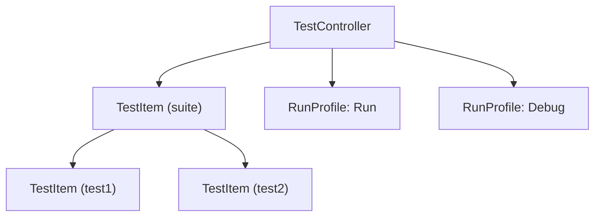
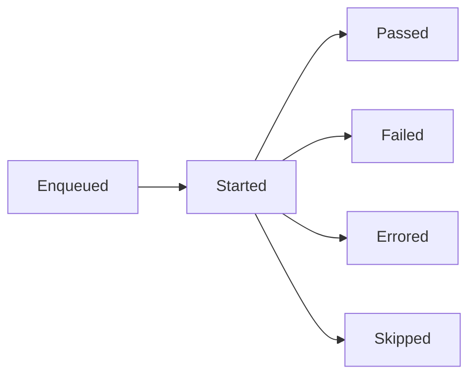

# Testing API

DSCode implements the `vscode.tests` namespace, enabling extensions to integrate test frameworks into the editor's test explorer. Extensions can discover tests, run them, report results, and display them in the Test Explorer view.

**Source:** `extension-host/src/api/testing.ts`

---

## Overview

The Testing API centers around three concepts:

| Concept | Description |
|---------|-------------|
| **TestController** | Manages a set of test items and run profiles |
| **TestItem** | Represents a single test or test suite in the tree |
| **TestRunProfile** | Defines how tests are executed (Run, Debug, Coverage) |



---

## Creating a Test Controller

```typescript
import * as vscode from 'vscode';

export function activate(context: vscode.ExtensionContext) {
    const controller = vscode.tests.createTestController(
        'myTestController',  // Unique ID
        'My Tests'           // Display label
    );

    context.subscriptions.push(controller);
}
```

---

## Test Items

Test items form a tree structure. Create them with `controller.createTestItem()`:

```typescript
// Create a test suite
const suite = controller.createTestItem(
    'suite-1',
    'Math Tests',
    vscode.Uri.file('/path/to/math.test.ts')
);
suite.canResolveChildren = true;

// Create individual tests
const test1 = controller.createTestItem(
    'test-add',
    'should add numbers',
    vscode.Uri.file('/path/to/math.test.ts')
);
test1.range = new vscode.Range(10, 0, 15, 0);  // Line range in source

const test2 = controller.createTestItem(
    'test-subtract',
    'should subtract numbers',
    vscode.Uri.file('/path/to/math.test.ts')
);

// Build the tree
suite.children.add(test1);
suite.children.add(test2);
controller.items.add(suite);
```

---

## Run Profiles

Run profiles define how tests are executed. DSCode supports three profile kinds:

| Kind | Enum Value | Description |
|------|-----------|-------------|
| **Run** | `TestRunProfileKind.Run` | Execute tests normally |
| **Debug** | `TestRunProfileKind.Debug` | Execute tests with debugger attached |
| **Coverage** | `TestRunProfileKind.Coverage` | Execute tests with code coverage |

```typescript
// Create a "Run" profile
const runProfile = controller.createRunProfile(
    'Run Tests',
    vscode.TestRunProfileKind.Run,
    async (request, token) => {
        await runTests(controller, request, token);
    },
    true  // isDefault
);

// Create a "Debug" profile
const debugProfile = controller.createRunProfile(
    'Debug Tests',
    vscode.TestRunProfileKind.Debug,
    async (request, token) => {
        await debugTests(controller, request, token);
    }
);
```

---

## Running Tests

When the user clicks "Run" in the Test Explorer, your run handler is called with a `TestRunRequest`:

```typescript
async function runTests(
    controller: vscode.TestController,
    request: vscode.TestRunRequest,
    token: vscode.CancellationToken
) {
    // Create a test run
    const run = controller.createTestRun(request, 'My Test Run');

    // Get the tests to run
    const tests = request.include ?? gatherAllTests(controller);

    for (const test of tests) {
        if (token.isCancellationRequested) break;

        // Mark test as started
        run.started(test);

        try {
            // Execute the test (your implementation)
            const result = await executeTest(test);

            if (result.passed) {
                run.passed(test, result.duration);
            } else {
                run.failed(test,
                    new vscode.TestMessage(result.error),
                    result.duration
                );
            }
        } catch (error) {
            run.errored(test,
                new vscode.TestMessage(`Error: ${error}`)
            );
        }
    }

    // End the test run
    run.end();
}
```

---

## Test Run Lifecycle

A test run progresses through states:



| Method | Description |
|--------|-------------|
| `run.enqueued(test)` | Test is queued to run |
| `run.started(test)` | Test execution has begun |
| `run.passed(test, duration?)` | Test passed |
| `run.failed(test, message, duration?)` | Test failed with a message |
| `run.errored(test, message, duration?)` | Test encountered an error |
| `run.skipped(test)` | Test was skipped |
| `run.appendOutput(text)` | Append output text to the run |
| `run.end()` | All tests in this run are complete |

---

## Complete Example: Creating a Test Extension

```typescript
import * as vscode from 'vscode';

export function activate(context: vscode.ExtensionContext) {
    const controller = vscode.tests.createTestController(
        'exampleTests',
        'Example Tests'
    );

    // Discover tests from workspace
    const discoverTests = async () => {
        const files = await vscode.workspace.findFiles('**/*.test.ts');
        for (const file of files) {
            const suite = controller.createTestItem(
                file.fsPath,
                file.path.split('/').pop() ?? 'test',
                file
            );
            controller.items.add(suite);
        }
    };

    // Create run profile
    controller.createRunProfile(
        'Run',
        vscode.TestRunProfileKind.Run,
        async (request, token) => {
            const run = controller.createTestRun(request);
            const tests = request.include ?? [];

            for (const test of tests) {
                run.started(test);
                // Simulate test execution
                await new Promise(r => setTimeout(r, 100));
                run.passed(test, 100);
            }

            run.end();
        },
        true
    );

    // Discover tests on activation
    discoverTests();

    context.subscriptions.push(controller);
}
```

---

## See Also

- [VS Code API Reference](vscode-api-reference.md) -- full API documentation
- [VS Code Compatibility Matrix](../reference/vscode-compatibility-matrix.md) -- Testing API coverage
