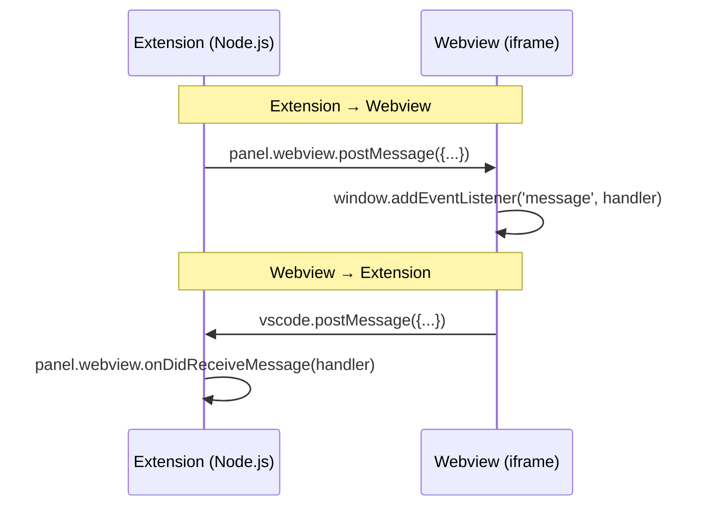

# Webview Extensions

Webview panels let you render custom HTML, CSS, and JavaScript inside DSCode. They are the foundation for building rich UIs that go beyond what the standard editor APIs offer -- previews, dashboards, forms, interactive diagrams, and more.

---

## Creating a Webview Panel

Use `vscode.window.createWebviewPanel` to open a new panel:

```typescript
import * as vscode from 'vscode';

export function activate(context: vscode.ExtensionContext) {
    const disposable = vscode.commands.registerCommand(
        'myExtension.openPreview',
        () => {
            const panel = vscode.window.createWebviewPanel(
                'myExtension.preview',   // viewType (unique identifier)
                'My Preview',            // title shown in tab
                vscode.ViewColumn.Beside, // where to show it
                {
                    enableScripts: true,              // allow JavaScript
                    retainContextWhenHidden: true,     // keep state when tab is not visible
                    localResourceRoots: [              // restrict local file access
                        vscode.Uri.joinPath(context.extensionUri, 'media')
                    ]
                }
            );

            panel.webview.html = getWebviewContent();
        }
    );

    context.subscriptions.push(disposable);
}
```

---

## Setting HTML Content

The `webview.html` property accepts a full HTML document string. This is the only way to set content -- there is no DOM API.

```typescript
function getWebviewContent(): string {
    return `
        <!DOCTYPE html>
        <html lang="en">
        <head>
            <meta charset="UTF-8">
            <meta name="viewport" content="width=device-width, initial-scale=1.0">
            <title>My Preview</title>
            <style>
                body {
                    font-family: var(--vscode-font-family);
                    color: var(--vscode-foreground);
                    background-color: var(--vscode-editor-background);
                    padding: 16px;
                }
                h1 {
                    color: var(--vscode-textLink-foreground);
                }
                button {
                    background: var(--vscode-button-background);
                    color: var(--vscode-button-foreground);
                    border: none;
                    padding: 8px 16px;
                    cursor: pointer;
                    border-radius: 2px;
                }
                button:hover {
                    background: var(--vscode-button-hoverBackground);
                }
            </style>
        </head>
        <body>
            <h1>Hello Webview</h1>
            <p>This is a custom UI panel inside DSCode.</p>
            <button id="actionBtn">Click Me</button>
            <script>
                const vscode = acquireVsCodeApi();
                document.getElementById('actionBtn').addEventListener('click', () => {
                    vscode.postMessage({ type: 'buttonClicked', value: 'hello' });
                });
            </script>
        </body>
        </html>
    `;
}
```

!!! tip "VS Code CSS variables"
    Use `var(--vscode-*)` CSS custom properties to match the user's theme. Common variables:

    | Variable | Purpose |
    |----------|---------|
    | `--vscode-foreground` | Default text color |
    | `--vscode-editor-background` | Editor background |
    | `--vscode-button-background` | Button background |
    | `--vscode-button-foreground` | Button text color |
    | `--vscode-input-background` | Input field background |
    | `--vscode-font-family` | Editor font family |
    | `--vscode-font-size` | Editor font size |

---

## Message Passing

Webviews run in an isolated iframe. Communication with the extension host happens through message passing.

### Extension to Webview

```typescript
// In your extension (Node.js side)
panel.webview.postMessage({
    type: 'updateContent',
    body: { html: '<p>Updated!</p>', timestamp: Date.now() }
});
```

```javascript
// In the webview (browser side)
window.addEventListener('message', event => {
    const message = event.data;
    switch (message.type) {
        case 'updateContent':
            document.getElementById('content').innerHTML = message.body.html;
            break;
    }
});
```

### Webview to Extension

```javascript
// In the webview (browser side)
const vscode = acquireVsCodeApi(); // (1)!

document.getElementById('saveBtn').addEventListener('click', () => {
    vscode.postMessage({
        type: 'save',
        body: { content: document.getElementById('editor').value }
    });
});
```

1. `acquireVsCodeApi()` can only be called **once** per webview. Store the result and reuse it.

```typescript
// In your extension (Node.js side)
panel.webview.onDidReceiveMessage(
    message => {
        switch (message.type) {
            case 'save':
                saveContent(message.body.content);
                vscode.window.showInformationMessage('Content saved!');
                break;
            case 'error':
                vscode.window.showErrorMessage(message.body.text);
                break;
        }
    },
    undefined,
    context.subscriptions
);
```

### Message Flow Diagram



---

## Loading Local Resources

For security, webviews cannot directly access files on disk. Convert local file paths to special webview URIs using `asWebviewUri`.

```typescript
function getWebviewContent(
    webview: vscode.Webview,
    extensionUri: vscode.Uri
): string {
    // Convert local paths to webview URIs
    const styleUri = webview.asWebviewUri(
        vscode.Uri.joinPath(extensionUri, 'media', 'style.css')
    );
    const scriptUri = webview.asWebviewUri(
        vscode.Uri.joinPath(extensionUri, 'media', 'main.js')
    );
    const logoUri = webview.asWebviewUri(
        vscode.Uri.joinPath(extensionUri, 'media', 'logo.png')
    );

    return `
        <!DOCTYPE html>
        <html lang="en">
        <head>
            <meta charset="UTF-8">
            <link rel="stylesheet" href="${styleUri}">
        </head>
        <body>
            
            <div id="app"></div>
            <script src="${scriptUri}"></script>
        </body>
        </html>
    `;
}
```

!!! warning "Restrict resource roots"
    Always set `localResourceRoots` in the webview options to limit which directories the webview can access:

    ```typescript
    const panel = vscode.window.createWebviewPanel(
        'myExtension.preview',
        'Preview',
        vscode.ViewColumn.One,
        {
            enableScripts: true,
            localResourceRoots: [
                vscode.Uri.joinPath(context.extensionUri, 'media'),
                vscode.Uri.joinPath(context.extensionUri, 'dist')
            ]
        }
    );
    ```

    If `localResourceRoots` is not set, the webview can access any file the extension can access.

---

## Content Security Policy

Always include a Content Security Policy (CSP) in your webview HTML to prevent script injection attacks.

```typescript
function getWebviewContent(webview: vscode.Webview, extensionUri: vscode.Uri): string {
    const nonce = getNonce(); // (1)!
    const scriptUri = webview.asWebviewUri(
        vscode.Uri.joinPath(extensionUri, 'media', 'main.js')
    );
    const styleUri = webview.asWebviewUri(
        vscode.Uri.joinPath(extensionUri, 'media', 'style.css')
    );

    return `
        <!DOCTYPE html>
        <html lang="en">
        <head>
            <meta charset="UTF-8">
            <meta http-equiv="Content-Security-Policy"
                content="
                    default-src 'none';
                    style-src ${webview.cspSource} 'unsafe-inline';
                    img-src ${webview.cspSource} https: data:;
                    script-src 'nonce-${nonce}';
                    font-src ${webview.cspSource};
                "
            >
            <link rel="stylesheet" href="${styleUri}">
        </head>
        <body>
            <div id="app"></div>
            <script nonce="${nonce}" src="${scriptUri}"></script>
        </body>
        </html>
    `;
}

function getNonce(): string {
    let text = '';
    const possible = 'ABCDEFGHIJKLMNOPQRSTUVWXYZabcdefghijklmnopqrstuvwxyz0123456789';
    for (let i = 0; i < 32; i++) {
        text += possible.charAt(Math.floor(Math.random() * possible.length));
    }
    return text;
}
```

1. A nonce is a one-time random value. Only scripts with a matching `nonce` attribute will execute, blocking injected scripts.

!!! info "CSP directives explained"
    | Directive | Purpose |
    |-----------|---------|
    | `default-src 'none'` | Block everything by default |
    | `style-src ${webview.cspSource}` | Allow styles from webview resource URIs |
    | `img-src ${webview.cspSource} https:` | Allow images from webview URIs and HTTPS |
    | `script-src 'nonce-${nonce}'` | Only allow scripts with the matching nonce |
    | `font-src ${webview.cspSource}` | Allow fonts from webview URIs |

---

## Webview Lifecycle

### Panel Events

```typescript
const panel = vscode.window.createWebviewPanel(/* ... */);

// Fires when the panel becomes visible or hidden
panel.onDidChangeViewState(e => {
    if (e.webviewPanel.visible) {
        console.log('Panel is now visible');
        // Optionally update content when panel is shown
        updateContent(panel);
    }
});

// Fires when the panel is closed (disposed)
panel.onDidDispose(() => {
    console.log('Panel was closed');
    // Clean up resources
}, null, context.subscriptions);
```

### State Serialization and Restoration

To persist webview content across editor restarts, use state serialization:

**Step 1:** Save state from the webview:

```javascript
// In the webview
const vscode = acquireVsCodeApi();

function saveState() {
    vscode.setState({
        content: document.getElementById('editor').value,
        scrollPosition: window.scrollY
    });
}

// Restore state on load
const previousState = vscode.getState();
if (previousState) {
    document.getElementById('editor').value = previousState.content;
    window.scrollTo(0, previousState.scrollPosition);
}
```

**Step 2:** Register a serializer in your extension:

```typescript
export function activate(context: vscode.ExtensionContext) {
    // Register the serializer for webview restoration
    vscode.window.registerWebviewPanelSerializer(
        'myExtension.preview', // must match the viewType
        {
            async deserializeWebviewPanel(
                panel: vscode.WebviewPanel,
                state: any
            ) {
                // Restore the webview panel
                panel.webview.options = { enableScripts: true };
                panel.webview.html = getWebviewContent(
                    panel.webview,
                    context.extensionUri
                );

                // State is automatically restored in the webview
                // via vscode.getState()
                if (state) {
                    panel.webview.postMessage({
                        type: 'restoreState',
                        body: state
                    });
                }
            }
        }
    );
}
```

**Step 3:** Declare the activation event:

```json title="package.json"
{
    "activationEvents": [
        "onWebviewPanel:myExtension.preview"
    ]
}
```

---

## Webview View Provider (Sidebar Webviews)

Webview views embed a webview inside a sidebar or panel view, rather than an editor tab. This is useful for tool panels, property inspectors, and dashboards.

### Declare the View

```json title="package.json"
{
    "contributes": {
        "views": {
            "explorer": [
                {
                    "type": "webview",
                    "id": "myExtension.sidebarView",
                    "name": "My Sidebar"
                }
            ]
        }
    }
}
```

### Implement the Provider

```typescript
class MySidebarProvider implements vscode.WebviewViewProvider {
    public static readonly viewType = 'myExtension.sidebarView';

    constructor(private readonly extensionUri: vscode.Uri) {}

    resolveWebviewView(
        webviewView: vscode.WebviewView,
        context: vscode.WebviewViewResolveContext,
        token: vscode.CancellationToken
    ): void {
        webviewView.webview.options = {
            enableScripts: true,
            localResourceRoots: [this.extensionUri]
        };

        webviewView.webview.html = this.getHtml(webviewView.webview);

        // Handle messages from the sidebar webview
        webviewView.webview.onDidReceiveMessage(message => {
            switch (message.type) {
                case 'openFile':
                    vscode.window.showTextDocument(
                        vscode.Uri.file(message.path)
                    );
                    break;
            }
        });
    }

    private getHtml(webview: vscode.Webview): string {
        return `
            <!DOCTYPE html>
            <html>
            <head>
                <style>
                    body {
                        padding: 8px;
                        color: var(--vscode-foreground);
                        font-family: var(--vscode-font-family);
                    }
                    ul { list-style: none; padding: 0; }
                    li {
                        padding: 4px 8px;
                        cursor: pointer;
                        border-radius: 3px;
                    }
                    li:hover {
                        background: var(--vscode-list-hoverBackground);
                    }
                </style>
            </head>
            <body>
                <h3>Quick Actions</h3>
                <ul>
                    <li onclick="action('build')">Build Project</li>
                    <li onclick="action('test')">Run Tests</li>
                    <li onclick="action('deploy')">Deploy</li>
                </ul>
                <script>
                    const vscode = acquireVsCodeApi();
                    function action(name) {
                        vscode.postMessage({ type: 'action', name });
                    }
                </script>
            </body>
            </html>
        `;
    }
}

// Register the provider
export function activate(context: vscode.ExtensionContext) {
    context.subscriptions.push(
        vscode.window.registerWebviewViewProvider(
            MySidebarProvider.viewType,
            new MySidebarProvider(context.extensionUri)
        )
    );
}
```

---

## Example: Markdown Preview Extension

Here is a complete example that implements a live Markdown preview using a webview panel.

### Manifest

```json title="package.json"
{
    "name": "md-preview",
    "displayName": "Markdown Preview",
    "version": "0.1.0",
    "engines": { "vscode": "^1.85.0" },
    "activationEvents": [
        "onLanguage:markdown"
    ],
    "main": "./out/extension.js",
    "contributes": {
        "commands": [
            {
                "command": "mdPreview.open",
                "title": "Open Markdown Preview",
                "category": "Markdown",
                "icon": "$(open-preview)"
            }
        ],
        "menus": {
            "editor/title": [
                {
                    "command": "mdPreview.open",
                    "when": "editorLangId == markdown",
                    "group": "navigation"
                }
            ]
        }
    },
    "dependencies": {
        "marked": "^12.0.0"
    }
}
```

### Extension Code

```typescript title="src/extension.ts"
import * as vscode from 'vscode';
import { marked } from 'marked';

let currentPanel: vscode.WebviewPanel | undefined;

export function activate(context: vscode.ExtensionContext) {
    context.subscriptions.push(
        vscode.commands.registerCommand('mdPreview.open', () => {
            const editor = vscode.window.activeTextEditor;
            if (!editor || editor.document.languageId !== 'markdown') {
                vscode.window.showErrorMessage('Open a Markdown file first.');
                return;
            }

            if (currentPanel) {
                currentPanel.reveal(vscode.ViewColumn.Beside);
            } else {
                currentPanel = vscode.window.createWebviewPanel(
                    'mdPreview',
                    'Markdown Preview',
                    vscode.ViewColumn.Beside,
                    { enableScripts: true }
                );

                currentPanel.onDidDispose(() => {
                    currentPanel = undefined;
                }, null, context.subscriptions);
            }

            updatePreview(editor.document);
        })
    );

    // Update preview on document change
    vscode.workspace.onDidChangeTextDocument(event => {
        if (
            currentPanel &&
            event.document.languageId === 'markdown' &&
            event.document === vscode.window.activeTextEditor?.document
        ) {
            updatePreview(event.document);
        }
    }, null, context.subscriptions);

    // Update preview when switching editors
    vscode.window.onDidChangeActiveTextEditor(editor => {
        if (
            currentPanel &&
            editor &&
            editor.document.languageId === 'markdown'
        ) {
            updatePreview(editor.document);
        }
    }, null, context.subscriptions);
}

function updatePreview(document: vscode.TextDocument) {
    if (!currentPanel) return;

    const markdown = document.getText();
    const html = marked(markdown);

    currentPanel.webview.html = `
        <!DOCTYPE html>
        <html lang="en">
        <head>
            <meta charset="UTF-8">
            <meta http-equiv="Content-Security-Policy"
                content="default-src 'none'; style-src 'unsafe-inline'; img-src https: data:;">
            <style>
                body {
                    font-family: var(--vscode-font-family);
                    color: var(--vscode-foreground);
                    background: var(--vscode-editor-background);
                    padding: 24px;
                    line-height: 1.6;
                    max-width: 800px;
                    margin: 0 auto;
                }
                code {
                    background: var(--vscode-textCodeBlock-background);
                    padding: 2px 6px;
                    border-radius: 3px;
                    font-family: var(--vscode-editor-font-family);
                }
                pre code {
                    display: block;
                    padding: 16px;
                    overflow-x: auto;
                }
                blockquote {
                    border-left: 3px solid var(--vscode-textBlockQuote-border);
                    margin-left: 0;
                    padding-left: 16px;
                    color: var(--vscode-textBlockQuote-foreground);
                }
                a { color: var(--vscode-textLink-foreground); }
                img { max-width: 100%; }
                table {
                    border-collapse: collapse;
                    width: 100%;
                }
                th, td {
                    border: 1px solid var(--vscode-panel-border);
                    padding: 8px 12px;
                    text-align: left;
                }
            </style>
        </head>
        <body>
            ${html}
        </body>
        </html>
    `;

    currentPanel.title = `Preview: ${document.fileName.split('/').pop()}`;
}

export function deactivate() {
    currentPanel?.dispose();
}
```

---

## Best Practices

!!! success "Do"
    - **Use a Content Security Policy** in every webview
    - **Use nonces** for inline scripts
    - **Set `localResourceRoots`** to the minimum required directories
    - **Use VS Code CSS variables** to respect the user's theme
    - **Use `retainContextWhenHidden`** sparingly -- it increases memory usage
    - **Implement state serialization** so the webview survives editor restarts
    - **Dispose of panels** when the user or extension no longer needs them

!!! failure "Don't"
    - **Don't load remote scripts** from CDNs -- bundle your dependencies
    - **Don't use `eval()`** or `new Function()` in webview code
    - **Don't assume a specific theme** -- always use CSS variables
    - **Don't store sensitive data** in webview state (it is not encrypted)
    - **Don't set `html` on every keystroke** without debouncing -- it re-creates the entire iframe

---

## Next Steps

- **[VS Code API Reference](vscode-api-reference.md)** -- Full `window.createWebviewPanel` API details
- **[Activation Events](activation-events.md)** -- `onWebviewPanel` for webview restoration
- **[Publishing](publishing.md)** -- Package and distribute your webview extension
