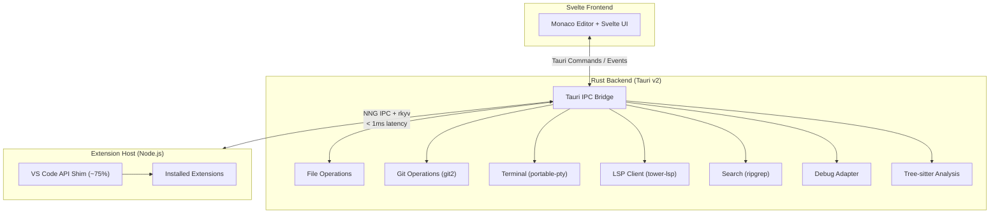

<!-- Hero Section -->
<div class="hero" markdown>

# DSCode

<p class="hero-subtitle">
A fast, lightweight code editor built with Tauri, Svelte, and Monaco Editor.<br>
Native performance. Familiar workflow. Open source.
</p>

<div class="hero-buttons">
  <a href="getting-started/installation/" class="primary">Get Started</a>
  <a href="architecture/overview/" class="secondary">Architecture</a>
</div>

</div>

<!-- Performance Badges -->
<div class="badge-row" markdown>
<span class="badge"><span class="badge-icon">:material-rocket-launch:</span> Cold Start &lt;100ms</span>
<span class="badge"><span class="badge-icon">:material-memory:</span> Memory ~50MB</span>
<span class="badge"><span class="badge-icon">:material-keyboard:</span> Keystroke &lt;5ms</span>
<span class="badge"><span class="badge-icon">:material-file-document-outline:</span> File Open &lt;50ms</span>
</div>

---

## Why DSCode?

DSCode is a ground-up rewrite of the code editor experience. It pairs a **Rust backend** powered by Tauri v2 with a **Svelte frontend** and the same **Monaco Editor** that powers VS Code -- giving you the editor you already know at a fraction of the resource cost.

!!! info "v0.1.0-alpha -- Early Access"
    DSCode is in active development. Core editing, terminal, git, and extension hosting are functional. Expect rough edges and breaking changes. We welcome contributors and early adopters.

---

## Features

<div class="feature-grid" markdown>

<div class="feature-card" markdown>
### :material-code-braces: Monaco Editor
The same editor engine behind VS Code. Full support for IntelliSense, multi-cursor editing, minimap, bracket matching, code folding, and hundreds of built-in language grammars.
</div>

<div class="feature-card" markdown>
### :material-puzzle: Extension Ecosystem
A Node.js extension host provides ~75% VS Code API compatibility. Install extensions from `.vsix` packages, use familiar activation events, and access language providers, webviews, and tree views.
</div>

<div class="feature-card" markdown>
### :material-console: Integrated Terminal
A fully featured terminal powered by xterm.js and `portable-pty`. Multiple terminal instances, shell integration, and cross-platform support for bash, zsh, PowerShell, and cmd.
</div>

<div class="feature-card" markdown>
### :material-git: Git Integration
Built-in Git support via the `git2` crate -- no external `git` binary needed. Stage, commit, diff, branch, and manage remotes directly from the sidebar with fast, native performance.
</div>

<div class="feature-card" markdown>
### :material-translate: Language Intelligence
LSP support via `tower-lsp` with syntax analysis via LSP semantic tokens (Tree-sitter integration planned). Get completions, diagnostics, go-to-definition, hover info, and semantic highlighting for your language of choice.
</div>

<div class="feature-card" markdown>
### :material-laptop: Cross-Platform
Native builds for **macOS**, **Linux**, and **Windows** via Tauri v2. Single codebase, platform-native windowing, and a lightweight install footprint under 30MB.
</div>

</div>

---

## Quick Start

=== "macOS"

    ```bash
    # Download the latest .dmg from GitHub Releases
    curl -LO https://github.com/nicepkg/dscode/releases/latest/download/DSCode_0.1.0_aarch64.dmg

    # Mount and install
    hdiutil attach DSCode_0.1.0_aarch64.dmg
    cp -R /Volumes/DSCode/DSCode.app /Applications/
    hdiutil detach /Volumes/DSCode

    # Launch from terminal (after adding to PATH)
    dscode .
    ```

=== "Linux"

    ```bash
    # Debian / Ubuntu (.deb)
    curl -LO https://github.com/nicepkg/dscode/releases/latest/download/dscode_0.1.0_amd64.deb
    sudo dpkg -i dscode_0.1.0_amd64.deb

    # Fedora / RHEL (.rpm)
    curl -LO https://github.com/nicepkg/dscode/releases/latest/download/dscode-0.1.0-1.x86_64.rpm
    sudo rpm -i dscode-0.1.0-1.x86_64.rpm

    # Launch
    dscode .
    ```

=== "Windows"

    ```powershell
    # Download the installer from GitHub Releases
    Invoke-WebRequest -Uri "https://github.com/nicepkg/dscode/releases/latest/download/DSCode_0.1.0_x64-setup.exe" -OutFile "DSCode_setup.exe"

    # Run the installer
    .\DSCode_setup.exe

    # Launch from terminal (added to PATH automatically)
    dscode .
    ```

=== "Build from Source"

    ```bash
    # Prerequisites: Rust 1.75+, Node.js 20+, pnpm
    git clone https://github.com/nicepkg/dscode.git
    cd dscode
    pnpm install
    cargo tauri dev
    ```

!!! tip "Detailed instructions"
    See the full [Installation Guide](getting-started/installation.md) for prerequisites, platform-specific notes, and troubleshooting.

---

## Architecture Overview

DSCode uses a multi-process architecture that separates the UI, backend logic, and extension execution into isolated layers connected by high-performance IPC.



The Rust backend exposes **48 command modules** covering file operations, git, terminal, debugging, search, extensions, theming, keybindings, and more. The extension host runs in a separate Node.js process, communicating over NNG (nanomsg next generation) with rkyv zero-copy serialization for sub-millisecond message latency.

!!! note "Deep dive"
    Read the full [Architecture Overview](architecture/overview.md) for details on the IPC protocol, command registry, and extension lifecycle.

---

## Coming from VS Code?

DSCode is designed to feel familiar. Here is what carries over and what is different.

| Area | Status | Notes |
|---|---|---|
| **Keyboard shortcuts** | :material-check-circle:{ .status-full } Full | Default keybindings match VS Code |
| **Settings (JSON)** | :material-check-circle:{ .status-full } Full | Same `settings.json` format |
| **Themes** | :material-check-circle:{ .status-full } Full | VS Code color themes work directly |
| **Extensions (core APIs)** | :material-circle-half-full:{ .status-partial } ~75% | Most language extensions work; some UI APIs are pending |
| **Snippets** | :material-check-circle:{ .status-full } Full | VS Code snippet format supported |
| **Tasks** | :material-circle-half-full:{ .status-partial } Partial | `tasks.json` support with core task types |
| **Debugging** | :material-circle-half-full:{ .status-partial } Partial | DAP support; adapter auto-discovery in progress |
| **Remote Development** | :material-circle-outline:{ .status-planned } Planned | SSH and container targets on the roadmap |
| **Notebook / Jupyter** | :material-circle-half-full:{ .status-partial } Partial | Extension host API implemented; frontend rendering incomplete |

!!! tip "Migration checklist"
    1. Copy your `settings.json`, `keybindings.json`, and `snippets/` folder into `~/.config/dscode/`
    2. Install your essential extensions via `.vsix` or the built-in marketplace
    3. Check the [VS Code Compatibility Matrix](reference/vscode-compatibility-matrix.md) for API coverage details

---

## Explore the Documentation

<div class="feature-grid" markdown>

<div class="feature-card" markdown>
### :material-download: [Getting Started](getting-started/installation.md)
Installation, first project setup, and editor orientation.
</div>

<div class="feature-card" markdown>
### :material-book-open-variant: [User Guide](user-guide/editor-features.md)
Editor features, navigation, search, terminal, git, debugging, and configuration.
</div>

<div class="feature-card" markdown>
### :material-puzzle-outline: [Extensions](extensions/installing-extensions.md)
Finding, installing, and managing extensions.
</div>

<div class="feature-card" markdown>
### :material-code-tags: [Extension Development](extension-development/getting-started.md)
Build your own extensions with the VS Code-compatible API.
</div>

<div class="feature-card" markdown>
### :material-sitemap: [Architecture](architecture/overview.md)
IPC design, Rust backend internals, extension system, and LSP integration.
</div>

<div class="feature-card" markdown>
### :material-account-group: [Contributing](contributing/building-from-source.md)
Build from source, development setup, testing, and PR guidelines.
</div>

</div>

---

<div style="text-align: center; color: var(--md-default-fg-color--light); font-size: 0.85rem; margin-top: 2rem;" markdown>

**DSCode** is open source under the MIT License. [View on GitHub :material-github:](https://github.com/nicepkg/dscode){ target="_blank" }

</div>
