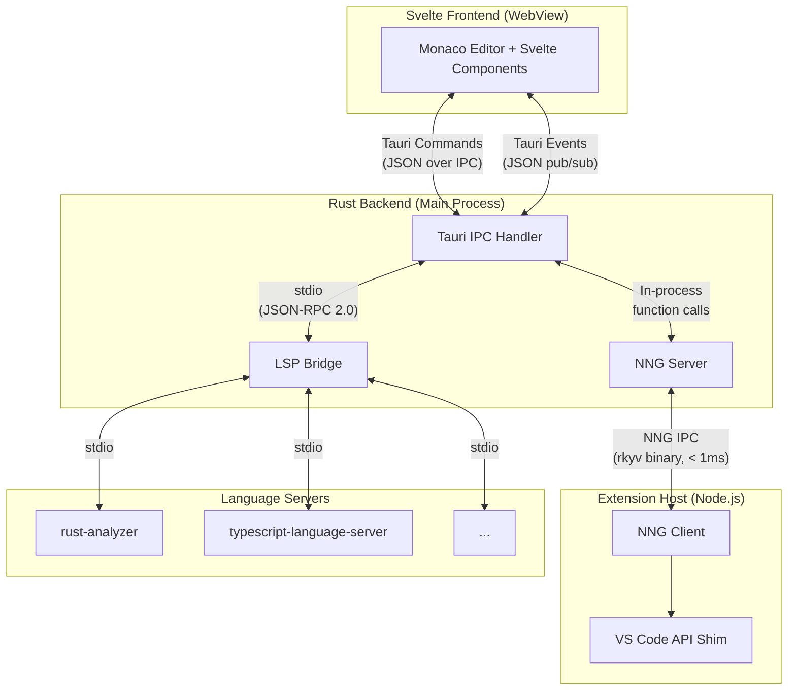
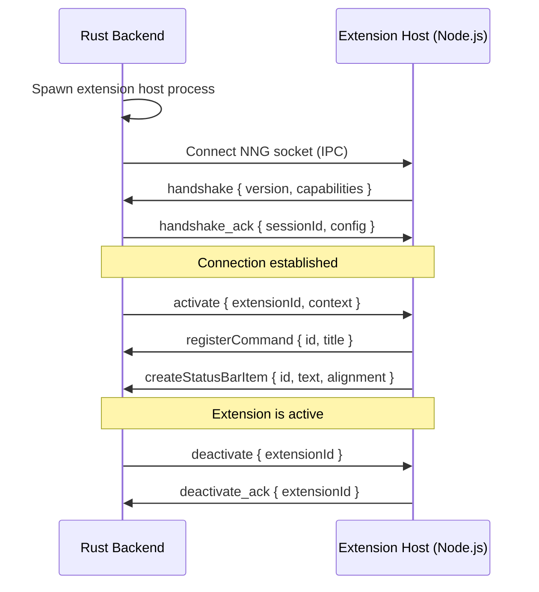
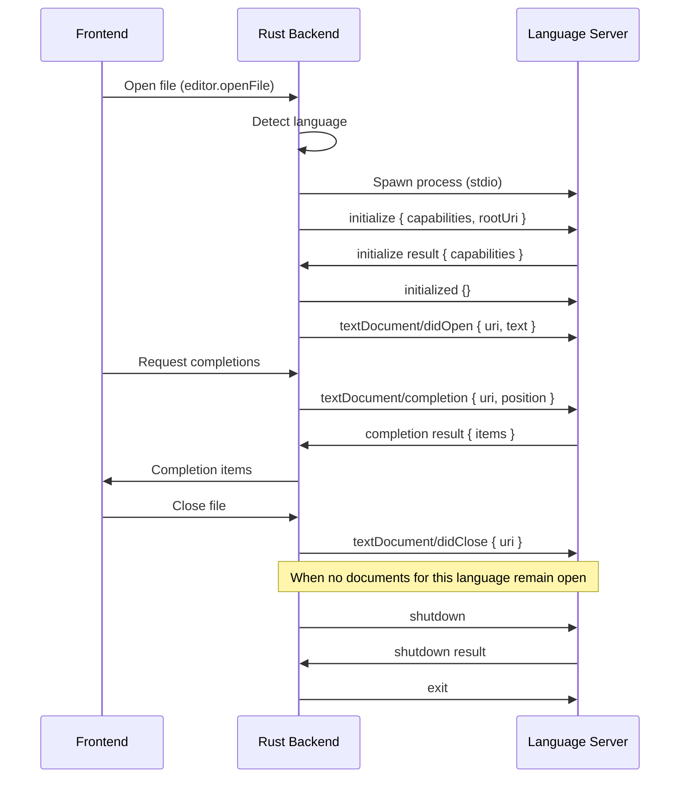
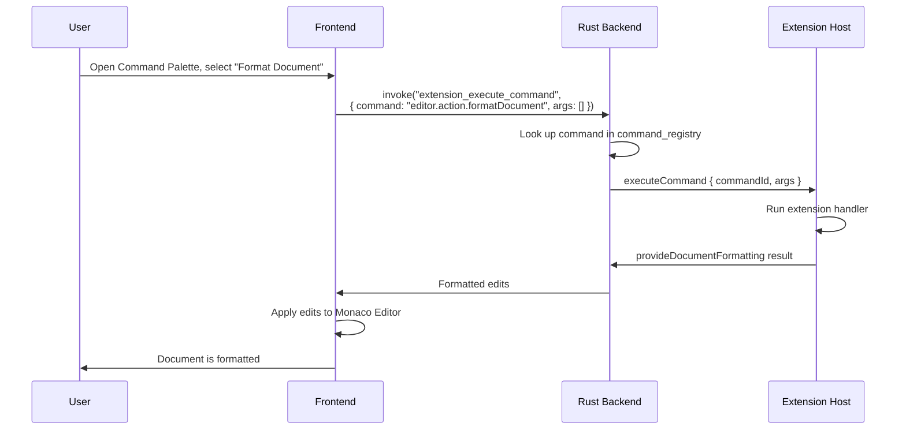
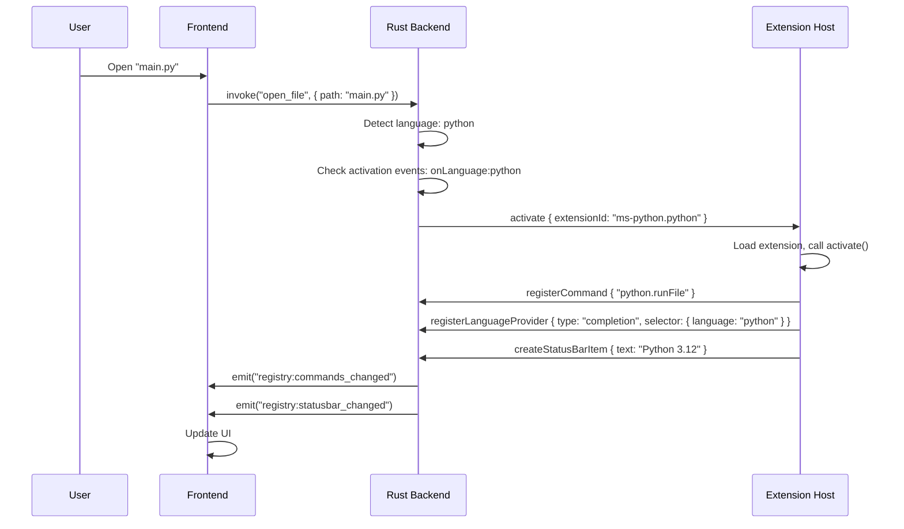
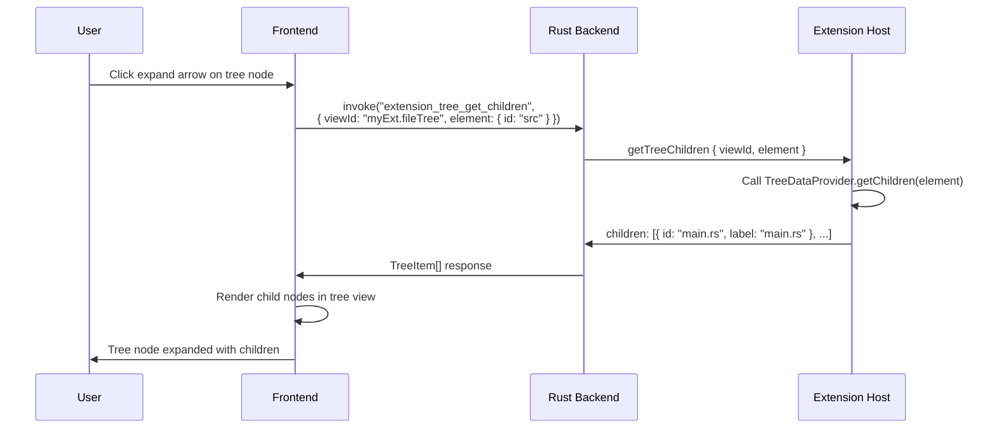
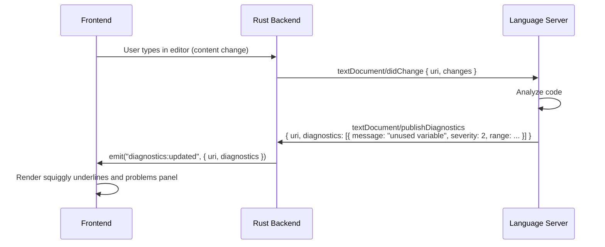

# IPC Protocol Reference

DSCode uses multiple IPC channels to connect its three main processes: the **Svelte frontend**, the **Rust backend**, and the **Node.js extension host**. This page documents every protocol layer, message format, and communication flow.

---

## Protocol Architecture



DSCode has three distinct IPC channels:

| Channel | Transport | Serialization | Latency | Purpose |
|---|---|---|---|---|
| **Tauri IPC** | WebView message passing | JSON | ~2ms | Frontend to Rust backend communication |
| **NNG IPC** | Unix domain socket / named pipe | rkyv (zero-copy) | <1ms | Rust backend to extension host communication |
| **LSP Bridge** | stdio pipes | JSON-RPC 2.0 | ~5ms | Rust backend to language servers |
| **Tauri Events** | WebView event system | JSON | ~2ms | Backend to frontend push notifications |

---

## Tauri IPC (Frontend to Backend)

### Request Format

Frontend code calls `invoke()` from `@tauri-apps/api/core`. Tauri serializes arguments as JSON and routes to the matching `#[tauri::command]` handler in Rust.

```typescript
// Frontend (TypeScript)
import { invoke } from '@tauri-apps/api/core';

const result = await invoke('command_name', {
    arg1: 'value1',
    arg2: 42
});
```

The underlying message has this structure:

```json
{
    "cmd": "command_name",
    "callback": 12345,
    "error": 12346,
    "__tauriModule": "Shell",
    "message": {
        "cmd": "command_name",
        "arg1": "value1",
        "arg2": 42
    }
}
```

### Response Format

Successful responses:

```json
{
    "data": "<serialized return value>"
}
```

Error responses:

```json
{
    "error": "Human-readable error message"
}
```

### Tauri Events (Backend to Frontend)

The Rust backend pushes real-time updates to the frontend using Tauri's event system:

```rust
// Backend (Rust)
app_handle.emit("event_name", payload)?;
```

```typescript
// Frontend (TypeScript)
import { listen } from '@tauri-apps/api/event';

const unlisten = await listen('registry_updated', (event) => {
    console.log('Registry changed:', event.payload);
});
```

#### Core Event Types

| Event Name | Payload | Description |
|---|---|---|
| `session:initialized` | `{ extensions: number, folders: string[] }` | Session initialization complete |
| `session:extension_loaded` | `{ extensionId: string }` | An extension was loaded and activated |
| `session:extension_unloaded` | `{ extensionId: string }` | An extension was deactivated and unloaded |
| `registry:commands_changed` | `{ added: string[], removed: string[] }` | The command registry was updated |
| `registry:keybindings_changed` | `{}` | Keybindings were added, removed, or modified |
| `registry:menus_changed` | `{ location: string }` | Menu items changed for a specific location |
| `registry:statusbar_changed` | `{ itemId: string, action: string }` | A status bar item was created, updated, or disposed |
| `registry:activitybar_changed` | `{}` | Activity bar items were updated |
| `registry:theme_changed` | `{ themeId: string }` | The active color or icon theme changed |
| `registry:configuration_changed` | `{ keys: string[] }` | Configuration values changed |
| `fs:file_changed` | `{ path: string, kind: string }` | A watched file was created, modified, or deleted |
| `terminal:output` | `{ terminalId: string, data: string }` | Terminal produced output data |
| `terminal:exit` | `{ terminalId: string, exitCode: number }` | A terminal process exited |
| `debug:event` | `{ sessionId: string, event: string, body: object }` | Debug adapter event (stopped, output, breakpoint, etc.) |
| `search:result` | `{ file: string, matches: object[] }` | Streaming search result |
| `search:complete` | `{ fileCount: number, matchCount: number }` | Search operation completed |
| `git:status_changed` | `{ repoPath: string }` | Git repository status changed (files modified, staged, etc.) |

---

## Extension Host Protocol (NNG IPC)

The Rust backend communicates with the Node.js extension host over NNG (nanomsg next generation) using rkyv zero-copy binary serialization for maximum performance.

### Connection Lifecycle



### Message Envelope

All NNG messages use a binary envelope serialized with rkyv:

```rust
#[derive(Archive, Serialize, Deserialize)]
struct IpcMessage {
    /// Unique message ID for request-response correlation
    id: u64,
    /// Message type identifier
    msg_type: String,
    /// Serialized payload (rkyv bytes)
    payload: Vec<u8>,
    /// Timestamp in microseconds since epoch
    timestamp: u64,
}
```

For debugging and logging purposes, the logical structure can be represented as JSON:

```json
{
    "id": 1042,
    "msg_type": "registerCommand",
    "payload": {
        "commandId": "myext.helloWorld",
        "title": "Hello World",
        "category": "My Extension"
    },
    "timestamp": 1710000000000000
}
```

### Extension Host Messages (Extension to Backend)

Messages sent from the Node.js extension host to the Rust backend:

| Message Type | Payload | Description |
|---|---|---|
| `handshake` | `{ version: string, pid: number, capabilities: string[] }` | Initial handshake from the extension host |
| `registerCommand` | `{ commandId: string, title?: string, category?: string }` | Register a command handler |
| `executeCommand` | `{ commandId: string, args: any[] }` | Request execution of a command (extension-to-extension) |
| `showInformationMessage` | `{ message: string, items?: string[], options?: object }` | Show an information notification |
| `showWarningMessage` | `{ message: string, items?: string[], options?: object }` | Show a warning notification |
| `showErrorMessage` | `{ message: string, items?: string[], options?: object }` | Show an error notification |
| `showQuickPick` | `{ items: QuickPickItem[], options?: object }` | Show a quick pick selection dialog |
| `showInputBox` | `{ options: InputBoxOptions }` | Show a text input dialog |
| `createStatusBarItem` | `{ id: string, alignment: string, priority: number }` | Create a status bar item |
| `updateStatusBarItem` | `{ id: string, text?: string, tooltip?: string, color?: string, command?: string }` | Update a status bar item's properties |
| `disposeStatusBarItem` | `{ id: string }` | Remove a status bar item |
| `registerTreeDataProvider` | `{ viewId: string }` | Register a tree data provider for a view |
| `treeDataChanged` | `{ viewId: string, element?: any }` | Notify that tree data has changed (triggers refresh) |
| `createWebviewPanel` | `{ viewType: string, title: string, column: number, options: object }` | Create a webview panel |
| `postMessage` | `{ webviewId: string, message: any }` | Send a message to a webview |
| `registerLanguageProvider` | `{ type: string, selector: DocumentSelector, id: string }` | Register a language feature provider |
| `publishDiagnostics` | `{ uri: string, diagnostics: Diagnostic[] }` | Publish diagnostics (errors, warnings) for a document |
| `createOutputChannel` | `{ name: string }` | Create a named output channel |
| `appendOutput` | `{ channelName: string, value: string }` | Append text to an output channel |
| `setDecorations` | `{ editorId: string, decorationType: string, ranges: Range[] }` | Set editor decorations |
| `registerTaskProvider` | `{ type: string }` | Register a task provider |
| `registerDebugConfigurationProvider` | `{ type: string }` | Register a debug configuration provider |
| `startDebugSession` | `{ config: DebugConfiguration }` | Start a debug session |
| `getConfiguration` | `{ section?: string, resource?: string }` | Read configuration values |
| `updateConfiguration` | `{ section: string, value: any, target: string }` | Write a configuration value |
| `readFile` | `{ uri: string }` | Read file contents from the workspace |
| `writeFile` | `{ uri: string, content: Uint8Array }` | Write file contents |
| `readDirectory` | `{ uri: string }` | List directory contents |
| `getSecretValue` | `{ key: string }` | Retrieve a secret from the OS keychain |
| `setSecretValue` | `{ key: string, value: string }` | Store a secret in the OS keychain |
| `deleteSecretValue` | `{ key: string }` | Delete a secret from the OS keychain |
| `log` | `{ level: string, message: string, extensionId: string }` | Log a message from an extension |

### Backend Messages (Backend to Extension)

Messages sent from the Rust backend to the Node.js extension host:

| Message Type | Payload | Description |
|---|---|---|
| `handshake_ack` | `{ sessionId: string, config: object }` | Acknowledge the handshake and provide session configuration |
| `activate` | `{ extensionId: string, extensionPath: string, context: object }` | Activate an extension |
| `deactivate` | `{ extensionId: string }` | Deactivate an extension |
| `executeCommand` | `{ commandId: string, args: any[] }` | Execute a command registered by an extension |
| `provideCompletionItems` | `{ providerId: string, document: object, position: object, context: object }` | Request completion items from a provider |
| `provideHover` | `{ providerId: string, document: object, position: object }` | Request hover information |
| `provideDefinition` | `{ providerId: string, document: object, position: object }` | Request go-to-definition locations |
| `resolveCompletionItem` | `{ providerId: string, item: object }` | Resolve additional details for a completion item |
| `getTreeChildren` | `{ viewId: string, element?: any }` | Request children for a tree view node |
| `handleTreeEvent` | `{ viewId: string, event: string, data: object }` | Forward a tree view UI event to the extension |
| `textDocumentOpened` | `{ uri: string, languageId: string, version: number, text: string }` | Notify that a document was opened |
| `textDocumentChanged` | `{ uri: string, version: number, changes: ContentChange[] }` | Notify that a document's content changed |
| `textDocumentClosed` | `{ uri: string }` | Notify that a document was closed |
| `textDocumentSaved` | `{ uri: string }` | Notify that a document was saved |
| `configurationChanged` | `{ keys: string[] }` | Notify that configuration values changed |
| `workspaceFoldersChanged` | `{ added: string[], removed: string[] }` | Notify that workspace folders changed |
| `webviewMessage` | `{ webviewId: string, message: any }` | Forward a message from a webview to the extension |
| `debugEvent` | `{ sessionId: string, event: string, body: object }` | Forward a debug adapter event |

---

## LSP Bridge (Backend to Language Servers)

DSCode communicates with language servers using the standard Language Server Protocol over stdio. The Rust backend manages the lifecycle of language server processes and routes requests between the frontend and the active server.

### LSP Message Format

All LSP messages follow the JSON-RPC 2.0 specification with HTTP-style headers:

```
Content-Length: 123\r\n
\r\n
{"jsonrpc":"2.0","id":1,"method":"textDocument/completion","params":{...}}
```

### LSP Lifecycle



### Supported LSP Methods

| Method | Direction | Description |
|---|---|---|
| `initialize` | Client to Server | Initialize the server with capabilities |
| `initialized` | Client to Server | Notify server that initialization is complete |
| `shutdown` | Client to Server | Prepare server for exit |
| `exit` | Client to Server (notification) | Exit the server process |
| `textDocument/didOpen` | Client to Server | Document opened |
| `textDocument/didChange` | Client to Server | Document content changed |
| `textDocument/didSave` | Client to Server | Document saved |
| `textDocument/didClose` | Client to Server | Document closed |
| `textDocument/completion` | Client to Server | Request completions |
| `completionItem/resolve` | Client to Server | Resolve completion item details |
| `textDocument/hover` | Client to Server | Request hover information |
| `textDocument/signatureHelp` | Client to Server | Request signature help |
| `textDocument/definition` | Client to Server | Request go-to-definition |
| `textDocument/typeDefinition` | Client to Server | Request go-to-type-definition |
| `textDocument/implementation` | Client to Server | Request go-to-implementation |
| `textDocument/references` | Client to Server | Find all references |
| `textDocument/documentHighlight` | Client to Server | Highlight occurrences |
| `textDocument/documentSymbol` | Client to Server | Document symbols (outline) |
| `textDocument/codeAction` | Client to Server | Request code actions |
| `textDocument/codeLens` | Client to Server | Request code lenses |
| `codeLens/resolve` | Client to Server | Resolve code lens details |
| `textDocument/formatting` | Client to Server | Format entire document |
| `textDocument/rangeFormatting` | Client to Server | Format a range |
| `textDocument/onTypeFormatting` | Client to Server | Format on typing |
| `textDocument/rename` | Client to Server | Rename symbol |
| `textDocument/prepareRename` | Client to Server | Validate rename location |
| `textDocument/foldingRange` | Client to Server | Request folding ranges |
| `textDocument/selectionRange` | Client to Server | Request selection ranges |
| `textDocument/semanticTokens/full` | Client to Server | Full semantic tokens |
| `textDocument/semanticTokens/delta` | Client to Server | Delta semantic tokens |
| `textDocument/inlayHint` | Client to Server | Request inlay hints |
| `textDocument/publishDiagnostics` | Server to Client | Push diagnostics |
| `window/showMessage` | Server to Client | Show a message notification |
| `window/logMessage` | Server to Client | Log a message |
| `window/showMessageRequest` | Server to Client | Show message with actions |
| `client/registerCapability` | Server to Client | Dynamic capability registration |

---

## Error Response Format

### Tauri IPC Errors

```typescript
// Errors from Tauri commands are rejected promises with string messages
try {
    await invoke('write_file', { path: '/readonly/file', content: 'data' });
} catch (error: string) {
    // error = "Permission denied: /readonly/file"
}
```

### NNG IPC Errors

Error responses in the NNG protocol include a structured error envelope:

```json
{
    "id": 1042,
    "msg_type": "error",
    "payload": {
        "code": -32601,
        "message": "Command not found: myext.unknownCommand",
        "data": {
            "commandId": "myext.unknownCommand"
        }
    },
    "timestamp": 1710000000000000
}
```

Error codes follow the JSON-RPC 2.0 convention extended with DSCode-specific ranges:

| Code Range | Category | Examples |
|---|---|---|
| `-32700` | Parse error | Malformed message |
| `-32600` | Invalid request | Missing required fields |
| `-32601` | Method not found | Unknown message type or command |
| `-32602` | Invalid params | Wrong argument types or missing parameters |
| `-32603` | Internal error | Unexpected Rust panic or Node.js exception |
| `-32000` to `-32099` | Server error (DSCode) | Extension host crash, timeout, resource unavailable |

### LSP Errors

LSP errors follow the JSON-RPC 2.0 error format:

```json
{
    "jsonrpc": "2.0",
    "id": 1,
    "error": {
        "code": -32601,
        "message": "Method not found: textDocument/semanticTokens/full"
    }
}
```

---

## Timeout and Retry Behavior

| Channel | Default Timeout | Retries | Configurable |
|---|---|---|---|
| Tauri IPC (commands) | 30s | 0 | No (Tauri internal) |
| Tauri Events | No timeout (fire-and-forget) | 0 | No |
| NNG IPC (request-response) | 5s | 2 | Yes (`DSCODE_NNG_TIMEOUT` env var) |
| NNG IPC (handshake) | 10s | 3 | Yes |
| NNG IPC (activate) | 30s | 0 | No (activation can be slow) |
| LSP (initialize) | 15s | 1 | Yes (per-server settings) |
| LSP (requests) | 10s | 0 | Yes (per-server settings) |
| LSP (shutdown) | 5s | 0 | No (force-kill after timeout) |

!!! warning "Extension host restart"
    If the extension host process crashes or stops responding, the Rust backend automatically restarts it after a 2-second backoff. Extensions are re-activated in the order they were originally loaded. If the extension host crashes three times within 60 seconds, DSCode disables automatic restarts and shows a notification to the user.

---

## Example Message Flows

### Command Execution (End to End)

A user triggers a command from the Command Palette, which was registered by an extension:



### Extension Activation

An extension activates when a Python file is opened:



### Tree View Interaction

A user expands a node in a sidebar tree view provided by an extension:



### Diagnostics Flow (LSP to Frontend)

A language server publishes diagnostics after a file change:



---

## Serialization Details

### Tauri IPC Serialization

Tauri uses **serde_json** on the Rust side to serialize/deserialize command arguments and return values. All types must implement `serde::Serialize` and `serde::Deserialize`.

```rust
#[tauri::command]
fn get_session_state(
    state: tauri::State<'_, AppState>
) -> Result<SessionState, String> {
    // SessionState must derive Serialize
    Ok(state.session.lock().unwrap().clone())
}
```

### NNG IPC Serialization (rkyv)

The extension host channel uses **rkyv** for zero-copy deserialization. This avoids the overhead of JSON parsing for high-frequency messages like document changes and completion requests.

```rust
use rkyv::{Archive, Serialize, Deserialize};

#[derive(Archive, Serialize, Deserialize)]
struct DocumentChange {
    uri: String,
    version: u32,
    changes: Vec<ContentChange>,
}

// Zero-copy access (no deserialization needed)
let archived = rkyv::check_archived_root::<DocumentChange>(&bytes)?;
println!("URI: {}", archived.uri);
```

!!! tip "Debugging NNG messages"
    Set `DSCODE_LOG_LEVEL=trace` to log all NNG messages in JSON format to the debug console. In production, only errors and warnings are logged.

### LSP Serialization

LSP messages use standard **JSON-RPC 2.0** over stdio, managed by the `tower-lsp` crate on the Rust side.

---

## See Also

- [Architecture: IPC Design](../architecture/ipc-design.md) -- design rationale and performance benchmarks
- [Tauri Commands](tauri-commands.md) -- complete list of frontend-callable commands
- [Architecture: Extension System](../architecture/extension-system.md) -- extension host lifecycle details
