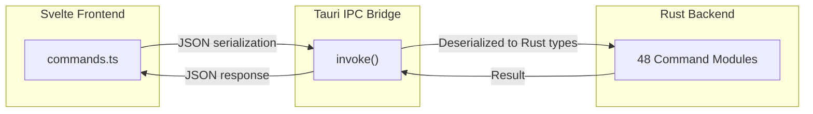

# Tauri Commands Reference

DSCode's Rust backend is organized into **48 command modules**, each responsible for a specific domain of functionality. These modules expose Tauri commands that the Svelte frontend invokes via Tauri's IPC bridge using `@tauri-apps/api/core`'s `invoke()` function.

This page catalogs every module and every frontend-exposed command.

---

## Architecture Overview



All Tauri commands follow the same pattern:

1. The frontend calls `invoke("command_name", { arg1, arg2 })` from TypeScript.
2. Tauri's IPC bridge serializes arguments to JSON and dispatches to the matching Rust `#[tauri::command]` handler.
3. The handler returns `Result<T, Error>`, which is serialized back to the frontend as a resolved or rejected promise.

---

## Command Modules by Category

### Core

Fundamental application lifecycle, session management, system monitoring, and window control.

| Module | Description |
|---|---|
| `app` | Application lifecycle management -- startup, shutdown, version info, platform detection, and global state initialization |
| `session_ops` | Session lifecycle for the editor workspace -- initialization, state persistence, extension loading/unloading, and workspace folder management |
| `monitoring` | Runtime performance monitoring -- memory usage, CPU metrics, extension host health checks, and IPC latency tracking |
| `window_ops` | Window management -- creating, closing, focusing, minimizing, maximizing, and arranging editor windows |

### File System

Reading, writing, watching, and managing files and directories.

| Module | Description |
|---|---|
| `file_ops` | Core file operations -- reading file contents, writing files, creating files and folders, deleting, renaming, and copying paths |
| `filesystem_registry` | File system watcher registration -- manages watchers for file change notifications sent to the frontend and extension host |
| `filesystem_registry_ops` | Operations on registered file system watchers -- add, remove, and query active watchers and their glob patterns |

### Editor

Text document management and language intelligence features.

| Module | Description |
|---|---|
| `textdocument_registry` | Open document registry -- tracks all open text documents, their content versions, language modes, and dirty states |
| `textdocument_registry_ops` | Operations on the document registry -- open, close, update content, change language mode, and query document metadata |
| `language_features_registry` | Language feature provider registry -- stores registered providers for all 24 language feature types (completions, hover, definitions, etc.) |
| `language_features_registry_ops` | Operations on language feature providers -- register, unregister, and invoke providers for specific documents and positions |

### Extensions

Extension discovery, lifecycle management, and manifest parsing.

| Module | Description |
|---|---|
| `extension_ops` | Extension lifecycle management -- discovering installed extensions, loading/unloading extensions, reading manifests, and communicating with the Node.js extension host |
| `extension_menu_parser` | Parses `contributes.menus` from extension manifests -- converts VS Code menu contribution syntax into DSCode's internal menu item representation with `when`-clause evaluation |
| `extension_keybinding_parser` | Parses `contributes.keybindings` from extension manifests -- normalizes platform-specific key strings (`key`, `mac`, `linux`, `win`) into the internal keybinding format |

### UI Registries

Registries that manage UI contribution points -- commands, menus, keybindings, status bar items, and activity bar entries.

| Module | Description |
|---|---|
| `command_registry` | Central command registry -- stores all registered commands (built-in and extension-contributed) with their handlers and metadata |
| `command_registry_ops` | Operations on the command registry -- register, unregister, execute, and enumerate commands. Provides `get_all_commands` to the frontend |
| `menu_registry` | Menu item registry -- stores menu contributions organized by location (e.g., `editor/context`, `editor/title`, `explorer/context`) |
| `menu_registry_ops` | Operations on the menu registry -- add, remove, and query menu items by location. Supports `when`-clause filtering with `get_menu_items_filtered` |
| `keybinding_registry` | Keybinding registry -- stores all keyboard shortcut bindings with platform normalization and conflict detection |
| `keybinding_registry_ops` | Operations on the keybinding registry -- add, remove, query, and resolve keybindings. Provides `get_all_keybindings` and `get_keybindings_for_command` |
| `status_bar_registry` | Status bar item registry -- manages status bar entries with alignment, priority, text, tooltip, color, and click command |
| `status_bar_registry_ops` | Operations on the status bar registry -- create, update, dispose, and query status bar items |
| `activity_bar_registry` | Activity bar registry -- manages sidebar view container entries (icons, tooltips, badges) shown in the activity bar |
| `activity_bar_registry_ops` | Operations on the activity bar registry -- add, remove, reorder, and query activity bar items. Provides `get_activity_bar_items` |

### Workspace

Workspace configuration, settings, and project structure management.

| Module | Description |
|---|---|
| `workspace_registry` | Workspace state registry -- tracks workspace folders, workspace-level settings, and the trusted/restricted workspace mode |
| `workspace_registry_ops` | Operations on the workspace registry -- add/remove workspace folders, read workspace configuration, and manage workspace trust |
| `configuration_registry` | Configuration schema registry -- stores JSON Schema definitions for all configuration keys contributed by built-in features and extensions |
| `configuration_registry_ops` | Operations on the configuration registry -- register configuration schemas, read/write settings values, and notify listeners of changes |
| `settings_ui_registry` | Settings UI registry -- manages the structured settings editor metadata including categories, labels, descriptions, and input types |
| `settings_ui_registry_ops` | Operations on the settings UI registry -- query setting categories, render setting descriptions, and map UI controls to configuration keys |

### SCM and Debug

Source control management (Git) and debug adapter protocol support.

| Module | Description |
|---|---|
| `git_ops` | Git operations powered by the `git2` crate -- status, stage, unstage, commit, diff, branch, merge, log, remote, and stash operations |
| `debug_ops` | Debug session management -- launching debug adapters, sending DAP requests, managing breakpoints, and handling debug events |
| `debug_configuration_registry` | Debug configuration registry -- stores launch configurations and compound configurations from `launch.json` and extension contributions |
| `debug_configuration_registry_ops` | Operations on the debug configuration registry -- add, remove, query, and resolve debug configurations with variable substitution |

### Terminal and Tasks

Integrated terminal management and task execution.

| Module | Description |
|---|---|
| `terminal_ops` | Terminal process management using `portable-pty` -- creating PTY instances, writing input, reading output, resizing, and managing terminal lifecycle |
| `task_registry` | Task registry -- stores task definitions from `tasks.json` and extension contributions with type, command, group, and problem matcher metadata |
| `task_registry_ops` | Operations on the task registry -- register, unregister, enumerate, and execute tasks. Manages task lifecycle and output capture |

### Search

Full-text search across workspace files.

| Module | Description |
|---|---|
| `search_ops` | File search and text search powered by ripgrep -- full-text search with regex support, glob filtering, file exclusions, and result streaming |

### Themes

Color theme and icon theme management.

| Module | Description |
|---|---|
| `theme_registry` | Theme registry -- stores loaded color themes (`.json`, `.tmTheme`) and icon themes with token color rules and workbench color overrides |
| `theme_registry_ops` | Operations on the theme registry -- load, unload, activate, and query themes. Handles theme inheritance and color customization overlays |

### Marketplace

Extension marketplace browsing and installation.

| Module | Description |
|---|---|
| `marketplace_ui_registry` | Marketplace UI registry -- manages search results, featured extensions, category filtering, and pagination state for the marketplace view |
| `marketplace_ui_registry_ops` | Operations on the marketplace registry -- search, fetch extension details, download and install `.vsix` packages, and check for updates |

### Testing

Test runner integration and test explorer management.

| Module | Description |
|---|---|
| `test_runner_registry` | Test runner registry -- manages registered test controllers, test items, test run profiles, and test result state |
| `test_runner_registry_ops` | Operations on the test runner registry -- create test controllers, discover tests, run tests, report results, and manage test coverage data |

### Security

Secure credential storage.

| Module | Description |
|---|---|
| `secrets_ops` | Secure secret storage -- stores and retrieves extension secrets using the OS keychain (macOS Keychain, Windows Credential Manager, Linux Secret Service). Implements the `vscode.SecretStorage` API |

---

## Frontend-Exposed Commands

The following commands are defined in `src/lib/contracts/commands.ts` and are directly callable from the Svelte frontend via `invoke()`. They represent the primary communication surface between the frontend and backend.

### Session Commands

| Command | Parameters | Return Type | Description |
|---|---|---|---|
| `initialize_session` | (none) | `void` | Initialize the editor session -- loads settings, discovers extensions, and starts the extension host |
| `get_session_state` | (none) | `SessionState` | Retrieve the current session state including loaded extensions, workspace folders, and configuration |
| `session_load_extension` | `extension_id: string` | `void` | Load and activate a specific extension by its identifier |
| `session_unload_extension` | `extension_id: string` | `void` | Deactivate and unload a specific extension |
| `session_delete_extension` | `extension_id: string` | `void` | Permanently delete an extension from disk and unload it |
| `add_workspace_folder` | `path: string` | `void` | Add a folder to the current workspace (multi-root workspace support) |
| `remove_workspace_folder` | `path: string` | `void` | Remove a folder from the current workspace |

### Registry Query Commands

| Command | Parameters | Return Type | Description |
|---|---|---|---|
| `get_all_commands` | (none) | `CommandEntry[]` | Retrieve all registered commands (built-in and extension-contributed) |
| `get_all_keybindings` | (none) | `KeybindingEntry[]` | Retrieve all registered keybindings with their resolved key strings |
| `get_keybindings_for_command` | `command: string` | `KeybindingEntry[]` | Get all keybindings bound to a specific command identifier |
| `get_activity_bar_items` | (none) | `ActivityBarItem[]` | Retrieve all activity bar items for rendering the sidebar icon strip |
| `get_menu_items` | `location: string` | `MenuItem[]` | Get all menu items registered for a specific menu location |
| `get_menu_items_filtered` | `location: string, context: object` | `MenuItem[]` | Get menu items filtered by `when`-clause evaluation against the provided context |

### System Commands

| Command | Parameters | Return Type | Description |
|---|---|---|---|
| `get_platform` | (none) | `string` | Returns the current platform identifier: `"darwin"`, `"linux"`, or `"windows"` |
| `git_status` | `repoPath: string` | `GitStatus` | Get the Git status for a repository including changed, staged, and untracked files |

### File System Commands

| Command | Parameters | Return Type | Description |
|---|---|---|---|
| `write_file` | `path: string, content: string` | `void` | Write string content to a file, creating it if it does not exist |
| `create_file` | `path: string` | `void` | Create an empty file at the specified path |
| `create_folder` | `path: string` | `void` | Create a directory (and parent directories) at the specified path |
| `delete_file` | `path: string` | `void` | Delete a file at the specified path |
| `delete_folder` | `path: string` | `void` | Recursively delete a directory and its contents |
| `rename_path` | `oldPath: string, newPath: string` | `void` | Rename or move a file or directory |

### Extension Commands

| Command | Parameters | Return Type | Description |
|---|---|---|---|
| `list_extensions` | (none) | `ExtensionInfo[]` | List all installed extensions with metadata (name, version, publisher, enabled state) |
| `search_marketplace` | `query: string, page: number, pageSize: number` | `MarketplaceResult[]` | Search the extension marketplace and return paginated results |
| `install_from_marketplace` | `publisher: string, name: string, version: string` | `ExtensionInfo` | Download and install an extension from the marketplace |
| `uninstall_extension` | `extension_id: string` | `void` | Uninstall an extension and remove it from disk |

### Extension Runtime Commands

| Command | Parameters | Return Type | Description |
|---|---|---|---|
| `extension_execute_command` | `command: string, args: any[]` | `unknown` | Execute a command registered by an extension, passing arguments to the handler |
| `extension_tree_get_children` | `viewId: string, element: unknown` | `TreeItem[]` | Get child items for a tree view node (used to populate sidebar tree views) |
| `extension_tree_get_item` | `viewId: string, element: unknown` | `TreeItem` | Get a single tree view item by its element identifier |
| `extension_tree_notify_event` | `viewId: string, event: string, element?: unknown, selection?: unknown[], visible?: boolean` | `void` | Notify the extension host of a tree view event (click, selection change, visibility change) |

---

## TypeScript Usage Examples

### Initializing a Session

```typescript
import { sessionCommands } from '$lib/contracts/commands';

// Initialize the editor session on app startup
await sessionCommands.initialize();

// Retrieve session state
const state = await sessionCommands.getState();
console.log('Loaded extensions:', state.extensions.length);
console.log('Workspace folders:', state.workspaceFolders);
```

### Working with Extensions

```typescript
import { extensionCommands } from '$lib/contracts/commands';

// List installed extensions
const extensions = await extensionCommands.list();
for (const ext of extensions) {
    console.log(`${ext.publisher}.${ext.name}@${ext.version}`);
}

// Search the marketplace
const results = await extensionCommands.searchMarketplace('rust', 1, 20);

// Install an extension
await extensionCommands.installFromMarketplace(
    'rust-lang',
    'rust-analyzer',
    '0.4.1894'
);

// Execute an extension command
const result = await extensionCommands.executeCommand(
    'rust-analyzer.reload'
);
```

### Querying Registries

```typescript
import { registryCommands } from '$lib/contracts/commands';

// Get all registered commands for the command palette
const commands = await registryCommands.getAllCommands();

// Get keybindings for a specific command
const bindings = await registryCommands.getKeybindingsForCommand(
    'editor.action.formatDocument'
);

// Get context-menu items with when-clause filtering
const menuItems = await registryCommands.getMenuItemsFiltered(
    'editor/context',
    { editorTextFocus: true, editorHasSelection: true }
);

// Get activity bar items for the sidebar
const activityItems = await registryCommands.getActivityBarItems();
```

### File System Operations

```typescript
import { systemCommands } from '$lib/contracts/commands';

// Create a new project structure
await systemCommands.createFolder('/home/user/projects/my-app/src');
await systemCommands.createFile('/home/user/projects/my-app/src/main.rs');
await systemCommands.writeFile(
    '/home/user/projects/my-app/src/main.rs',
    'fn main() {\n    println!("Hello, DSCode!");\n}\n'
);

// Rename a file
await systemCommands.renamePath(
    '/home/user/projects/my-app/src/main.rs',
    '/home/user/projects/my-app/src/lib.rs'
);

// Check Git status
const status = await systemCommands.getGitStatus(
    '/home/user/projects/my-app'
);
console.log('Changed files:', status.changed);
console.log('Staged files:', status.staged);
```

---

## Error Handling

All Tauri commands return promises that reject with a structured error object on failure:

```typescript
import { systemCommands } from '$lib/contracts/commands';

try {
    await systemCommands.deleteFile('/nonexistent/path');
} catch (error) {
    // error is a string message from the Rust backend
    console.error('Operation failed:', error);
    // Example: "File not found: /nonexistent/path"
}
```

Common error conditions:

| Error | Cause |
|---|---|
| `File not found: <path>` | The specified file or directory does not exist |
| `Permission denied: <path>` | Insufficient permissions to read, write, or delete |
| `Extension not found: <id>` | The specified extension is not installed |
| `Extension host not running` | The Node.js extension host process is not available |
| `Command not found: <command>` | No handler is registered for the given command ID |
| `Git repository not found: <path>` | The specified path is not inside a Git repository |
| `Marketplace request failed` | Network error or marketplace service unavailable |

---

## See Also

- [IPC Protocol](ipc-protocol.md) -- message formats for extension host communication
- [VS Code Compatibility Matrix](vscode-compatibility-matrix.md) -- API coverage details
- [Architecture: Rust Backend](../architecture/rust-backend.md) -- deep dive into the backend design
